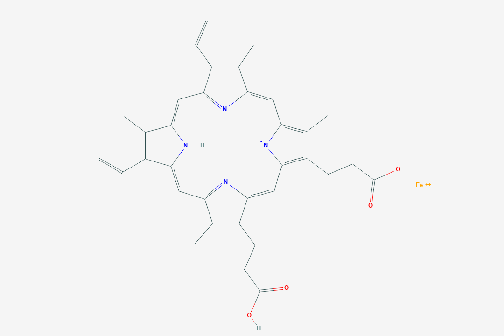

---
#########################################
# options for knitting a single chapter #
#########################################
output:
  bookdown::pdf_document2:
    template: templates/brief_template.tex
    citation_package: biblatex
  bookdown::html_document2: default
  bookdown::word_document2: default
documentclass: book
#bibliography: [bibliography/references.bib, bibliography/additional-references.bib]
---

# Introduction {.unnumbered}

```{=tex}
\adjustmtc
\markboth{Introduction}{}
```
<!-- For PDF output, include these two LaTeX commands after unnumbered chapter headings, otherwise the mini table of contents and the running header will show the previous chapter -->
<!-- Note, future Pat, that tabs are significant here and will fuck your text -->

Proteins may catalyze reactions, and many require ligands to enable their chemistry. A significant portion of all proteins, approximately 40\%, require a metallic group as a ligand in order to function correctly - these proteins are known as metalloproteins. 
	
One of these metallic groups is heme. Heme is a member of the porphyrin family, a group of molecules capable of catalyzing a broad range of reactions. Heme can catalyze many different reactions and is present in many proteins. However, the underlying structural requirements to host heme in a protein are not well understood. [MAY ADD CITATIONS]
	
There have only been a handful of studies dedicated to understanding the structure-chemical relationship between heme and the proteins that use heme for their chemistry (these proteins are known as hemoproteins). 

In the most significant previous work, approximately 125 hemoproteins were studied(@Li2011). The study focused on the structural differences between hemoproteins with bound and unbound ligands.

In this study, structures of hemoproteins with bound ligands were examined. Multiple ligands and their binding protein were examined: heme (HEM), heme-c (HEC), siroheme (SER), and verdoheme (VEA/VER).

<!-- They look like this and hopefully I can make these all kinda be side to side homie yo: -->
<!-- <!-- knitr::include_graphics("figures/HEM-b") --> -->
<!--  -->
<!-- We include an external image with the R function: -->

<!-- ```{r, echo=FALSE, out.width="50%", fig.cap="A nice image."} -->
<!--  -->
<!-- ``` -->

<!-- Another attempt homie: -->

```{r, echo=FALSE,out.width="49%", out.height="20%",fig.cap=c("HEM","HEC","SRM","VEA","VER"),fig.align='center'}
knitr::include_graphics(c("figures/HEM-b.png","figures/HEM-c.png",
                          "figures/SRM.png","figures/VEApubchem.png",
                          "figures/VERpuchem.png"))
``` 
<!-- fig.show='hold', -->
Of particular interest were any qualities that may suggest a requirement for ligand binding. In addition, with several ligands studied, the similarities and differences for binding pockets for the different ligands could be elucidated. Properties of the binding pockets were both predicted and observed from their respective PDB files.

## other stuff to consider adding to the introduction
Although pdbs were thoroughly examined and the datasets were culled, the sample size of this study is very small compared to the amount of hemoproteins available in the pdb a decade later (~10,000 HEM-containing proteins and xx). The dataset is also limited in that there is a somewhat homogenous group of proteins examined (?). The characteristics examined were limited to: xx. 

It is hypothesized that the following characteristics all have an impact on the binding of heme and function of the hemoprotein: XXXXXXXXX.
	
In this study, some of these characteristics were examined. They include: XX. The remainder are thus far not feasible to calculate.
	
All of these characteristics have implications in the field of protein engineering or basic research into hemoproteins. Examples of the uses of these results include [SUPER BLOOD STUDY] and [OTHER PROTEIN ENGINEERING STUFF]. Not sure how much we can reference those other papers besides doing that besides in the conclusion.