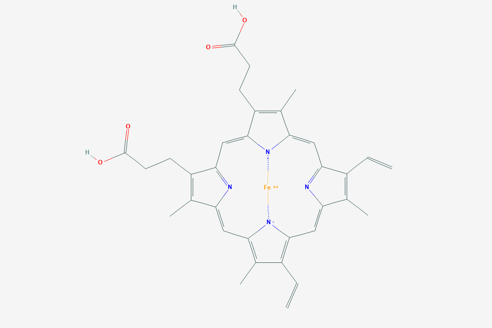
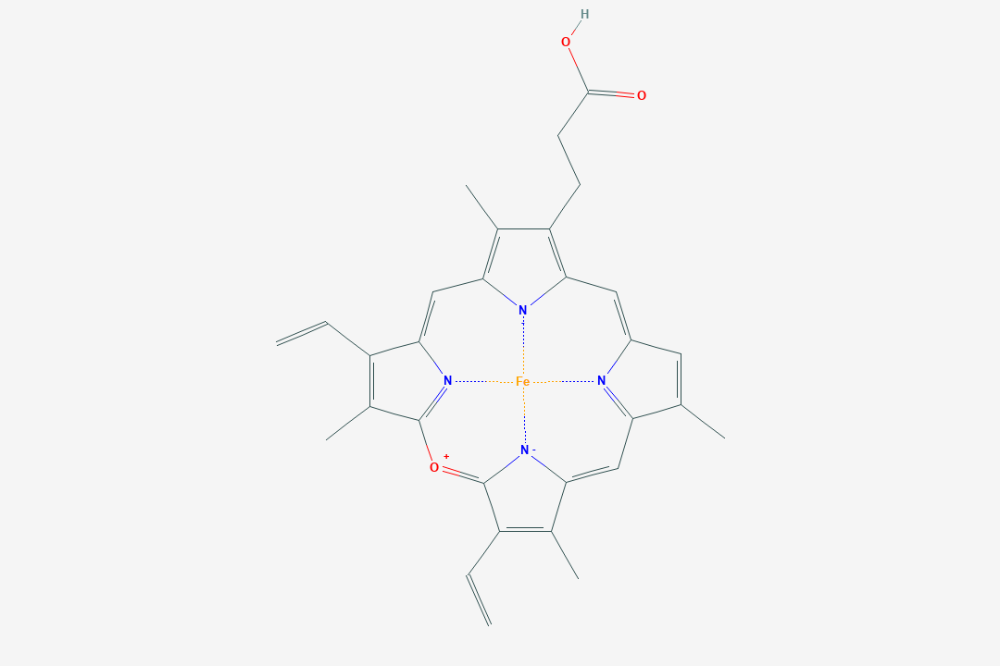

---
#########################################
# options for knitting a single chapter #
#########################################
output:
  bookdown::pdf_document2:
    template: templates/brief_template.tex
    citation_package: biblatex
    extra_dependencies: 
  bookdown::html_document2: default
  bookdown::word_document2: default
documentclass: book
#bibliography: [bibliography/references.bib, bibliography/additional-references.bib]
---

# Introduction {.unnumbered}

```{=tex}
\adjustmtc
\markboth{Introduction}{}
```
<!-- For PDF output, include these two LaTeX commands after unnumbered chapter headings, otherwise the mini table of contents and the running header will show the previous chapter -->

Proteins that contain metal ion cofactor(s) are known as metalloproteins, and they compose approximately 40\% of all proteins. The metal ion can be free, or bound within a ligand. One such ligand is heme, a complex of iron and a porphyrin ring. Heme is employed by many metalloproteins to catalyze a broad range of reactions. 

<!-- heme-b is proliferate it gets to have its own couple paragraphs -->
Proteins containing heme are known as hemoproteins - hemoglobin and myoglboin are well-known examples, using heme to store and transport oxygen. Other examples hemoproteins are peroxidases, catalases (a type of peroxidase), nitric oxide synthases, heme oxygenases, and cytochrome p450s. Peroxidases and catalases catalyze oxidation-reduction reactions using a histidine-bound heme, with catalases in particular specializing in the decomposition of hydrogen peroxide. Nitric oxide synthases catalyze the reaction of L-arginine into nitric oxide, which is vitally important to cellular signaling (@Poulos2014). Free heme molecules may be released upon degradation of hemoproteins (especially hemoglobin), however, heme is prooxidative and therefore toxic to cells and must be cleared. Heme oxygenases assist in the degradation of heme, and are regarded as potential therapeutics, due to anti-inflammatory effects[@Araujo2012].

The enzymes with arguably the most potential applications, cytochrome P450s function as powerful monooxygenases. They participate in many reactions: capable oxidizing a wide range of substrates, serving to oxidize carbohydrates, steroids, fatty acids; catalyzing hormone degradation and synthesis; and degrading the majority of drugs(@Poulos2014). Due to their extraordinary utility and range of reactions, cytochrome p450s are of great interest in the protein engineering field. Cytochrome P450s have the potential to be used  in industrial biocatalysis, e.g. in pharmaceutical production, bioremediation of environmental pollutants[@Du2017; @Lalonde2016]. The limiting factor preventing its deployment has been the struggle to increase enzymatic efficiency and therefore yield of processes employing the enzyme[@Girvan2016; @Li2020]. 

Echoing the many applications of its host enzymes, the heme molecule itself has its own variety. Thus far, only heme-b has been discussed (although it is the most abundant and most employed). There are several types of heme, structurally and chemically different, that are used to achieve different chemical reactions: in this study, we examined heme-b, heme-c, siroheme, and verdoheme. Their structures are shown in Figures 1-5. 

All types of heme are a coordination complex composed of an iron atom coordinated and bound to a porphyrin ring. Porphyins are composed of four pyrrole subunits (pentagonal structures of four carbons and a nitrogen) that are bound together via methine (i.e. carbon) bridges (FIXME get a citation for this stuff). Porphyrins are considered macrocycles, molecules with large ring structures. The ring within porphyrins is heterocyclic, and considered aromatic, and therefore acts as a large resonant structure capable of transferring electrons. Coupled with an iron atom to enable reduction-oxidation reactions and (something something provide radicals/electrons), the overall heme complex is therefore highly suited for reactions involving electron transfer (FIXME better way to word?). 


```{r structHEM, echo=FALSE,out.width="50%",fig.cap="Heme-b (HEM)",fig.show="hold",fig.align='center'}
knitr::include_graphics("figures/HEM-b.png")
```
```{r structHEC, echo=FALSE,out.width="50%",fig.cap="Heme-c (HEC)",fig.show="hold",fig.align='center'}
knitr::include_graphics("figures/HEM-c.png")
```

```{r structSRM, echo=FALSE,out.width="50%",fig.cap="Siroheme (SRM)",fig.show="hold",fig.align='center'}
knitr::include_graphics("figures/SRM.png")
```

```{r structVEA, echo=FALSE,out.width="50%",fig.cap="Verdoheme, VEA",fig.align='center'}

```
```{r structVER, echo=FALSE,out.width="50%",fig.cap="Verdoheme, VER",fig.align='center'}

```


The most common heme is heme-b. It is employed by the vast majority of hemoproteins. It is composed of an iron and porphyrin ring complex, with the addition of two propionate groups. These two propionate groups interact with polar amino acids in the binding pocket. The iron atom is usually coordinated to a histidine or cysteine, depending on the enzyme. 

Heme-c is derived from heme-b. It is fairly similar to heme, with two notable excetions: the iron atom binds, with few exceptions, covalently to cysteine residues in the binding pocket; and it has two substituted vinyl groups, and these form thioester bonds with amino acids in the protein matrix/binding pocket (FIXME choose one lol). Its function is much more specific than heme-b, mostly serving as an electron carrier rather than catalyzing a plethora of reactions. The reason for this is not abundantly clear, but several studies suggest that because of its covalent bonding, heme-c has an electronic potential that is can be far lower and in general more broad, and more specifiable, than heme-b. [@Bowman2008; @Kleingardner2015]

Siroheme is even more limted in its applications, but highly specialized for its role. It is still an iron atom-porphyrin coordination complex, but it contains far more carboxyl and propionate groups than the other types of heme, making it highly polar. It is used exclusively in sulfite and nitrite reductases, which catalyze the reduction of the sulfates and nitrates plants uptake from the ground, providing the sources of nitrogen and sulfur used to produce nitrogen and sulfur-containing amino acids(@Tripathy2010). The reason for the use of siroheme in this reaction rather than heme-b is not completely understood. But one study suggests that the bridge that siroheme forms between its catalyic iron atom, and the protein matrix envrionment (which also necessarily involves another cofactor, a cluster of cubane for electron transfer and provision) is more efficient at channeling electrons than the bridge that could be formed by heme.[@Branzanic2019] FIXME DEFINITELY CUT THIS DOWN IN WORDS.

Lastly, verdoheme is an intermediate product in the degradation of heme-b by heme oxygenase. When heme oxygenase degrades heme-b, biliverdin, carbon monoxide, and iron are produced; verdoheme is the precusor to bilverdin[@Lai2010; @Sato2007]. While a product of prior reactions wthin heme oxygenase, verdoheme appears to be oriented and bound differently [@Lad2004]. The two structures used in the study, VEA and VER, are either partially oxidized or partially oxidized and contain one less propionate group.

In summary, heme molecules are varied, and used in a diverse set of reactions. Several enzymes have the potential to be of great value either in biocatalysis or pharmaceutical applications. There are multiple methods employed to design molecules, but rational design in particular (basically, the mutation of certain residues based on an understanding of the structure-function relationships) is at least partially hampered by an incomplete understanding of the binding environment for heme. The importance of the binding environment was noted in a study seeking to design *de novo* heme-c based enzymes, and found the binding environment likely to be of importance in modulating redox potential [@Ishida2004].

A fairly recent study conducted a structural analysis of 125 hemoprotein chains(@Li2011). The study suggested hemoproteins undergo small conformational changes during binding; and that apo-form (ligand-containing) proteins may therefore be suitable for bioinformatics-based prediction and protein design. Additionally, the heme binding environment of the protein dataset used in the study was found to be rich in aromatic and nonpolar residues.

The aforementioned study was published in 2011 - since then the PDB has been populated with far more hemoproteins. The 125 protein chains used in the study were sourced from a small dataset of proteins (FIXME: Double check but their Table 2 is like 20 proteins), compared to the amount of hemoproteins now available in the PDB. The focus of the study was on conformational differences induced by heme-binding. And as for the binding environment, the focus was largely on interactions with the coordinating iron atom rather than interactions that occur with the porphyrin ring. **could add the distances arbitrary definition thing but I hesitate to write anything that could be construed as uh, negative**

The interactions heme forms with its binding environment have been well documented. And many studies have demonstrated the importance of these interactions and have either demonstrated or at least furnished theoretical mechanisms by which the heme molecule functions in reactions involving hemoproteins. However, there has not been significant work dedicated to examining the heme-binding environment itself. (FIXME maybe like, there appears to be a knowledge gap... idk that seems just as uhm, cocky idk)

In this study, we present research focused on elucidating the binding environment of multiple heme molecules: heme-b (HEM), heme-c (HEC), siroheme (SER), and verdoheme (VEA/VER). UCSF Chimera was used to both extract and predict properties of a diverse set of hemoproteins. A robust and high-throughput framework was constructed to process the datasets for each heme molecule, requiring only inputs of which ligand is to be examined per dataset.

The properties extracted and predicted of the heme molecules were (I need to figure out how to do a bullet list in this format):
+Amino acid frequencies within binding pockets
+Volumes
+Solvent accessible and excluded surface areas of heme and binding pockets
+Distances of amino acids from the Fe atom of heme
+Planar angles of amino acids in binding pocket v. heme
+CA-CB-Fe angles of amino acids in binding pocket v. heme


**GOTTA TALK ABOUT ARTIFICAL METALLOPROTEINS, IT IS TIME. 'AS MENTIONED PREVIOUSLY, THERE ARE MANY OPPORTUNITIES TO EMPLOY IMPROVED HEMOPROTEINS, AND THE RESULTS ALIKE THE ABOVE MAY  FACTOR HEAVILY IN THE ABILITY TO DESIGN..... YOU SEE? DANKNESS**

These results may be of use in rational design of hemoproteins in future studies, or at least improve the understanding of the heme binding environment. **probably put something more... salesman-like here later**