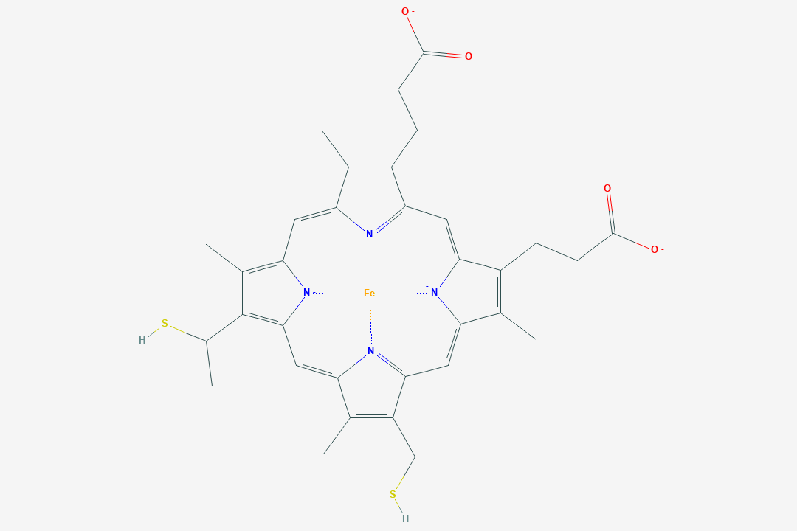
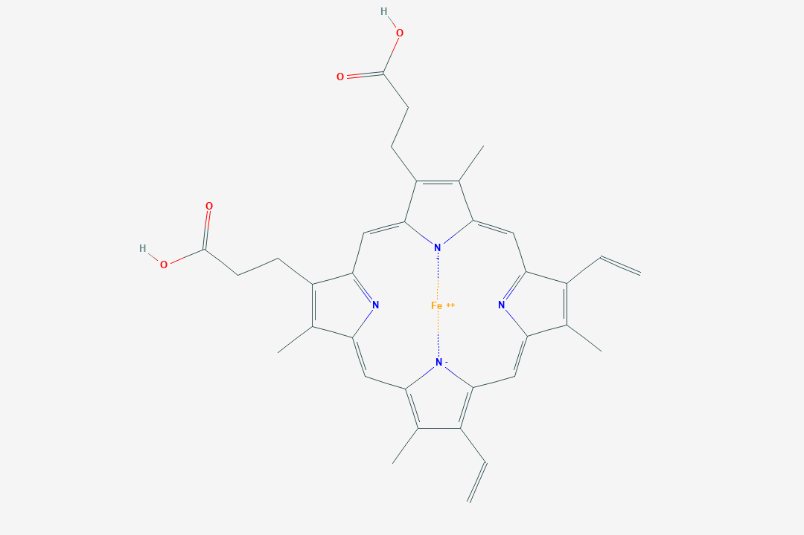
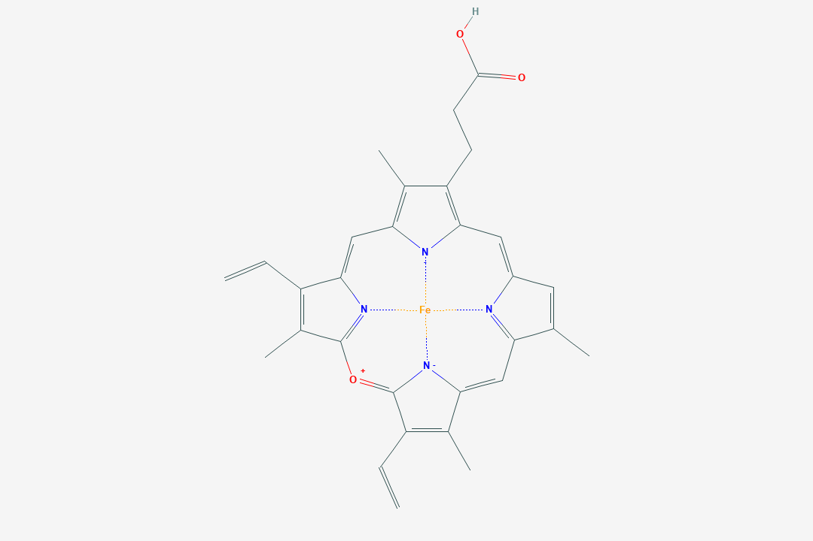

---
#####################
##  output format  ##
#####################
# The lines below makes the 'knit' button build the entire thesis 
# Edit the line 'thesis_formats <- "pdf"' to the formats you want
# The format options are: 'pdf', 'bs4', 'gitbook', 'word'
# E.g. you can build both pdf and html with 'thesis_formats <- c("pdf", "bs4")'
knit: (function(input, ...) {
    thesis_formats <- "pdf";
    
    source("scripts_and_filters/knit-functions.R");
    knit_thesis(input, thesis_formats, ...)
  })

#####################
## thesis metadata ##
#####################
title: Characterizing Heme Pockets
# #title: |
#   `oxforddown`: \
#   An Oxford University Thesis \
#   Template for R Markdown
author: Patrick Finnerty
college: Biosciences
university: Universtat Autonoma de Barcelona
university-logo: templates/UABlogo.pdf
university-logo-width: 8cm
submitted-text: A thesis submitted for the degree of
degree: Master of Science
degreedate: Fall 2021
abstract: |
  `r paste(readLines("front-and-back-matter/_abstract.Rmd"), collapse = '\n  ')`
acknowledgements: |
  `r paste(readLines("front-and-back-matter/_acknowledgements.Rmd"), collapse = '\n  ')`
dedication: 
abbreviations: |
  `r paste(readLines("front-and-back-matter/_abbreviations.Rmd"), collapse = '\n  ')`

#######################
## bibliography path ##
#######################
bibliography: [bibliography/references.bib, bibliography/additional-references.bib]

########################
## PDF layout options ###
#########################
### submitting a master's thesis ###
# set masters-submission: true for an alternative, anonymous title page with 
# candidate number and word count
masters-submission: false
candidate-number: 123456
word-count: "10,052"

# if you want to use a different title page altogether, provide a path to a 
# .tex file here and it will override the default Oxford one
# alternative-title-page: templates/alt-title-page-example.tex

### abbreviations ###
abbreviations-width: 3.2cm
abbreviations-heading: List of Abbreviations


### citation and bibliography style ###
bibliography-heading-in-pdf: Works Cited

# biblatex options #
# unless you run into 'biber' error messages, use natbib as it lets you customise your bibliography directly
use-biblatex: true
bib-latex-options: "style=numeric-comp, sorting=none, backend=biber, maxcitenames=2, useprefix, doi=true, isbn=false, uniquename=false" #for science, you might want style=numeric-comp, sorting=none for numerical in-text citation with references in order of appearance
#original options:
  #style=authoryear
  #sorting=nyt

# natbib options #
# natbib runs into fewer errors than biblatex, but to customise your bibliography you need to fiddle with .bst files
use-natbib: false # to use natbib, set this to true, and change "output:bookdown::pdf_book:citation_package:" to "natbib"
natbib-citation-style: authoryear #for science, you might want numbers,square
natbib-bibliography-style: templates/ACM-Reference-Format.bst #e.g. "plainnat", unsrtnat, or path to a .bst file

### correction highlighting ###
corrections: true

### link highlighting ###
colored-not-bordered-links: true # true = highlight links by coloring text; false = highlight links with a border

# Set the link text/border coloring here, in RGB. 
# Comment out a variable to use whatever the text's existing color is.
# If printing a physical version of your thesis, you'll want to comment out all of these.
urlcolor-rgb: "0,0,139"     # web addresses
citecolor-rgb: "0,33,71"    # citations
linkcolor-rgb: "0,0,139"    # links to sections in your thesis

# Make page number, not text, be link in TOC, LOF, and LOT. Otherwise, section link
# highlighting may look a bit excessive.
toc-link-page-numbers: true

### binding / margins ###
page-layout: nobind #'nobind' for equal margins (PDF output), 'twoside' for two-sided binding (mirror margins and blank pages), leave blank for one-sided binding (left margin > right margin)

### position of page numbers ###
ordinary-page-number-foot-or-head: foot #'foot' puts page number in footer, 'head' in header
ordinary-page-number-position: C  #C = center, R = right, L = left. If page layout is 'twoside', O = odd pages and E = even pages. E.g. RO,LE puts the page number to the right on odd pages and left on even pages
chapter-page-number-foot-or-head: foot #you may want it to be different on the chapter pages
chapter-page-number-position: C

### position of running header ###
running-header: true #indicate current chapter/section in header?
running-header-foot-or-head: head
running-header-position-leftmark: LO #marks the chapter. If layout is 'nobind', only this is used.
running-header-position-rightmark: RE  #marks the section.


### draft mark ###
draft-mark: false # add a DRAFT mark?
draft-mark-foot-or-head: foot ##'foot' = in footer, 'head' = in header
draft-mark-position: C

### section numbering ###
section-numbering-depth: 2 # to which depth should headings be numbered?

### tables of content ###
toc-depth: 1 # to which depth should headings be included in table of contents?
lof: true # include list of figures in front matter?
lot: true # include list of tables in front matter?
mini-toc: true  # include mini-table of contents at start of each chapter? (this just prepares it; you must also add \minitoc after the chapter titles)
mini-lot: false  # include mini-list of tables by start of each chapter?
mini-lof: false  # include mini-list of figures by start of each chapter?

### code block spacing ###
space-before-code-block: 10pt
space-after-code-block: 8pt

### linespacing ###
linespacing: 22pt plus2pt # 22pt is official for submission & library copies
frontmatter-linespacing: 17pt plus1pt minus1pt #spacing in roman-numbered pages (acknowledgments, table of contents, etc.)

### other stuff ###
abstractseparate: false  # include front page w/ abstract for examination schools?
includeline-num: false #show line numbering in PDF?


#####################
## output details  ##
#####################
output:
  bookdown::pdf_book:
    citation_package: biblatex
    template: templates/template.tex
    keep_tex: true
    pandoc_args: "--lua-filter=scripts_and_filters/colour_and_highlight.lua"
  bookdown::bs4_book: 
    css: 
      - templates/bs4_style.css
      - templates/corrections.css # remove to stop highlighting corrections
    theme:
      primary: "#6D1919"
    repo: https://github.com/ulyngs/oxforddown
    pandoc_args: "--lua-filter=scripts_and_filters/colour_and_highlight.lua"
  bookdown::gitbook:
    css: templates/style.css
    config:
      sharing:
        facebook: false
        twitter: yes
        all: false
  bookdown::word_document2:
    toc: true   
link-citations: true
documentclass: book
always_allow_html: true #this allows html stuff in word (.docx) output
---


```{r install_packages, include=FALSE}
source('scripts_and_filters/install_packages_if_missing.R')
```

```{r create_chunk_options, include=FALSE, eval=knitr::is_latex_output()}
source('scripts_and_filters/create_chunk_options.R')
source('scripts_and_filters/wrap_lines.R')
```

<!--
Include the create_chunk_options chunk above at the top of your index.Rmd file
This will include code to create additional chunk options (e.g. for adding author references to savequotes)
and to make sure lines in code soft wrap
If you need to create your own additional chunk options, edit the file scripts/create_chunk_options.R
-->

<!-- This chunk includes the front page content in HTML output -->
```{r ebook-welcome, child = 'front-and-back-matter/_welcome-ebook.Rmd', eval=knitr::is_html_output()}
```

<!--chapter:end:index.Rmd-->

---
#########################################
# options for knitting a single chapter #
#########################################
output:
  bookdown::pdf_document2:
    template: templates/brief_template.tex
    citation_package: biblatex
  bookdown::html_document2: default
  bookdown::word_document2: default
documentclass: book
#bibliography: [bibliography/references.bib, bibliography/additional-references.bib]
---

# Lay Summary {.unnumbered}

```{=tex}
\adjustmtc
\markboth{Lay Summary}{}
```

I investigated how heme, a molecule involved in many biological processes, binds to proteins. I did this by...

<!--chapter:end:00-lay-summary.Rmd-->

---
#########################################
# options for knitting a single chapter #
#########################################
output:
  bookdown::pdf_document2:
    template: templates/brief_template.tex
    citation_package: biblatex
    extra_dependencies: 
  bookdown::html_document2: default
  bookdown::word_document2: default
documentclass: book
#bibliography: [bibliography/references.bib, bibliography/additional-references.bib]
---

# Introduction {.unnumbered}

```{=tex}
\adjustmtc
\markboth{Introduction}{}
```
<!-- For PDF output, include these two LaTeX commands after unnumbered chapter headings, otherwise the mini table of contents and the running header will show the previous chapter -->

How we wanna do this? We gonna assume a base level of biochemistry amongst our peers, what we had in the last semester. 

Proteins that require metallic groups as their ligands are known as metalloproteins, and they compose approximately 40\% of all proteins. One such ligand is heme. Heme is employed by many metalloproteins to catalyze a broad range of reactions. 

Hemoglobin and myoglboin are likely familiar proteins, and use heme to store and transport oxygen. Other examples of the enzymes that employ heme are peroxidases, catalases (a type of peroxidase), nitric oxide synthases, heme oxygenases, and cytochrome p450s. Peroxidases and catalases catalyze oxidation-reduction reactions using a histidine-bound heme, with catalases in particular specializing in the decomposition of hydrogen peroxide. Nitric oxide synthases catalyze the reaction of L-arginine into nitric oxide, which is vitally important to cellular signaling[@Poulos2014]. Free heme molecules may be released upon degradation of hemoproteins, however, heme is prooxidative and therefore toxic to cells; heme oxygenases serve to degrade heme, protecting the cell and forming products preventing vascular inflamation. Heme oxygenases are regarded as potential therapeutics, because of their anti-inflammatory effects. 

Last but not least, cytochrome p450 function as powerful monooxygenases. They are capable oxidizing, inserting oxygen into a fanastic amount of substrates, serving to oxidize carbohydrates, steroids, fatty acids; hormone degradation and synthesis; and degrade the vast majority of drugs. Due to their extraordinary utility and range of reactions, cytochrome p450s are of great interest in the protein engineering field. Cytochrome p450s have the potential to be used  in industrial biocatalysis, e.g. in pharmaceutical production, bioremediation of environmental pollutants. The limiting factor preventing its deployment has been the struggle to increase enzymatic efficiency and therefore yield of processes employing the enzyme. The struggle to increase enzymatic efficiency, in turn, is due to an incomplete understanding of the binding environment for heme; indeed, the binding environment for *hemes*. 

The heme molecule itself has its own variety. There are several "hemes", structurally and chemically different, that are used to achieve different chemical reactions; in this study, we examined heme-b, heme-c, siroheme, and verdoheme. Their structures are shown in Figures 1-5. 

FIXME!! Actually put the reference of this stuff.

```{r, echo=FALSE,out.width="50%",fig.cap="Heme-b (HEM)",fig.show="hold",fig.align='center'}
knitr::include_graphics("figures/HEM-b.png")
```
```{r, echo=FALSE,out.width="50%",fig.cap="Heme-c (HEC)",fig.show="hold",fig.align='center'}

```

```{r, echo=FALSE,out.width="50%",fig.cap="Siroheme (SRM)",fig.show="hold",fig.align='center'}
knitr::include_graphics("figures/SRM.png")
```

```{r, echo=FALSE,out.width="50%",fig.cap="Verdoheme, VEA",fig.align='center'}

```
```{r, echo=FALSE,out.width="50%",fig.cap="Verdoheme, VER",fig.align='center'}

```


The most common "heme", heme-b, has been discussed above. It binds principally via noncovalent interactions with its binding pocket. Heme-c is derived from heme-b; it binds, with few exceptions, covalently to cysteine residues in the binding pocket, forming thioester bonds between the residues and heme-c vinyl groups. Its function is much more specific than heme-b, mostly serving as an elctron carrier. The reason for this is not abundantly clear, but several studies suggest that because of its covalent bonding, heme-chas an electronic potential that is broader and more specifiable than heme-b. 

<!-- Work here homie I'm not clear on specifics -->
Siroheme is even more limted in its applications but arguably of greater signifiance in nature. It is used exclusively in XXX, which in turn is responsible for XX and therefore Y.. Siroheme uniquely is able to transfer 6 eletrons or something; one study suggests this is due to its structure of blablabla.

Verdoheme is an intermediate product in the degradation of heme-b by heme oxygenase. When heme oxygenase degrades heme-b, balblabla are produced; verdoheme is the precusor to xx. And while an intermediate, the way verdoheme is at least briefly bound in heme oxygenase (CHECK!!!) is not well documented and may be of interest.  

<!-- alright now go in for the kill -->
As discussed above, the potential for engineered proteins is yuge for these molecules. However, binding environments are not well udnerstood and form a crucial part of the puzzle. Studies have been done engineering hemoproteins, and have concluded the binding environemnt highyl important. Another stud blablbla


There have only been a handful of studies dedicated to understanding the structure-chemical relationship between heme and the proteins that use heme for their chemistry (these proteins are known as hemoproteins). 

In the most significant previous work, approximately 125 hemoproteins were studied[@Li2011]. The study focused on the structural differences between hemoproteins with bound and unbound ligands.

In this study, structures of hemoproteins with bound ligands were examined. Multiple ligands and their binding protein were examined: heme (HEM), heme-c (HEC), siroheme (SER), and verdoheme (VEA/VER).

Yeah so below we get 'em. But no sure how I'd go about stacking em side by side and keeping a caption. So far this gets the job done let's move on homie!

<!-- fig.show='hold', -->


Of particular interest were any qualities that may suggest a requirement for ligand binding. In addition, with several ligands studied, the similarities and differences for binding pockets for the different ligands could be elucidated. Properties of the binding pockets were both predicted and observed from their respective PDB files.

## other stuff to consider adding to the introduction
Although pdbs were thoroughly examined and the datasets were culled, the sample size of this study is very small compared to the amount of hemoproteins available in the pdb a decade later (~10,000 HEM-containing proteins and xx). The dataset is also limited in that there is a somewhat homogenous group of proteins examined (?). The characteristics examined were limited to: xx. 

It is hypothesized that the following characteristics all have an impact on the binding of heme and function of the hemoprotein: XXXXXXXXX.
	
In this study, some of these characteristics were examined. They include: XX. The remainder are thus far not feasible to calculate.
	ss
All of these characteristics have implications in the field of protein engineering or basic research into hemoproteins. Examples of the uses of these results include [SUPER BLOOD STUDY] and [OTHER PROTEIN ENGINEERING STUFF]. Not sure how much we can reference those other papers besides doing that besides in the conclusion.

<!--chapter:end:01-introduction.Rmd-->

---
#########################################
# options for knitting a single chapter #
#########################################
output:
  bookdown::pdf_document2:
    template: templates/brief_template.tex
    citation_package: biblatex
  bookdown::html_document2: default
  bookdown::word_document2: default
documentclass: book
#bibliography: [bibliography/references.bib, bibliography/additional-references.bib]
---


```{=tex}
\adjustmtc
\markboth{Methods}{}
```

# Methods {#methods}
\minitoc

## Datasets
\noindent A list of PDBs was assembled that represented either a representative sample of a variety of proteins, with a resolution better than 3A, (HEM and HEC) or, all proteins containing these ligands were downloaded from the PDB (in the case of SRM, VER, VEA). Not all downloaded PDBs were appropriate for this study (e.g. contained "wobble" structures) and therefore the amount of PDBs was culled. The datasets are current as of 16 August 2021. 

The size of the datasets actually used in the study were as follows: HEM (n=58), HEC(n=14), SRM (n=9), VER (n=2) and VEA (n=2) for a combined n=4 for VERDOHEME. 

The name of all proteins used in the study and their source organism are provided tables within Appendix \@ref(molOrgSec).

## Preprocessing
Many of the PDBs downloaded were multimeric structures. While many of the scripts employed in the study may function with multimeric structures, the number of subunits per protein (FIXME! better way to say this?) would skew results in favor of multimeric proteins with more subunits. The information gleaned from similar subunits would also not be of utility in this study.

Therefore all downloaded PDBs were converted to monomeric structures. This was achieved by saving a single chain (chain A) of each PDB and eliminating all other chains. The single chain was then saved as a PDB and used in all subsequent scripts.

## Processing Monomers

UCSF-Chimera was used to generate all data in this study. Multiple scripts were employed to achieve a high-throughput process where all monomeric PDBs could be processed in the same session. 

Chimera was used to predict the following qualities: Volume of the ligand binding pocket, accessible and excluded surface area of the ligand, and accessible and excluded surface area of the binding pocket. These calculations require a population of atoms to be selected for the calculation. 

Atoms were selected within a distance cutoff, to be considered as "interacting" with the ligand or forming the binding pocket. Distance cutoffs from the ligand of 5A and 7A were chosen; for the predicted qualities, the algorithms were run twice to get values at 5A and 7A. For the distance and angle calculations, only the 7A distance cutoff was used, as the cutoff does not factor into any calculations and may be set during analysis.

as these are selected arbitrarily, data from the 5A and 7A runs are overlaid in the figures reported in Appendix \@ref(Figures). Data tables are also provided in Appendix \@ref(Tables).

### Amino Acid Frequency
Amino acids within the bounds of the lower and upper distance cutoff were selected and recorded. These were then counted for frequency per residue.

### Volume Calculations
Volume of the binding pocket was predicted via Surfnet, run with default parameters of Grid Interval = 1.0 and Distance Cutoff = 10.0 (the latter option does not relate to the distance cutoff from the ligand(FIXME! find source for this, appears 100% to be true?)).

### Surface Area Calculations
Excluded and accessible surface areas of both the ligand and the binding pocket were calcualted using Chimera's "surf" algorithm, available as "Measure Volume and Area" via the GUI. 

### Distance Calculations

Distances of amino acids from the ligand could not be calculated accurately nor precisely in a direct way. Instead, distances for each atom composing a residue were calculated. The distances of all atoms within a residue were averaged, and this value was taken as the mean distance of the entire residue and used in subsequent steps. 

The data produced in this step therefore include the mean distance of each amino acid. This is traceable, and the angular data below are cross-referenced with this list of distances. All data shown in figures (FIME! Also for tables?) are multidimensional and may be filtered for distance.

### Planar Angle Calculations
Individual residues and the ligand were defined as axes The angle between each residue's axis and the axis of the ligand were calculated. Each axis functions essentially as a separate plane. (FIXME! Include a picture of what this looks like?) This employed the "define axis", and "angle" functions of Chimera; the Axes/Planes/Centroids Structural Analysis function of Chimera via GUI. 

### CA-CB-Fe Calculations
Residues within the distance cutoff were examined one by one. The angle of between each residue's carbon alpha (CA) and carbon beta (CB) and the Fe of the ligand was calculated, using the "angle" function of Chimera. The ligand nor the Fe atom were compared with themselves.

## Import to R
All data were imported to R and processed from text files into organized data formats. R was used to cross-reference angle and distance data. All plots and tables were constructed using R and imported directly to this document using Rmarkdown. 

<!--chapter:end:02-methods.Rmd-->

---
#########################################
# options for knitting a single chapter #
#########################################
output:
  bookdown::pdf_document2:
    template: templates/brief_template.tex
    citation_package: biblatex
  bookdown::html_document2: default
  bookdown::word_document2: default
documentclass: book
#bibliography: [bibliography/references.bib, bibliography/additional-references.bib]
---

```{=tex}
\adjustmtc
\markboth{Introduction}{}
```


# Results {#results}
Data are reported as figures in Appendix \@ref(a-figures) and tables in Appendix \@ref(a-tables). Data are organized by result e.g. Volume, and then by ligand. 

<!--chapter:end:03-results.Rmd-->

---
#########################################
# options for knitting a single chapter #
#########################################
output:
  bookdown::pdf_document2:
    template: templates/brief_template.tex
    citation_package: biblatex
  bookdown::html_document2: default
  bookdown::word_document2: default
documentclass: book
#bibliography: [bibliography/references.bib, bibliography/additional-references.bib]
---


```{=tex}
\adjustmtc
\markboth{Methods}{}
```


# Discussion {#discussion}

This section is organized by type of result; figures and tables referenced are within the appendices.

## AA Frequency Discussion
Amino acid frequencies within the 5A and 7A distance cutoffs of the ligand are reported in Appendix \@ref(figs-aaFreq) and (FIXME! Missing amino acid tables).
For HEM and HEC, nonpolar amino acids are the most frequent. This may indicate that nonpolar amino acids are extremely important to stabilizing the binding pocket.

For SRM, this is not the case. HEM and HEC are very similar, but SRM is quite different. For SRM we find that arginine is extremely frequent to find in the pocket (amongst n=9). This is perhaps expected given the exposure of charged groups on SRM, but the degree of the effect is very notable. Glycine and Lysine and other small residues are also highly present. Perhaps this indicates a selection for small residues in the binding pocket to accomodate SRM. 

Verdoheme, again, has a very small sample size (n=4). But the results appear to follow trends seen in other ligands; a preference for nonpolar, charged, or small residues. Leucine is the most preferred of these, along with alanine - two small nonpolar amino acids. These results, although limited, reinforce the trend of an especially important composition of amino acids in the binding pocket rather than the coordinating amino acids.

## Volume Discussion

Figures can be found in Appendix \@ref(figs-vol)
Besides HEM, much of the volume data for the different ligands did not closely agree between different distance cutoffs. Most of the data did however fall within reasonable bounds, regardless of distance cutoffs.

HEM appears to require a pocket volume of between 800 and 1200 A³. Data reported for this quality range between 500 and 2000 A³. These outliers can perhaps be explained by proteins with exceptionally large binding pockets, but are more likely an indication of the imperfections in the volume calculation algorithm, highlighting the need for studies that take into account a multiplicity of PDBs to evaluate the size of a binding pocket.

HEC volume data centers around 800-1100A³. This molecule is very similar to HEM and these results are somewhat expected. Outliers again can perhaps be explained by the volume calculation algorithm.

SRM and Verdoheme suffer from a low number of sample data. SRM appears to center at 1000-1200 A³, again somewhat confirmed by other ligands examined in the study. 

But Verdoheme has a near equal distribution of samples from 700-1450 A³; this lack of agreement precludes a range that may be suspected to be the "real" volume. 

## Ligand Solvent Excluded Surface Area Discussion

Figures can be found in Appendix \@ref(figs-ligExcSA).

The limitations of the limited sample size can be seen in this quality as well.

HEM appears to have a ligand surface area of approximately 500-700 A². HEC follows a similar trend.

However, for SRM and Verdoheme, data are more scattered. Trends cannot be derived from these data.

## Ligand Solvent Accessible Surface Area Discussion

Figures can be found in Appendix \@ref(figs-ligAccSA).

HEM has a strong agreement of data at approximately 1000-1250 A². HEC, slightly more scattered, appears to agree from 750-1250 A². 

SRM, despite its limited sample size, has strong agreement for this quality: it ranges from about 1000-1050 A².

VERDOHEME is highly scattered for this measure.  Verdoheme ranges from 750-1800 A². 


## Pocket Solvent Excluded Surface Area

Figures can be found in \@ref(figs-pocketExcSA)

HEM data has poor agreement for this measure. Data is concentrated from 5000-15000 A², but this is a very large range and not very useful.

HEC agrees in a somewhat tighter range: most data fall within 5000-7500 A²; still not very useful but better than HEM.

Most SRM data fall within 21000-22000 A². 

Verdoheme data range from 9200 to 10000 A². 

For this measure, then, we find that SRM and Verdoheme have a fairly specific range of predicted solvent excluded surface area for their binding pockets.

## Pocket Solvent Accessible Surface Area

Figures can be found in Appendix \@ref(figs-pocketAccSA).

The results for this measure follow the trends for the previous section.

Most HEM data fall from 5000-15000 A². HEC data mostly fall from 5000-7500 A².

SRM data is highly concentrated at approximately 21000 A², more specific than the pocket solvent excluded surface area. 

Verdoheme data range from 10000-11000 A².

## All Planar Angles

Figures can be found in \@ref(figs-planarAll)

These data, for all ligands, largely serve to compare as noise for the next section. The planar angles of all residues falling within the upper distance cutoff are plotted. 

A notable exception is HEC; the plot for this ligand seems to suggest that GLU and LYS have fairly specific planar angles with the ligand. (FIXME! Check out the distance tables to drill down further)

## Planar Angles of Closest Residues

Figures can be found in \@ref(figs-planarClosest)

Here, the three closest residues to the ligand in each PDDB and their planar angle to the ligand are plotted.

HEM has a fairly inconclusive set of data for this measure. GLU and GLN nearby HEM do appear to fall within a tight range, though, of approximately 75 degrees and 80 degrees respectively.

The data for residues nearby HEC diverge from what is found for all residues around HEC. The most agreement is found for ILE and LYS, with angles concentrated about 50 degrees and 75 degrees, respectively.

Only three types of residues appear nearby SRM: CYS, LYS, and ARG. Although their angles vary wildly, these data suggest these residues are important to the coordination fo SRM. (FIXME! Add reasoning)

Verdoheme also has a small selection of residues that are close to the ligand. GLY and HIS are the only residues that are close to the ligand in the PDBs used in this study. (FIXME! Add reasoning... or qualifier statement n=2)

## All CA-CB-Fe Angles

Figures can be found in \@ref(figs-cabAll)

All residues have a broad range of angles in relation to HEM.

Most residues have a broad range of angles for HEC, with the exception of THR, which has a tight distribution around 100 degrees. This result only appears here and does not follow for the closest residues, and therefore may be due to a small sample size of THR residues.

SRM appears to have tight distributions of angles when considering all residues; the residues closest to SRM do not echo this. Although likely attributable to a small sample size, there appear several residues with specific angles: ALA around 50 degrees, GLN around 140-150 degrees, and SER around 50 degrees.

Verdoheme... (FIXME! Confer with JeanDi before we report more of these angles. Not sure I'm going about it in an informative way. Also add figure numbers.)

## CA-CB-Fe Angles of Closest Residues

Figures can be found in \@ref(figs-cabClosest)

Most notably, HIS is the only residue that appears closeby Verdoheme, and falls within a range of 106-116 degrees. 

## Limitations of the Study
Limited sample size

Limited experimental data to reference to verify

NO experimental data in this study to verify, all theoretical

Only one software package/few algorithms used to calculate all these properties. Others were evaluated but none are compared w.

Algorithms may introduce bias based on how they work e.g. all the bubbles

Arbitrary selection of parameters; some based on rule of thumb or visual evaluation but all or almost all arbitrary

Unknown if the qualities measured are truly the most critical for the heme binding. Some papers suggest other properties may also be important but cannot be calculated, at least right now, e.g. ionic bonding strength etc.

Visual examination itself to OK the parameters/algorithms can introduce bias

<!--chapter:end:04-discussion.Rmd-->

---
#########################################
# options for knitting a single chapter #
#########################################
output:
  bookdown::pdf_document2:
    template: templates/brief_template.tex
    citation_package: biblatex
  bookdown::html_document2: default
  bookdown::word_document2: default
documentclass: book
#bibliography: [bibliography/references.bib, bibliography/additional-references.bib]
---


```{=tex}
\adjustmtc
\markboth{Methods}{}
```


# Conclusion {#conclusion}
Multiple qualities were predicted and data gathered from representative or whole population (FIXME! better way to put this?) datasets of ligands for hemoproteins. Some qualities per ligand follow very tight distributions and suggest a requirement for ligand binding, e.g. specific volume of binding pockets. 

This is not the case for all qualities. Surface areas and angles of residues in relation to the ligands appear to diverge greately. This suggests the binding pockets, while having some useful trends (e.g. high populations of nonpolar amino acids), may still be highly variable. 
The results of this study are limited by the small sample size, but suggest that binding pockets for hemoproteins have some requirements for binding that may be overlooked, e.g. a high population of nonpolar amino acids. These results may be useful in the design of hemoproteins in the future, in combination with other approaches, to at least narrow down screening efforts and determine realistic designs and modifications.

<!--chapter:end:05-conclusion.Rmd-->

`r if(knitr:::is_latex_output()) '\\startappendices'`

`r if(!knitr:::is_latex_output()) '# (APPENDIX) Appendix {-}'` 

<!-- If you feel it necessary to include an appendix, it goes here. The first appendix should include the commands above. -->


# Figures{#a-figures}

<!-- Figures begin here  -->

## AA Frequency {#figs-aaFreq}
```{r HEM-AAfreq,fig.cap="HEM: AA Frequency",echo=FALSE, message= FALSE, warning=FALSE, results=FALSE}
load("mainData.RData")
activeLigand = "HEM"
library(dplyr) 
library(data.table)
library(tidyr)
library(ggplot2) 
library(stringr)
library(knitr)
library(clipr) # Linux) sudo apt-get install xclip ... R)install.packages("clipr")  
source("~/heme-binding/scripts/r/addpdbcol.R")
library(kableExtra) 

   # AA FReq ----
   rm(tmp5A,tmp7A,tmpBoth)
   head(HEM_aaFreqDf)
   tmp7A <- data.frame(df7A = eval(parse(text=(paste(activeLigand,"_aaFreqDf",sep="")))))
                          #HEM_aaFreqDf)
   tmp5A <- data.frame(df5A = eval(parse(text=(paste("ls5A$",activeLigand,"_5A_aaFreqDf",sep="")))))
   tmp7A$ang = '7'
   tmp5A$ang = '5'
   head(tmp7A)
   tmp7A
   tmp7A %>%
      dplyr::rename(
         df5A.Residue = df7A.Residue
      ) -> tmp7A
   merge(tmp5A,tmp7A,by = 'df5A.Residue') -> tmpBoth
   #alternative: left_join(tmp5A,tmp7A,by='df5A.Residue')
   tmpBoth %>%
      dplyr::rename(
         Residue = df5A.Residue
      ) -> tmpBoth
   tmpBoth
   
   library(reshape) #ONLY LOAD THIS HERE. IF YOU LOAD EALIER,
   # ALL CASE OF RENAME() FROM DPLYR PACKAGE IN ALL SCRIPTS GETS FUCKED UP.
   # PUTTING IT HERE, ONLY BELOW THIS LIBRARY LOAD DO YOU NEED NEED TO SPECIFY DPLYR::XXX
   
   to_plot <- reshape::melt((data.frame(x=tmpBoth$Residue,`Distance_5A`=tmpBoth$df5A.Freq,`Distance_7A`=tmpBoth$df7A.Freq)),id="x")
#   detach("package:reshape", unload=TRUE) #maybe avoid the problem anyway lol
   
   print(ggplot(to_plot,aes(x= reorder(x,-value),y=value,fill=variable)) + 
            geom_bar(stat="identity",position = "identity", alpha=.4) +
            labs(x = "Residue",y="Frequency", title = paste(activeLigand,": AA Frequency",sep='')) +
            scale_fill_discrete(name = "Distance Cutoff")+
            theme(axis.text.x = element_text(angle = 45, vjust = 1, hjust=1)))
   
```

```{r HEC-AAfreq,fig.cap="HEC: AA Frequency",echo=FALSE, message= FALSE, warning=FALSE, results=FALSE}
load("mainData.RData")
activeLigand = "HEC"
library(dplyr) 
library(data.table)
library(tidyr)
library(ggplot2) 
library(stringr)
library(knitr)
library(clipr) # Linux) sudo apt-get install xclip ... R)install.packages("clipr")  
source("~/heme-binding/scripts/r/addpdbcol.R")
library(kableExtra) 

   # AA FReq ----
   rm(tmp5A,tmp7A,tmpBoth)
   head(HEM_aaFreqDf)
   tmp7A <- data.frame(df7A = eval(parse(text=(paste(activeLigand,"_aaFreqDf",sep="")))))
                          #HEM_aaFreqDf)
   tmp5A <- data.frame(df5A = eval(parse(text=(paste("ls5A$",activeLigand,"_5A_aaFreqDf",sep="")))))
   tmp7A$ang = '7'
   tmp5A$ang = '5'
   head(tmp7A)
   tmp7A
   tmp7A %>%
      dplyr::rename(
         df5A.Residue = df7A.Residue
      ) -> tmp7A
   merge(tmp5A,tmp7A,by = 'df5A.Residue') -> tmpBoth
   #alternative: left_join(tmp5A,tmp7A,by='df5A.Residue')
   tmpBoth %>%
      dplyr::rename(
         Residue = df5A.Residue
      ) -> tmpBoth
   tmpBoth
   
   library(reshape) #ONLY LOAD THIS HERE. IF YOU LOAD EALIER,
   # ALL CASE OF RENAME() FROM DPLYR PACKAGE IN ALL SCRIPTS GETS FUCKED UP.
   # PUTTING IT HERE, ONLY BELOW THIS LIBRARY LOAD DO YOU NEED NEED TO SPECIFY DPLYR::XXX
   
   to_plot <- reshape::melt((data.frame(x=tmpBoth$Residue,`Distance_5A`=tmpBoth$df5A.Freq,`Distance_7A`=tmpBoth$df7A.Freq)),id="x")
#   detach("package:reshape", unload=TRUE) #maybe avoid the problem anyway lol
   
   print(ggplot(to_plot,aes(x= reorder(x,-value),y=value,fill=variable)) + 
            geom_bar(stat="identity",position = "identity", alpha=.4) +
            labs(x = "Residue",y="Frequency", title = paste(activeLigand,": AA Frequency",sep='')) +
            scale_fill_discrete(name = "Distance Cutoff")+
            theme(axis.text.x = element_text(angle = 45, vjust = 1, hjust=1)))
   
```

```{r SRM-AAfreq,fig.cap="SRM: AA Frequency",echo=FALSE, message= FALSE, warning=FALSE, results=FALSE}
load("mainData.RData")
activeLigand = "SRM"
library(dplyr) 
library(data.table)
library(tidyr)
library(ggplot2) 
library(stringr)
library(knitr)
library(clipr) # Linux) sudo apt-get install xclip ... R)install.packages("clipr")  
source("~/heme-binding/scripts/r/addpdbcol.R")
library(kableExtra) 

   # AA FReq ----
   rm(tmp5A,tmp7A,tmpBoth)
   head(HEM_aaFreqDf)
   tmp7A <- data.frame(df7A = eval(parse(text=(paste(activeLigand,"_aaFreqDf",sep="")))))
                          #HEM_aaFreqDf)
   tmp5A <- data.frame(df5A = eval(parse(text=(paste("ls5A$",activeLigand,"_5A_aaFreqDf",sep="")))))
   tmp7A$ang = '7'
   tmp5A$ang = '5'
   head(tmp7A)
   tmp7A
   tmp7A %>%
      dplyr::rename(
         df5A.Residue = df7A.Residue
      ) -> tmp7A
   merge(tmp5A,tmp7A,by = 'df5A.Residue') -> tmpBoth
   #alternative: left_join(tmp5A,tmp7A,by='df5A.Residue')
   tmpBoth %>%
      dplyr::rename(
         Residue = df5A.Residue
      ) -> tmpBoth
   tmpBoth
   
   library(reshape) #ONLY LOAD THIS HERE. IF YOU LOAD EALIER,
   # ALL CASE OF RENAME() FROM DPLYR PACKAGE IN ALL SCRIPTS GETS FUCKED UP.
   # PUTTING IT HERE, ONLY BELOW THIS LIBRARY LOAD DO YOU NEED NEED TO SPECIFY DPLYR::XXX
   
   to_plot <- reshape::melt((data.frame(x=tmpBoth$Residue,`Distance_5A`=tmpBoth$df5A.Freq,`Distance_7A`=tmpBoth$df7A.Freq)),id="x")
#   detach("package:reshape", unload=TRUE) #maybe avoid the problem anyway lol
   
   print(ggplot(to_plot,aes(x= reorder(x,-value),y=value,fill=variable)) + 
            geom_bar(stat="identity",position = "identity", alpha=.4) +
            labs(x = "Residue",y="Frequency", title = paste(activeLigand,": AA Frequency",sep='')) +
            scale_fill_discrete(name = "Distance Cutoff")+
            theme(axis.text.x = element_text(angle = 45, vjust = 1, hjust=1)))
   
```

```{r VERDOHEME-AAfreq,fig.cap="VERDOHEME: AA Frequency",echo=FALSE, message= FALSE, warning=FALSE, results=FALSE}
load("mainData.RData")
activeLigand = "VERDOHEME"
library(dplyr) 
library(data.table)
library(tidyr)
library(ggplot2) 
library(stringr)
library(knitr)
library(clipr) # Linux) sudo apt-get install xclip ... R)install.packages("clipr")  
source("~/heme-binding/scripts/r/addpdbcol.R")
library(kableExtra) 

   # AA FReq ----
   rm(tmp5A,tmp7A,tmpBoth)
   head(HEM_aaFreqDf)
   tmp7A <- data.frame(df7A = eval(parse(text=(paste(activeLigand,"_aaFreqDf",sep="")))))
                          #HEM_aaFreqDf)
   tmp5A <- data.frame(df5A = eval(parse(text=(paste("ls5A$",activeLigand,"_5A_aaFreqDf",sep="")))))
   tmp7A$ang = '7'
   tmp5A$ang = '5'
   head(tmp7A)
   tmp7A
   tmp7A %>%
      dplyr::rename(
         df5A.Residue = df7A.Residue
      ) -> tmp7A
   merge(tmp5A,tmp7A,by = 'df5A.Residue') -> tmpBoth
   #alternative: left_join(tmp5A,tmp7A,by='df5A.Residue')
   tmpBoth %>%
      dplyr::rename(
         Residue = df5A.Residue
      ) -> tmpBoth
   tmpBoth
   
   library(reshape) #ONLY LOAD THIS HERE. IF YOU LOAD EALIER,
   # ALL CASE OF RENAME() FROM DPLYR PACKAGE IN ALL SCRIPTS GETS FUCKED UP.
   # PUTTING IT HERE, ONLY BELOW THIS LIBRARY LOAD DO YOU NEED NEED TO SPECIFY DPLYR::XXX
   
   to_plot <- reshape::melt((data.frame(x=tmpBoth$Residue,`Distance_5A`=tmpBoth$df5A.Freq,`Distance_7A`=tmpBoth$df7A.Freq)),id="x")
#   detach("package:reshape", unload=TRUE) #maybe avoid the problem anyway lol
   
   print(ggplot(to_plot,aes(x= reorder(x,-value),y=value,fill=variable)) + 
            geom_bar(stat="identity",position = "identity", alpha=.4) +
            labs(x = "Residue",y="Frequency", title = paste(activeLigand,": AA Frequency",sep='')) +
            scale_fill_discrete(name = "Distance Cutoff")+
            theme(axis.text.x = element_text(angle = 45, vjust = 1, hjust=1)))
   
```


## Volume{#figs-vol}


```{r HEM-Volume,fig.cap="HEM: Volume",echo=FALSE, message= FALSE, warning=FALSE, results=FALSE}

#    # ### VOLUME ####
load("mainData.RData")
activeLigand = "HEM"
library(dplyr) 
library(data.table)
library(tidyr)
library(ggplot2) 
library(stringr)
library(knitr)
library(clipr) # Linux) sudo apt-get install xclip ... R)install.packages("clipr")  
source("~/heme-binding/scripts/r/addpdbcol.R")
library(kableExtra)

   rm(tmp5A,tmp7A,tmpBoth)
   colName = 'volume_data'
   tmp7A <- data.frame(df7A = eval(parse(text=(paste(activeLigand,"_MERGED_DF$",colName,sep="")))))
   tmp5A <- data.frame(df5A = eval(parse(text=(paste("ls5A$",activeLigand,"_5A_MERGED_DF$",colName,sep="")))))
   tmp7A$Distance_Cutoff = '7A'
   tmp5A$Distance_Cutoff = '5A'
   tmp7A %>%
      dplyr::rename(
         df5A = df7A #hopefuly does not append, rm() should take care of that
      ) -> tmp7A
   tmpBoth <- rbind(tmp5A,tmp7A)
   print(
      ggplot(tmpBoth, aes(x=df5A,fill=Distance_Cutoff,color=)) +
         geom_histogram(position="identity",alpha=0.4)
      + labs(x="Volume (A³)",y="Frequency",title = paste(activeLigand,": Volume (A³)"))
   )
    
```

```{r HEC-Volume,fig.cap="HEC: Volume",echo=FALSE, message= FALSE, warning=FALSE, results=FALSE}

#    # ### VOLUME ####
load("mainData.RData")
activeLigand = "HEC"
library(dplyr) 
library(data.table)
library(tidyr)
library(ggplot2) 
library(stringr)
library(knitr)
library(clipr) # Linux) sudo apt-get install xclip ... R)install.packages("clipr")  
source("~/heme-binding/scripts/r/addpdbcol.R")
library(kableExtra)

   rm(tmp5A,tmp7A,tmpBoth)
   colName = 'volume_data'
   tmp7A <- data.frame(df7A = eval(parse(text=(paste(activeLigand,"_MERGED_DF$",colName,sep="")))))
   tmp5A <- data.frame(df5A = eval(parse(text=(paste("ls5A$",activeLigand,"_5A_MERGED_DF$",colName,sep="")))))
   tmp7A$Distance_Cutoff = '7A'
   tmp5A$Distance_Cutoff = '5A'
   tmp7A %>%
      dplyr::rename(
         df5A = df7A #hopefuly does not append, rm() should take care of that
      ) -> tmp7A
   tmpBoth <- rbind(tmp5A,tmp7A)
   print(
      ggplot(tmpBoth, aes(x=df5A,fill=Distance_Cutoff,color=)) +
         geom_histogram(position="identity",alpha=0.4)
      + labs(x="Volume (A³)",y="Frequency",title = paste(activeLigand,": Volume (A³)"))
   )
    
```

```{r SRM-Volume,fig.cap="SRM: Volume",echo=FALSE, message= FALSE, warning=FALSE, results=FALSE}

#    # ### VOLUME ####
load("mainData.RData")
activeLigand = "SRM"
library(dplyr) 
library(data.table)
library(tidyr)
library(ggplot2) 
library(stringr)
library(knitr)
library(clipr) # Linux) sudo apt-get install xclip ... R)install.packages("clipr")  
source("~/heme-binding/scripts/r/addpdbcol.R")
library(kableExtra)

   rm(tmp5A,tmp7A,tmpBoth)
   colName = 'volume_data'
   tmp7A <- data.frame(df7A = eval(parse(text=(paste(activeLigand,"_MERGED_DF$",colName,sep="")))))
   tmp5A <- data.frame(df5A = eval(parse(text=(paste("ls5A$",activeLigand,"_5A_MERGED_DF$",colName,sep="")))))
   tmp7A$Distance_Cutoff = '7A'
   tmp5A$Distance_Cutoff = '5A'
   tmp7A %>%
      dplyr::rename(
         df5A = df7A #hopefuly does not append, rm() should take care of that
      ) -> tmp7A
   tmpBoth <- rbind(tmp5A,tmp7A)
   print(
      ggplot(tmpBoth, aes(x=df5A,fill=Distance_Cutoff,color=)) +
         geom_histogram(position="identity",alpha=0.4)
      + labs(x="Volume (A³)",y="Frequency",title = paste(activeLigand,": Volume (A³)"))
   )
    
```

```{r VERDOHEME-Volume,fig.cap="VERDOHEME: Volume",echo=FALSE, message= FALSE, warning=FALSE, results=FALSE}

#    # ### VOLUME ####
load("mainData.RData")
activeLigand = "VERDOHEME"
library(dplyr) 
library(data.table)
library(tidyr)
library(ggplot2) 
library(stringr)
library(knitr)
library(clipr) # Linux) sudo apt-get install xclip ... R)install.packages("clipr")  
source("~/heme-binding/scripts/r/addpdbcol.R")
library(kableExtra)

   rm(tmp5A,tmp7A,tmpBoth)
   colName = 'volume_data'
   tmp7A <- data.frame(df7A = eval(parse(text=(paste(activeLigand,"_MERGED_DF$",colName,sep="")))))
   tmp5A <- data.frame(df5A = eval(parse(text=(paste("ls5A$",activeLigand,"_5A_MERGED_DF$",colName,sep="")))))
   tmp7A$Distance_Cutoff = '7A'
   tmp5A$Distance_Cutoff = '5A'
   tmp7A %>%
      dplyr::rename(
         df5A = df7A #hopefuly does not append, rm() should take care of that
      ) -> tmp7A
   tmpBoth <- rbind(tmp5A,tmp7A)
   print(
      ggplot(tmpBoth, aes(x=df5A,fill=Distance_Cutoff,color=)) +
         geom_histogram(position="identity",alpha=0.4)
      + labs(x="Volume (A³)",y="Frequency",title = paste(activeLigand,": Volume (A³)"))
   )
    
```

## Ligand Excluded Surface Area{#figs-ligExcSA}

```{r HEM-Ligand-ExcludedSA,fig.cap="HEM: Ligand Excluded Suface Area",echo=FALSE, message= FALSE, warning=FALSE, results=FALSE}

   # Ligand Excluded Surface Area
load("mainData.RData")
activeLigand = "HEM"
library(dplyr) 
library(data.table)
library(tidyr)
library(ggplot2) 
library(stringr)
library(knitr)
library(clipr) # Linux) sudo apt-get install xclip ... R)install.packages("clipr")  
source("~/heme-binding/scripts/r/addpdbcol.R")
library(kableExtra)

   rm(tmp5A,tmp7A,tmpBoth)
   colName = paste(activeLigand,"_Excluded_SA",sep="")
   tmp7A <- data.frame(df7A = eval(parse(text=(paste(activeLigand,"_MERGED_DF$",colName,sep="")))))
   tmp5A <- data.frame(df5A = eval(parse(text=(paste("ls5A$",activeLigand,"_5A_MERGED_DF$",colName,sep="")))))
   tmp7A$Distance_Cutoff = '7A'
   tmp5A$Distance_Cutoff = '5A'
   tmp7A %>%
      dplyr::rename(
         df5A = df7A #hopefuly does not append, rm() should take care of that
      ) -> tmp7A
   tmpBoth <- rbind(tmp5A,tmp7A)
   print(
      ggplot(tmpBoth, aes(x=df5A,fill=Distance_Cutoff,color=)) +
         geom_histogram(position="identity",alpha=0.4)
      + labs(x="Surface Area (A²)",y="Frequency",title = paste(activeLigand,": Ligand Excluded SA (A²)"))
   )
```

```{r HEC-Ligand-ExcludedSA,fig.cap="HEC: Ligand Excluded Suface Area",echo=FALSE, message= FALSE, warning=FALSE, results=FALSE}

   # Ligand Excluded Surface Area
load("mainData.RData")
activeLigand = "HEC"
library(dplyr) 
library(data.table)
library(tidyr)
library(ggplot2) 
library(stringr)
library(knitr)
library(clipr) # Linux) sudo apt-get install xclip ... R)install.packages("clipr")  
source("~/heme-binding/scripts/r/addpdbcol.R")
library(kableExtra)

   rm(tmp5A,tmp7A,tmpBoth)
   colName = paste(activeLigand,"_Excluded_SA",sep="")
   tmp7A <- data.frame(df7A = eval(parse(text=(paste(activeLigand,"_MERGED_DF$",colName,sep="")))))
   tmp5A <- data.frame(df5A = eval(parse(text=(paste("ls5A$",activeLigand,"_5A_MERGED_DF$",colName,sep="")))))
   tmp7A$Distance_Cutoff = '7A'
   tmp5A$Distance_Cutoff = '5A'
   tmp7A %>%
      dplyr::rename(
         df5A = df7A #hopefuly does not append, rm() should take care of that
      ) -> tmp7A
   tmpBoth <- rbind(tmp5A,tmp7A)
   print(
      ggplot(tmpBoth, aes(x=df5A,fill=Distance_Cutoff,color=)) +
         geom_histogram(position="identity",alpha=0.4)
      + labs(x="Surface Area (A²)",y="Frequency",title = paste(activeLigand,": Ligand Excluded SA (A²)"))
   )
```

```{r SRM-Ligand-ExcludedSA,fig.cap="SRM: Ligand Excluded Suface Area",echo=FALSE, message= FALSE, warning=FALSE, results=FALSE}

   # Ligand Excluded Surface Area
load("mainData.RData")
activeLigand = "SRM"
library(dplyr) 
library(data.table)
library(tidyr)
library(ggplot2) 
library(stringr)
library(knitr)
library(clipr) # Linux) sudo apt-get install xclip ... R)install.packages("clipr")  
source("~/heme-binding/scripts/r/addpdbcol.R")
library(kableExtra)

   rm(tmp5A,tmp7A,tmpBoth)
   colName = paste(activeLigand,"_Excluded_SA",sep="")
   tmp7A <- data.frame(df7A = eval(parse(text=(paste(activeLigand,"_MERGED_DF$",colName,sep="")))))
   tmp5A <- data.frame(df5A = eval(parse(text=(paste("ls5A$",activeLigand,"_5A_MERGED_DF$",colName,sep="")))))
   tmp7A$Distance_Cutoff = '7A'
   tmp5A$Distance_Cutoff = '5A'
   tmp7A %>%
      dplyr::rename(
         df5A = df7A #hopefuly does not append, rm() should take care of that
      ) -> tmp7A
   tmpBoth <- rbind(tmp5A,tmp7A)
   print(
      ggplot(tmpBoth, aes(x=df5A,fill=Distance_Cutoff,color=)) +
         geom_histogram(position="identity",alpha=0.4)
      + labs(x="Surface Area (A²)",y="Frequency",title = paste(activeLigand,": Ligand Excluded SA (A²)"))
   )
```

```{r VERDOHEME-Ligand-ExcludedSA,fig.cap="VERDOHEME: Ligand Excluded Suface Area",echo=FALSE, message= FALSE, warning=FALSE, results=FALSE}

   # Ligand Excluded Surface Area
load("mainData.RData")
activeLigand = "VERDOHEME"
library(dplyr) 
library(data.table)
library(tidyr)
library(ggplot2) 
library(stringr)
library(knitr)
library(clipr) # Linux) sudo apt-get install xclip ... R)install.packages("clipr")  
source("~/heme-binding/scripts/r/addpdbcol.R")
library(kableExtra)

   rm(tmp5A,tmp7A,tmpBoth)
   colName = paste(activeLigand,"_Excluded_SA",sep="")
   tmp7A <- data.frame(df7A = eval(parse(text=(paste(activeLigand,"_MERGED_DF$",colName,sep="")))))
   tmp5A <- data.frame(df5A = eval(parse(text=(paste("ls5A$",activeLigand,"_5A_MERGED_DF$",colName,sep="")))))
   tmp7A$Distance_Cutoff = '7A'
   tmp5A$Distance_Cutoff = '5A'
   tmp7A %>%
      dplyr::rename(
         df5A = df7A #hopefuly does not append, rm() should take care of that
      ) -> tmp7A
   tmpBoth <- rbind(tmp5A,tmp7A)
   print(
      ggplot(tmpBoth, aes(x=df5A,fill=Distance_Cutoff,color=)) +
         geom_histogram(position="identity",alpha=0.4)
      + labs(x="Surface Area (A²)",y="Frequency",title = paste(activeLigand,": Ligand Excluded SA (A²)"))
   )
```


## Ligand Accessible Surface Area{#figs-ligAccSA}

```{r HEM-Ligand-AccessibleSA,fig.cap="HEM: Ligand Accessible Surface Area",echo=FALSE, message= FALSE, warning=FALSE, results=FALSE}
   # Ligand Accessible Surface Area
load("mainData.RData")
activeLigand = "HEM"
library(dplyr) 
library(data.table)
library(tidyr)
library(ggplot2) 
library(stringr)
library(knitr)
library(clipr) # Linux) sudo apt-get install xclip ... R)install.packages("clipr")  
source("~/heme-binding/scripts/r/addpdbcol.R")
library(kableExtra)

   rm(tmp5A,tmp7A,tmpBoth)
   colName = paste(activeLigand,"_Accessible_SA",sep="")
   tmp7A <- data.frame(df7A = eval(parse(text=(paste(activeLigand,"_MERGED_DF$",colName,sep="")))))
   tmp5A <- data.frame(df5A = eval(parse(text=(paste("ls5A$",activeLigand,"_5A_MERGED_DF$",colName,sep="")))))
   tmp7A$Distance_Cutoff = '7A'
   tmp5A$Distance_Cutoff = '5A'
   tmp7A %>%
      dplyr::rename(
         df5A = df7A #hopefuly does not append, rm() should take care of that
      ) -> tmp7A
   tmpBoth <- rbind(tmp5A,tmp7A)
   print(
      ggplot(tmpBoth, aes(x=df5A,fill=Distance_Cutoff,color=)) +
         geom_histogram(position="identity",alpha=0.4)
      + labs(x="Surface Area (A²)",y="Frequency",title = paste(activeLigand,": Ligand Accessible SA (A²)"))
   )
```

```{r HEC-Ligand-AccessibleSA,fig.cap="HEC: Ligand Accessible Surface Area",echo=FALSE, message= FALSE, warning=FALSE, results=FALSE}
   # Ligand Accessible Surface Area
load("mainData.RData")
activeLigand = "HEC"
library(dplyr) 
library(data.table)
library(tidyr)
library(ggplot2) 
library(stringr)
library(knitr)
library(clipr) # Linux) sudo apt-get install xclip ... R)install.packages("clipr")  
source("~/heme-binding/scripts/r/addpdbcol.R")
library(kableExtra)

   rm(tmp5A,tmp7A,tmpBoth)
   colName = paste(activeLigand,"_Accessible_SA",sep="")
   tmp7A <- data.frame(df7A = eval(parse(text=(paste(activeLigand,"_MERGED_DF$",colName,sep="")))))
   tmp5A <- data.frame(df5A = eval(parse(text=(paste("ls5A$",activeLigand,"_5A_MERGED_DF$",colName,sep="")))))
   tmp7A$Distance_Cutoff = '7A'
   tmp5A$Distance_Cutoff = '5A'
   tmp7A %>%
      dplyr::rename(
         df5A = df7A #hopefuly does not append, rm() should take care of that
      ) -> tmp7A
   tmpBoth <- rbind(tmp5A,tmp7A)
   print(
      ggplot(tmpBoth, aes(x=df5A,fill=Distance_Cutoff,color=)) +
         geom_histogram(position="identity",alpha=0.4)
      + labs(x="Surface Area (A²)",y="Frequency",title = paste(activeLigand,": Ligand Accessible SA (A²)"))
   )
```

```{r SRM-Ligand-AccessibleSA,fig.cap="SRM: Ligand Accessible Surface Area",echo=FALSE, message= FALSE, warning=FALSE, results=FALSE}
   # Ligand Accessible Surface Area
load("mainData.RData")
activeLigand = "SRM"
library(dplyr) 
library(data.table)
library(tidyr)
library(ggplot2) 
library(stringr)
library(knitr)
library(clipr) # Linux) sudo apt-get install xclip ... R)install.packages("clipr")  
source("~/heme-binding/scripts/r/addpdbcol.R")
library(kableExtra)

   rm(tmp5A,tmp7A,tmpBoth)
   colName = paste(activeLigand,"_Accessible_SA",sep="")
   tmp7A <- data.frame(df7A = eval(parse(text=(paste(activeLigand,"_MERGED_DF$",colName,sep="")))))
   tmp5A <- data.frame(df5A = eval(parse(text=(paste("ls5A$",activeLigand,"_5A_MERGED_DF$",colName,sep="")))))
   tmp7A$Distance_Cutoff = '7A'
   tmp5A$Distance_Cutoff = '5A'
   tmp7A %>%
      dplyr::rename(
         df5A = df7A #hopefuly does not append, rm() should take care of that
      ) -> tmp7A
   tmpBoth <- rbind(tmp5A,tmp7A)
   print(
      ggplot(tmpBoth, aes(x=df5A,fill=Distance_Cutoff,color=)) +
         geom_histogram(position="identity",alpha=0.4)
      + labs(x="Surface Area (A²)",y="Frequency",title = paste(activeLigand,": Ligand Accessible SA (A²)"))
   )
```

```{r VERDOHEME-Ligand-AccessibleSA,fig.cap="VERDOHEME: Ligand Accessible Surface Area",echo=FALSE, message= FALSE, warning=FALSE, results=FALSE}
   # Ligand Accessible Surface Area
load("mainData.RData")
activeLigand = "VERDOHEME"
library(dplyr) 
library(data.table)
library(tidyr)
library(ggplot2) 
library(stringr)
library(knitr)
library(clipr) # Linux) sudo apt-get install xclip ... R)install.packages("clipr")  
source("~/heme-binding/scripts/r/addpdbcol.R")
library(kableExtra)

   rm(tmp5A,tmp7A,tmpBoth)
   colName = paste(activeLigand,"_Accessible_SA",sep="")
   tmp7A <- data.frame(df7A = eval(parse(text=(paste(activeLigand,"_MERGED_DF$",colName,sep="")))))
   tmp5A <- data.frame(df5A = eval(parse(text=(paste("ls5A$",activeLigand,"_5A_MERGED_DF$",colName,sep="")))))
   tmp7A$Distance_Cutoff = '7A'
   tmp5A$Distance_Cutoff = '5A'
   tmp7A %>%
      dplyr::rename(
         df5A = df7A #hopefuly does not append, rm() should take care of that
      ) -> tmp7A
   tmpBoth <- rbind(tmp5A,tmp7A)
   print(
      ggplot(tmpBoth, aes(x=df5A,fill=Distance_Cutoff,color=)) +
         geom_histogram(position="identity",alpha=0.4)
      + labs(x="Surface Area (A²)",y="Frequency",title = paste(activeLigand,": Ligand Accessible SA (A²)"))
   )
```


## Pocket Excluded Surface Area{#figs-pocketExcSA}

```{r HEM-Pocket-ExcludedSA,fig.cap="HEM: Pocket Excluded Surface Area",echo=FALSE, message= FALSE, warning=FALSE, results=FALSE}
   # Pocket Excluded SA
load("mainData.RData")
activeLigand = "HEM"
library(dplyr) 
library(data.table)
library(tidyr)
library(ggplot2) 
library(stringr)
library(knitr)
library(clipr) # Linux) sudo apt-get install xclip ... R)install.packages("clipr")  
source("~/heme-binding/scripts/r/addpdbcol.R")
library(kableExtra)

   rm(tmp5A,tmp7A,tmpBoth)
   colName = "Pocket_Excluded_SA"
   tmp7A <- data.frame(df7A = eval(parse(text=(paste(activeLigand,"_MERGED_DF$",colName,sep="")))))
   tmp5A <- data.frame(df5A = eval(parse(text=(paste("ls5A$",activeLigand,"_5A_MERGED_DF$",colName,sep="")))))
   tmp7A$Distance_Cutoff = '7A'
   tmp5A$Distance_Cutoff = '5A'
   tmp7A %>%
      dplyr::rename(
         df5A = df7A #hopefuly does not append, rm() should take care of that
      ) -> tmp7A
   tmpBoth <- rbind(tmp5A,tmp7A)
   print(
      ggplot(tmpBoth, aes(x=df5A,fill=Distance_Cutoff,color=)) +
         geom_histogram(position="identity",alpha=0.4)
      + labs(x="Surface Area A²",y="Frequency",title = paste(activeLigand,": Pocket Excluded SA (A²)"))
   )
```

```{r HEC-Pocket-ExcludedSA,fig.cap="HEC: Pocket Excluded Surface Area",echo=FALSE, message= FALSE, warning=FALSE, results=FALSE}
   # Pocket Excluded SA
load("mainData.RData")
activeLigand = "HEC"
library(dplyr) 
library(data.table)
library(tidyr)
library(ggplot2) 
library(stringr)
library(knitr)
library(clipr) # Linux) sudo apt-get install xclip ... R)install.packages("clipr")  
source("~/heme-binding/scripts/r/addpdbcol.R")
library(kableExtra)

   rm(tmp5A,tmp7A,tmpBoth)
   colName = "Pocket_Excluded_SA"
   tmp7A <- data.frame(df7A = eval(parse(text=(paste(activeLigand,"_MERGED_DF$",colName,sep="")))))
   tmp5A <- data.frame(df5A = eval(parse(text=(paste("ls5A$",activeLigand,"_5A_MERGED_DF$",colName,sep="")))))
   tmp7A$Distance_Cutoff = '7A'
   tmp5A$Distance_Cutoff = '5A'
   tmp7A %>%
      dplyr::rename(
         df5A = df7A #hopefuly does not append, rm() should take care of that
      ) -> tmp7A
   tmpBoth <- rbind(tmp5A,tmp7A)
   print(
      ggplot(tmpBoth, aes(x=df5A,fill=Distance_Cutoff,color=)) +
         geom_histogram(position="identity",alpha=0.4)
      + labs(x="Surface Area A²",y="Frequency",title = paste(activeLigand,": Pocket Excluded SA (A²)"))
   )
```

```{r SRM-Pocket-ExcludedSA,fig.cap="SRM: Pocket Excluded Surface Area",echo=FALSE, message= FALSE, warning=FALSE, results=FALSE}
   # Pocket Excluded SA
load("mainData.RData")
activeLigand = "SRM"
library(dplyr) 
library(data.table)
library(tidyr)
library(ggplot2) 
library(stringr)
library(knitr)
library(clipr) # Linux) sudo apt-get install xclip ... R)install.packages("clipr")  
source("~/heme-binding/scripts/r/addpdbcol.R")
library(kableExtra)

   rm(tmp5A,tmp7A,tmpBoth)
   colName = "Pocket_Excluded_SA"
   tmp7A <- data.frame(df7A = eval(parse(text=(paste(activeLigand,"_MERGED_DF$",colName,sep="")))))
   tmp5A <- data.frame(df5A = eval(parse(text=(paste("ls5A$",activeLigand,"_5A_MERGED_DF$",colName,sep="")))))
   tmp7A$Distance_Cutoff = '7A'
   tmp5A$Distance_Cutoff = '5A'
   tmp7A %>%
      dplyr::rename(
         df5A = df7A #hopefuly does not append, rm() should take care of that
      ) -> tmp7A
   tmpBoth <- rbind(tmp5A,tmp7A)
   print(
      ggplot(tmpBoth, aes(x=df5A,fill=Distance_Cutoff,color=)) +
         geom_histogram(position="identity",alpha=0.4)
      + labs(x="Surface Area A²",y="Frequency",title = paste(activeLigand,": Pocket Excluded SA (A²)"))
   )
```

```{r VERDOHEME-Pocket-ExcludedSA,fig.cap="VERDOHEME: Pocket Excluded Surface Area",echo=FALSE, message= FALSE, warning=FALSE, results=FALSE}
   # Pocket Excluded SA
load("mainData.RData")
activeLigand = "VERDOHEME"
library(dplyr) 
library(data.table)
library(tidyr)
library(ggplot2) 
library(stringr)
library(knitr)
library(clipr) # Linux) sudo apt-get install xclip ... R)install.packages("clipr")  
source("~/heme-binding/scripts/r/addpdbcol.R")
library(kableExtra)

   rm(tmp5A,tmp7A,tmpBoth)
   colName = "Pocket_Excluded_SA"
   tmp7A <- data.frame(df7A = eval(parse(text=(paste(activeLigand,"_MERGED_DF$",colName,sep="")))))
   tmp5A <- data.frame(df5A = eval(parse(text=(paste("ls5A$",activeLigand,"_5A_MERGED_DF$",colName,sep="")))))
   tmp7A$Distance_Cutoff = '7A'
   tmp5A$Distance_Cutoff = '5A'
   tmp7A %>%
      dplyr::rename(
         df5A = df7A #hopefuly does not append, rm() should take care of that
      ) -> tmp7A
   tmpBoth <- rbind(tmp5A,tmp7A)
   print(
      ggplot(tmpBoth, aes(x=df5A,fill=Distance_Cutoff,color=)) +
         geom_histogram(position="identity",alpha=0.4)
      + labs(x="Surface Area A²",y="Frequency",title = paste(activeLigand,": Pocket Excluded SA (A²)"))
   )
```


## Pocket Accessible Surface Area{#figs-pocketAccSA}

```{r HEM-Pocket-AccessibleSA,fig.cap="HEM: Pocket Accessible Surface Area",echo=FALSE, message= FALSE, warning=FALSE, results=FALSE}
   # Pocket Acessible histo
load("mainData.RData")
activeLigand = "HEM"
library(dplyr) 
library(data.table)
library(tidyr)
library(ggplot2) 
library(stringr)
library(knitr)
library(clipr) # Linux) sudo apt-get install xclip ... R)install.packages("clipr")  
source("~/heme-binding/scripts/r/addpdbcol.R")
library(kableExtra)


   rm(tmp5A,tmp7A,tmpBoth)
   colName = "Pocket_Accessible_SA"
   tmp7A <- data.frame(df7A = eval(parse(text=(paste(activeLigand,"_MERGED_DF$",colName,sep="")))))
   tmp5A <- data.frame(df5A = eval(parse(text=(paste("ls5A$",activeLigand,"_5A_MERGED_DF$",colName,sep="")))))
   tmp7A$Distance_Cutoff = '7A'
   tmp5A$Distance_Cutoff = '5A'
   tmp7A %>%
      dplyr::rename(
         df5A = df7A #hopefuly does not append, rm() should take care of that
      ) -> tmp7A
   tmpBoth <- rbind(tmp5A,tmp7A)
   print(
      ggplot(tmpBoth, aes(x=df5A,fill=Distance_Cutoff,color=)) +
         geom_histogram(position="identity",alpha=0.4)
      + labs(title = paste(activeLigand,"Pocket Acessible SA (A²)"))
   )
```

```{r HEC-Pocket-AccessibleSA,fig.cap="HEC: Pocket Accessible Surface Area",echo=FALSE, message= FALSE, warning=FALSE, results=FALSE}
   # Pocket Acessible histo
load("mainData.RData")
activeLigand = "HEC"
library(dplyr) 
library(data.table)
library(tidyr)
library(ggplot2) 
library(stringr)
library(knitr)
library(clipr) # Linux) sudo apt-get install xclip ... R)install.packages("clipr")  
source("~/heme-binding/scripts/r/addpdbcol.R")
library(kableExtra)


   rm(tmp5A,tmp7A,tmpBoth)
   colName = "Pocket_Accessible_SA"
   tmp7A <- data.frame(df7A = eval(parse(text=(paste(activeLigand,"_MERGED_DF$",colName,sep="")))))
   tmp5A <- data.frame(df5A = eval(parse(text=(paste("ls5A$",activeLigand,"_5A_MERGED_DF$",colName,sep="")))))
   tmp7A$Distance_Cutoff = '7A'
   tmp5A$Distance_Cutoff = '5A'
   tmp7A %>%
      dplyr::rename(
         df5A = df7A #hopefuly does not append, rm() should take care of that
      ) -> tmp7A
   tmpBoth <- rbind(tmp5A,tmp7A)
   print(
      ggplot(tmpBoth, aes(x=df5A,fill=Distance_Cutoff,color=)) +
         geom_histogram(position="identity",alpha=0.4)
      + labs(title = paste(activeLigand,"Pocket Acessible SA (A²)"))
   )
```

```{r SRM-Pocket-AccessibleSA,fig.cap="SRM: Pocket Accessible Surface Area",echo=FALSE, message= FALSE, warning=FALSE, results=FALSE}
   # Pocket Acessible histo
load("mainData.RData")
activeLigand = "SRM"
library(dplyr) 
library(data.table)
library(tidyr)
library(ggplot2) 
library(stringr)
library(knitr)
library(clipr) # Linux) sudo apt-get install xclip ... R)install.packages("clipr")  
source("~/heme-binding/scripts/r/addpdbcol.R")
library(kableExtra)


   rm(tmp5A,tmp7A,tmpBoth)
   colName = "Pocket_Accessible_SA"
   tmp7A <- data.frame(df7A = eval(parse(text=(paste(activeLigand,"_MERGED_DF$",colName,sep="")))))
   tmp5A <- data.frame(df5A = eval(parse(text=(paste("ls5A$",activeLigand,"_5A_MERGED_DF$",colName,sep="")))))
   tmp7A$Distance_Cutoff = '7A'
   tmp5A$Distance_Cutoff = '5A'
   tmp7A %>%
      dplyr::rename(
         df5A = df7A #hopefuly does not append, rm() should take care of that
      ) -> tmp7A
   tmpBoth <- rbind(tmp5A,tmp7A)
   print(
      ggplot(tmpBoth, aes(x=df5A,fill=Distance_Cutoff,color=)) +
         geom_histogram(position="identity",alpha=0.4)
      + labs(title = paste(activeLigand,"Pocket Acessible SA (A²)"))
   )
```

```{r VERDOHEME-Pocket-AccessibleSA,fig.cap="VERDOHEME: Pocket Accessible Surface Area",echo=FALSE, message= FALSE, warning=FALSE, results=FALSE}
   # Pocket Acessible histo
load("mainData.RData")
activeLigand = "VERDOHEME"
library(dplyr) 
library(data.table)
library(tidyr)
library(ggplot2) 
library(stringr)
library(knitr)
library(clipr) # Linux) sudo apt-get install xclip ... R)install.packages("clipr")  
source("~/heme-binding/scripts/r/addpdbcol.R")
library(kableExtra)


   rm(tmp5A,tmp7A,tmpBoth)
   colName = "Pocket_Accessible_SA"
   tmp7A <- data.frame(df7A = eval(parse(text=(paste(activeLigand,"_MERGED_DF$",colName,sep="")))))
   tmp5A <- data.frame(df5A = eval(parse(text=(paste("ls5A$",activeLigand,"_5A_MERGED_DF$",colName,sep="")))))
   tmp7A$Distance_Cutoff = '7A'
   tmp5A$Distance_Cutoff = '5A'
   tmp7A %>%
      dplyr::rename(
         df5A = df7A #hopefuly does not append, rm() should take care of that
      ) -> tmp7A
   tmpBoth <- rbind(tmp5A,tmp7A)
   print(
      ggplot(tmpBoth, aes(x=df5A,fill=Distance_Cutoff,color=)) +
         geom_histogram(position="identity",alpha=0.4)
      + labs(title = paste(activeLigand,"Pocket Acessible SA (A²)"))
   )
```


## All Planar Angles{#figs-planarAll}

```{r HEM-planarAll,fig.cap="HEM: All Planar Angles",echo=FALSE, message= FALSE, warning=FALSE, results=FALSE}

   # all planar angles
   # yeah keep the as.numeric(as.character),easiest way to solve the problem
load("mainData.RData")
activeLigand = "HEM"
library(dplyr) 
library(data.table)
library(tidyr)
library(ggplot2) 
library(stringr)
library(knitr)
library(clipr) # Linux) sudo apt-get install xclip ... R)install.packages("clipr")  
source("~/heme-binding/scripts/r/addpdbcol.R")
library(kableExtra)


   planarAllPlot <- ggplot(eval(parse(text=paste(activeLigand,"_allDistPlanarDf",sep=''))),
                           aes(x=Residue_Code.x,y=as.numeric(as.character(Angle)),fill=Residue_Code.x)) +
      geom_violin(trim=FALSE) +
      labs(title = paste(activeLigand,": All Planar Angles",sep=''), x="Residue",y="Angle") + theme(axis.text.x = element_text(angle = 45, vjust = 1, hjust=1))
   print(planarAllPlot)
```

```{r HEC-planarAll,fig.cap="HEC: All Planar Angles",echo=FALSE, message= FALSE, warning=FALSE, results=FALSE}

   # all planar angles
   # yeah keep the as.numeric(as.character),easiest way to solve the problem
load("mainData.RData")
activeLigand = "HEC"
library(dplyr) 
library(data.table)
library(tidyr)
library(ggplot2) 
library(stringr)
library(knitr)
library(clipr) # Linux) sudo apt-get install xclip ... R)install.packages("clipr")  
source("~/heme-binding/scripts/r/addpdbcol.R")
library(kableExtra)


   planarAllPlot <- ggplot(eval(parse(text=paste(activeLigand,"_allDistPlanarDf",sep=''))),
                           aes(x=Residue_Code.x,y=as.numeric(as.character(Angle)),fill=Residue_Code.x)) +
      geom_violin(trim=FALSE) +
      labs(title = paste(activeLigand,": All Planar Angles",sep=''), x="Residue",y="Angle") + theme(axis.text.x = element_text(angle = 45, vjust = 1, hjust=1))
   print(planarAllPlot)
```

```{r SRM-planarAll,fig.cap="SRM: All Planar Angles",echo=FALSE, message= FALSE, warning=FALSE, results=FALSE}

   # all planar angles
   # yeah keep the as.numeric(as.character),easiest way to solve the problem
load("mainData.RData")
activeLigand = "SRM"
library(dplyr) 
library(data.table)
library(tidyr)
library(ggplot2) 
library(stringr)
library(knitr)
library(clipr) # Linux) sudo apt-get install xclip ... R)install.packages("clipr")  
source("~/heme-binding/scripts/r/addpdbcol.R")
library(kableExtra)


   planarAllPlot <- ggplot(eval(parse(text=paste(activeLigand,"_allDistPlanarDf",sep=''))),
                           aes(x=Residue_Code.x,y=as.numeric(as.character(Angle)),fill=Residue_Code.x)) +
      geom_violin(trim=FALSE) +
      labs(title = paste(activeLigand,": All Planar Angles",sep=''), x="Residue",y="Angle") + theme(axis.text.x = element_text(angle = 45, vjust = 1, hjust=1))
   print(planarAllPlot)
```

```{r VERDOHEME-planarAll,fig.cap="VERDOHEME: All Planar Angles",echo=FALSE, message= FALSE, warning=FALSE, results=FALSE}

   # all planar angles
   # yeah keep the as.numeric(as.character),easiest way to solve the problem
load("mainData.RData")
activeLigand = "VERDOHEME"
library(dplyr) 
library(data.table)
library(tidyr)
library(ggplot2) 
library(stringr)
library(knitr)
library(clipr) # Linux) sudo apt-get install xclip ... R)install.packages("clipr")  
source("~/heme-binding/scripts/r/addpdbcol.R")
library(kableExtra)


   planarAllPlot <- ggplot(eval(parse(text=paste(activeLigand,"_allDistPlanarDf",sep=''))),
                           aes(x=Residue_Code.x,y=as.numeric(as.character(Angle)),fill=Residue_Code.x)) +
      geom_violin(trim=FALSE) +
      labs(title = paste(activeLigand,": All Planar Angles",sep=''), x="Residue",y="Angle") + theme(axis.text.x = element_text(angle = 45, vjust = 1, hjust=1))
   print(planarAllPlot)
```

## Planar Angles of Closest Residues{#figs-planarClosest}

```{r HEM-planarClosest,fig.cap="HEM: Planar Angles of Closest Residues",echo=FALSE, message= FALSE, warning=FALSE, results=FALSE}
   # closest residues' planar angles
load("mainData.RData")
activeLigand = "HEM"
library(dplyr) 
library(data.table)
library(tidyr)
library(ggplot2) 
library(stringr)
library(knitr)
library(clipr) # Linux) sudo apt-get install xclip ... R)install.packages("clipr")  
source("~/heme-binding/scripts/r/addpdbcol.R")
library(kableExtra)


   planarMinPlot <- ggplot(eval(parse(text=paste(activeLigand,"_minDistPlanarDf",sep=''))),
                           aes(x=Residue_Code.x,y=as.numeric(as.character(Angle)),fill=Residue_Code.x)) +
      geom_violin(trim = FALSE) +
      labs(title = paste(activeLigand,": Planar Angles of Closest Residues",sep = ''),x="Residue",y="Angle") + theme(axis.text.x = element_text(angle = 45, vjust = 1, hjust=1))
   print(planarMinPlot)
 
```

```{r HEC-planarClosest,fig.cap="HEC: Planar Angles of Closest Residues",echo=FALSE, message= FALSE, warning=FALSE, results=FALSE}
   # closest residues' planar angles
load("mainData.RData")
activeLigand = "HEC"
library(dplyr) 
library(data.table)
library(tidyr)
library(ggplot2) 
library(stringr)
library(knitr)
library(clipr) # Linux) sudo apt-get install xclip ... R)install.packages("clipr")  
source("~/heme-binding/scripts/r/addpdbcol.R")
library(kableExtra)


   planarMinPlot <- ggplot(eval(parse(text=paste(activeLigand,"_minDistPlanarDf",sep=''))),
                           aes(x=Residue_Code.x,y=as.numeric(as.character(Angle)),fill=Residue_Code.x)) +
      geom_violin(trim = FALSE) +
      labs(title = paste(activeLigand,": Planar Angles of Closest Residues",sep = ''),x="Residue",y="Angle") + theme(axis.text.x = element_text(angle = 45, vjust = 1, hjust=1))
   print(planarMinPlot)
 
```

```{r SRM-planarClosest,fig.cap="SRM: Planar Angles of Closest Residues",echo=FALSE, message= FALSE, warning=FALSE, results=FALSE}
   # closest residues' planar angles
load("mainData.RData")
activeLigand = "SRM"
library(dplyr) 
library(data.table)
library(tidyr)
library(ggplot2) 
library(stringr)
library(knitr)
library(clipr) # Linux) sudo apt-get install xclip ... R)install.packages("clipr")  
source("~/heme-binding/scripts/r/addpdbcol.R")
library(kableExtra)


   planarMinPlot <- ggplot(eval(parse(text=paste(activeLigand,"_minDistPlanarDf",sep=''))),
                           aes(x=Residue_Code.x,y=as.numeric(as.character(Angle)),fill=Residue_Code.x)) +
      geom_violin(trim = FALSE) +
      labs(title = paste(activeLigand,": Planar Angles of Closest Residues",sep = ''),x="Residue",y="Angle") + theme(axis.text.x = element_text(angle = 45, vjust = 1, hjust=1))
   print(planarMinPlot)
 
```

```{r VERDOHEME-planarClosest,fig.cap="VERDOHEME: Planar Angles of Closest Residues",echo=FALSE, message= FALSE, warning=FALSE, results=FALSE}
   # closest residues' planar angles
load("mainData.RData")
activeLigand = "VERDOHEME"
library(dplyr) 
library(data.table)
library(tidyr)
library(ggplot2) 
library(stringr)
library(knitr)
library(clipr) # Linux) sudo apt-get install xclip ... R)install.packages("clipr")  
source("~/heme-binding/scripts/r/addpdbcol.R")
library(kableExtra)


   planarMinPlot <- ggplot(eval(parse(text=paste(activeLigand,"_minDistPlanarDf",sep=''))),
                           aes(x=Residue_Code.x,y=as.numeric(as.character(Angle)),fill=Residue_Code.x)) +
      geom_violin(trim = FALSE) +
      labs(title = paste(activeLigand,": Planar Angles of Closest Residues",sep = ''),x="Residue",y="Angle") + theme(axis.text.x = element_text(angle = 45, vjust = 1, hjust=1))
   print(planarMinPlot)
 
```

## All CA-CB-Fe Angles {#figs-cabAll}

```{r HEM-cab-All,fig.cap="HEM: All CA-CB-Fe Angles",echo=FALSE, message= FALSE, warning=FALSE, results=FALSE}

   # all cabs with distance intersect
load("mainData.RData")
activeLigand = "HEM"
library(dplyr) 
library(data.table)
library(tidyr)
library(ggplot2) 
library(stringr)
library(knitr)
library(clipr) # Linux) sudo apt-get install xclip ... R)install.packages("clipr")  
source("~/heme-binding/scripts/r/addpdbcol.R")
library(kableExtra)


   cabAllPlot <- ggplot(eval(parse(text=paste(activeLigand,"_allDistCabDf",sep=''))),
                        aes(x=Residue_Code.x,y=as.numeric(as.character(Angle)),fill=Residue_Code.x)) +
      geom_violin(trim=FALSE) +
      labs(title = paste(activeLigand,": All CA-CB-Fe Angles",sep=''), x="Residue",y="Angle") + theme(axis.text.x = element_text(angle = 45, vjust = 1, hjust=1))
   print(cabAllPlot)
   
```

```{r HEC-cab-All,fig.cap="HEC: All CA-CB-Fe Angles",echo=FALSE, message= FALSE, warning=FALSE, results=FALSE}

   # all cabs with distance intersect
load("mainData.RData")
activeLigand = "HEC"
library(dplyr) 
library(data.table)
library(tidyr)
library(ggplot2) 
library(stringr)
library(knitr)
library(clipr) # Linux) sudo apt-get install xclip ... R)install.packages("clipr")  
source("~/heme-binding/scripts/r/addpdbcol.R")
library(kableExtra)


   cabAllPlot <- ggplot(eval(parse(text=paste(activeLigand,"_allDistCabDf",sep=''))),
                        aes(x=Residue_Code.x,y=as.numeric(as.character(Angle)),fill=Residue_Code.x)) +
      geom_violin(trim=FALSE) +
      labs(title = paste(activeLigand,": All CA-CB-Fe Angles",sep=''), x="Residue",y="Angle") + theme(axis.text.x = element_text(angle = 45, vjust = 1, hjust=1))
   print(cabAllPlot)
   
```

```{r SRM-cab-All,fig.cap="SRM: All CA-CB-Fe Angles",echo=FALSE, message= FALSE, warning=FALSE, results=FALSE}

   # all cabs with distance intersect
load("mainData.RData")
activeLigand = "SRM"
library(dplyr) 
library(data.table)
library(tidyr)
library(ggplot2) 
library(stringr)
library(knitr)
library(clipr) # Linux) sudo apt-get install xclip ... R)install.packages("clipr")  
source("~/heme-binding/scripts/r/addpdbcol.R")
library(kableExtra)


   cabAllPlot <- ggplot(eval(parse(text=paste(activeLigand,"_allDistCabDf",sep=''))),
                        aes(x=Residue_Code.x,y=as.numeric(as.character(Angle)),fill=Residue_Code.x)) +
      geom_violin(trim=FALSE) +
      labs(title = paste(activeLigand,": All CA-CB-Fe Angles",sep=''), x="Residue",y="Angle") + theme(axis.text.x = element_text(angle = 45, vjust = 1, hjust=1))
   print(cabAllPlot)
   
```

```{r VERDOHEME-cab-All,fig.cap="VERDOHEME: All CA-CB-Fe Angles",echo=FALSE, message= FALSE, warning=FALSE, results=FALSE}

   # all cabs with distance intersect
load("mainData.RData")
activeLigand = "VERDOHEME"
library(dplyr) 
library(data.table)
library(tidyr)
library(ggplot2) 
library(stringr)
library(knitr)
library(clipr) # Linux) sudo apt-get install xclip ... R)install.packages("clipr")  
source("~/heme-binding/scripts/r/addpdbcol.R")
library(kableExtra)


   cabAllPlot <- ggplot(eval(parse(text=paste(activeLigand,"_allDistCabDf",sep=''))),
                        aes(x=Residue_Code.x,y=as.numeric(as.character(Angle)),fill=Residue_Code.x)) +
      geom_violin(trim=FALSE) +
      labs(title = paste(activeLigand,": All CA-CB-Fe Angles",sep=''), x="Residue",y="Angle") + theme(axis.text.x = element_text(angle = 45, vjust = 1, hjust=1))
   print(cabAllPlot)
   
```

## CA-CB-Fe Angles of Closest Residues{#figs-cabClosest}

```{r HEM-cabClosest,fig.cap="HEM: CACBFe Angles of Closest Residues",echo=FALSE, message= FALSE, warning=FALSE, results=FALSE}

   # cabs for closest 3 residues
load("mainData.RData")
activeLigand = "HEM"
library(dplyr) 
library(data.table)
library(tidyr)
library(ggplot2) 
library(stringr)
library(knitr)
library(clipr) # Linux) sudo apt-get install xclip ... R)install.packages("clipr")  
source("~/heme-binding/scripts/r/addpdbcol.R")
library(kableExtra)


   cabMinPlot <- ggplot(eval(parse(text=paste(activeLigand,"_minDistCabDf",sep=''))),
                        aes(x=Residue_Code.x,y=as.numeric(as.character(Angle)),fill=Residue_Code.x)) +
      geom_violin(trim=FALSE) +
      labs(title = paste(activeLigand,": CA-CB-Fe Angles of Closest Residues",sep=''), x="Residue",y="Angle") + theme(axis.text.x = element_text(angle = 45, vjust = 1, hjust=1))
   print(cabMinPlot)

```


```{r HEC-cabClosest,fig.cap="HEC: CACBFe Angles of Closest Residues",echo=FALSE, message= FALSE, warning=FALSE, results=FALSE}

   # cabs for closest 3 residues
load("mainData.RData")
activeLigand = "HEC"
library(dplyr) 
library(data.table)
library(tidyr)
library(ggplot2) 
library(stringr)
library(knitr)
library(clipr) # Linux) sudo apt-get install xclip ... R)install.packages("clipr")  
source("~/heme-binding/scripts/r/addpdbcol.R")
library(kableExtra)


   cabMinPlot <- ggplot(eval(parse(text=paste(activeLigand,"_minDistCabDf",sep=''))),
                        aes(x=Residue_Code.x,y=as.numeric(as.character(Angle)),fill=Residue_Code.x)) +
      geom_violin(trim=FALSE) +
      labs(title = paste(activeLigand,": CA-CB-Fe Angles of Closest Residues",sep=''), x="Residue",y="Angle") + theme(axis.text.x = element_text(angle = 45, vjust = 1, hjust=1))
   print(cabMinPlot)

```


```{r SRM-cabClosest,fig.cap="SRM: CACBFe Angles of Closest Residues",echo=FALSE, message= FALSE, warning=FALSE, results=FALSE}

   # cabs for closest 3 residues
load("mainData.RData")
activeLigand = "SRM"
library(dplyr) 
library(data.table)
library(tidyr)
library(ggplot2) 
library(stringr)
library(knitr)
library(clipr) # Linux) sudo apt-get install xclip ... R)install.packages("clipr")  
source("~/heme-binding/scripts/r/addpdbcol.R")
library(kableExtra)


   cabMinPlot <- ggplot(eval(parse(text=paste(activeLigand,"_minDistCabDf",sep=''))),
                        aes(x=Residue_Code.x,y=as.numeric(as.character(Angle)),fill=Residue_Code.x)) +
      geom_violin(trim=FALSE) +
      labs(title = paste(activeLigand,": CA-CB-Fe Angles of Closest Residues",sep=''), x="Residue",y="Angle") + theme(axis.text.x = element_text(angle = 45, vjust = 1, hjust=1))
   print(cabMinPlot)

```


```{r VERDOHEME-cabClosest,fig.cap="VERDOHEME: CACBFe Angles of Closest Residues",echo=FALSE, message= FALSE, warning=FALSE, results=FALSE}

   # cabs for closest 3 residues
load("mainData.RData")
activeLigand = "VERDOHEME"
library(dplyr) 
library(data.table)
library(tidyr)
library(ggplot2) 
library(stringr)
library(knitr)
library(clipr) # Linux) sudo apt-get install xclip ... R)install.packages("clipr")  
source("~/heme-binding/scripts/r/addpdbcol.R")
library(kableExtra)


   cabMinPlot <- ggplot(eval(parse(text=paste(activeLigand,"_minDistCabDf",sep=''))),
                        aes(x=Residue_Code.x,y=as.numeric(as.character(Angle)),fill=Residue_Code.x)) +
      geom_violin(trim=FALSE) +
      labs(title = paste(activeLigand,": CA-CB-Fe Angles of Closest Residues",sep=''), x="Residue",y="Angle") + theme(axis.text.x = element_text(angle = 45, vjust = 1, hjust=1))
   print(cabMinPlot)

```


# Tables{#a-tables}

<!-- Tables begin here  -->


## Molecule Names and Source Organisms{#molOrgSec}
```{r HEM-molOrg,echo=FALSE, message= FALSE, warning=FALSE}
# declarations

load("mainData.RData")
activeLigand = "HEM"
library(dplyr) 
library(data.table)
library(tidyr)
library(ggplot2) 
library(stringr)
library(knitr)
library(clipr) # Linux) sudo apt-get install xclip ... R)install.packages("clipr")  
source("~/heme-binding/scripts/r/addpdbcol.R")
library(kableExtra) 
#source("~/heme-binding/scripts/r/data5A.R") 
#ls5A <- data5A_fn()


HEM_p1DF %>%
  kable(longtable = T, booktabs = T, caption = "HEM: Molecules and Source Organisms") %>%
   kable_styling(full_width = T, latex_options = c("striped","repeat_header")) %>%
                    row_spec(0,angle=45)
```

```{r HEC-molOrg,echo=FALSE, message= FALSE, warning=FALSE}
# declarations

load("mainData.RData")
activeLigand = "HEC"
library(dplyr) 
library(data.table)
library(tidyr)
library(ggplot2) 
library(stringr)
library(knitr)
library(clipr) # Linux) sudo apt-get install xclip ... R)install.packages("clipr")  
source("~/heme-binding/scripts/r/addpdbcol.R")
library(kableExtra) 
#source("~/heme-binding/scripts/r/data5A.R") 
#ls5A <- data5A_fn()


HEC_p1DF %>%
  kable(longtable = T, booktabs = T, caption = "HEC: Molecules and Source Organisms") %>%
   kable_styling(full_width = T, latex_options = c("striped","repeat_header")) %>%
                    row_spec(0,angle=45)
```

```{r SRM-molOrg,echo=FALSE, message= FALSE, warning=FALSE}
# declarations

load("mainData.RData")
activeLigand = "SRM"
library(dplyr) 
library(data.table)
library(tidyr)
library(ggplot2) 
library(stringr)
library(knitr)
library(clipr) # Linux) sudo apt-get install xclip ... R)install.packages("clipr")  
source("~/heme-binding/scripts/r/addpdbcol.R")
library(kableExtra) 
#source("~/heme-binding/scripts/r/data5A.R") 
#ls5A <- data5A_fn()


SRM_p1DF %>%
  kable(longtable = T, booktabs = T, caption = "SRM: Molecules and Source Organisms") %>%
   kable_styling(full_width = T, latex_options = c("striped","repeat_header")) %>%
                    row_spec(0,angle=45)
```

```{r VERDOHEME-molOrg,echo=FALSE, message= FALSE, warning=FALSE}
# declarations

load("mainData.RData")
activeLigand = "VERDOHEME"
library(dplyr) 
library(data.table)
library(tidyr)
library(ggplot2) 
library(stringr)
library(knitr)
library(clipr) # Linux) sudo apt-get install xclip ... R)install.packages("clipr")  
source("~/heme-binding/scripts/r/addpdbcol.R")
library(kableExtra) 
#source("~/heme-binding/scripts/r/data5A.R") 
#ls5A <- data5A_fn()


VERDOHEME_p1DF %>%
  kable(longtable = T, booktabs = T, caption = "VERDOHEME: Molecules and Source Organisms") %>%
   kable_styling(full_width = T, latex_options = c("striped","repeat_header")) %>%
                    row_spec(0,angle=45)
```

## Volume and Surface Areas
```{r HEM-volSA,echo=FALSE, message= FALSE, warning=FALSE}
# declarations

load("mainData.RData")
activeLigand = "HEM"
library(dplyr) 
library(data.table)
library(tidyr)
library(ggplot2) 
library(stringr)
library(knitr)
library(clipr) # Linux) sudo apt-get install xclip ... R)install.packages("clipr")  
source("~/heme-binding/scripts/r/addpdbcol.R")
library(kableExtra) 

HEM_p2DF %>%
  kable(longtable = T, booktabs = T, caption = "HEM: Volume and Surface Areas") %>%
   kable_styling(full_width = T, latex_options = c("striped","repeat_header")) %>%
                    row_spec(0,angle=45)
  
```

```{r HEC-volSA,echo=FALSE, message= FALSE, warning=FALSE}
# declarations

load("mainData.RData")
activeLigand = "HEC"
library(dplyr) 
library(data.table)
library(tidyr)
library(ggplot2) 
library(stringr)
library(knitr)
library(clipr) # Linux) sudo apt-get install xclip ... R)install.packages("clipr")  
source("~/heme-binding/scripts/r/addpdbcol.R")
library(kableExtra) 

HEC_p2DF %>%
  kable(longtable = T, booktabs = T, caption = "HEC: Volume and Surface Areas") %>%
   kable_styling(full_width = T, latex_options = c("striped","repeat_header")) %>%
                    row_spec(0,angle=45)
  
```

```{r SRM-volSA,echo=FALSE, message= FALSE, warning=FALSE}
# declarations

load("mainData.RData")
activeLigand = "SRM"
library(dplyr) 
library(data.table)
library(tidyr)
library(ggplot2) 
library(stringr)
library(knitr)
library(clipr) # Linux) sudo apt-get install xclip ... R)install.packages("clipr")  
source("~/heme-binding/scripts/r/addpdbcol.R")
library(kableExtra) 

SRM_p2DF %>%
  kable(longtable = T, booktabs = T, caption = "SRM: Volume and Surface Areas") %>%
   kable_styling(full_width = T, latex_options = c("striped","repeat_header")) %>%
                    row_spec(0,angle=45)
  
```

```{r VERDOHEME-volSA,echo=FALSE, message= FALSE, warning=FALSE}
# declarations

load("mainData.RData")
activeLigand = "VERDOHEME"
library(dplyr) 
library(data.table)
library(tidyr)
library(ggplot2) 
library(stringr)
library(knitr)
library(clipr) # Linux) sudo apt-get install xclip ... R)install.packages("clipr")  
source("~/heme-binding/scripts/r/addpdbcol.R")
library(kableExtra) 

VERDOHEME_p2DF %>%
  kable(longtable = T, booktabs = T, caption = "VERDOHEME: Volume and Surface Areas") %>%
   kable_styling(full_width = T, latex_options = c("striped","repeat_header")) %>%
                    row_spec(0,angle=45)
  
```

## All Planar Angles
```{r HEM-t-planarAll,echo=FALSE, message= FALSE, warning=FALSE}
# declarations

load("mainData.RData")
activeLigand = "HEM"
library(dplyr) 
library(data.table)
library(tidyr)
library(ggplot2) 
library(stringr)
library(knitr)
library(clipr) # Linux) sudo apt-get install xclip ... R)install.packages("clipr")  
source("~/heme-binding/scripts/r/addpdbcol.R")
library(kableExtra) 

HEM_allDistPlanarDf %>%
  kable(longtable = T, booktabs = T, caption = "HEM: All Planar Angles") %>%
   kable_styling(full_width = T, latex_options = c("striped","repeat_header")) %>%
                    row_spec(0,angle=45)
  
```

```{r HEC-t-planarAll,echo=FALSE, message= FALSE, warning=FALSE}
# declarations

load("mainData.RData")
activeLigand = "HEC"
library(dplyr) 
library(data.table)
library(tidyr)
library(ggplot2) 
library(stringr)
library(knitr)
library(clipr) # Linux) sudo apt-get install xclip ... R)install.packages("clipr")  
source("~/heme-binding/scripts/r/addpdbcol.R")
library(kableExtra) 

HEC_allDistPlanarDf %>%
  kable(longtable = T, booktabs = T, caption = "HEC: All Planar Angles") %>%
   kable_styling(full_width = T, latex_options = c("striped","repeat_header")) %>%
                    row_spec(0,angle=45)
  
```

```{r SRM-t-planarAll,echo=FALSE, message= FALSE, warning=FALSE}
# declarations

load("mainData.RData")
activeLigand = "SRM"
library(dplyr) 
library(data.table)
library(tidyr)
library(ggplot2) 
library(stringr)
library(knitr)
library(clipr) # Linux) sudo apt-get install xclip ... R)install.packages("clipr")  
source("~/heme-binding/scripts/r/addpdbcol.R")
library(kableExtra) 

SRM_allDistPlanarDf %>%
  kable(longtable = T, booktabs = T, caption = "SRM: All Planar Angles") %>%
   kable_styling(full_width = T, latex_options = c("striped","repeat_header")) %>%
                    row_spec(0,angle=45)
  
```

```{r VERDOHEME-t-planarAll,echo=FALSE, message= FALSE, warning=FALSE}
# declarations

load("mainData.RData")
activeLigand = "VERDOHEME"
library(dplyr) 
library(data.table)
library(tidyr)
library(ggplot2) 
library(stringr)
library(knitr)
library(clipr) # Linux) sudo apt-get install xclip ... R)install.packages("clipr")  
source("~/heme-binding/scripts/r/addpdbcol.R")
library(kableExtra) 

VERDOHEME_allDistPlanarDf %>%
  kable(longtable = T, booktabs = T, caption = "VERDOHEME: All Planar Angles") %>%
   kable_styling(full_width = T, latex_options = c("striped","repeat_header")) %>%
                    row_spec(0,angle=45)
  
```

## Planar Angles of Closest Residues
```{r HEM-t-planarClosest,echo=FALSE, message= FALSE, warning=FALSE}
# declarations

load("mainData.RData")
activeLigand = "HEM"
library(dplyr) 
library(data.table)
library(tidyr)
library(ggplot2) 
library(stringr)
library(knitr)
library(clipr) # Linux) sudo apt-get install xclip ... R)install.packages("clipr")  
source("~/heme-binding/scripts/r/addpdbcol.R")
library(kableExtra) 

HEM_minDistPlanarDf %>%
  kable(longtable = T, booktabs = T, caption = "HEM: Planar Angles of Closest Residues") %>%
   kable_styling(full_width = T, latex_options = c("striped","repeat_header")) %>%
                    row_spec(0,angle=45)
  
```

```{r HEC-t-planarClosest,echo=FALSE, message= FALSE, warning=FALSE}
# declarations

load("mainData.RData")
activeLigand = "HEC"
library(dplyr) 
library(data.table)
library(tidyr)
library(ggplot2) 
library(stringr)
library(knitr)
library(clipr) # Linux) sudo apt-get install xclip ... R)install.packages("clipr")  
source("~/heme-binding/scripts/r/addpdbcol.R")
library(kableExtra) 

HEC_minDistPlanarDf %>%
  kable(longtable = T, booktabs = T, caption = "HEC: Planar Angles of Closest Residues") %>%
   kable_styling(full_width = T, latex_options = c("striped","repeat_header")) %>%
                    row_spec(0,angle=45)
  
```

```{r SRM-t-planarClosest,echo=FALSE, message= FALSE, warning=FALSE}
# declarations

load("mainData.RData")
activeLigand = "SRM"
library(dplyr) 
library(data.table)
library(tidyr)
library(ggplot2) 
library(stringr)
library(knitr)
library(clipr) # Linux) sudo apt-get install xclip ... R)install.packages("clipr")  
source("~/heme-binding/scripts/r/addpdbcol.R")
library(kableExtra) 

SRM_minDistPlanarDf %>%
  kable(longtable = T, booktabs = T, caption = "SRM: Planar Angles of Closest Residues") %>%
   kable_styling(full_width = T, latex_options = c("striped","repeat_header")) %>%
                    row_spec(0,angle=45)
  
```

```{r VERDOHEME-t-planarClosest,echo=FALSE, message= FALSE, warning=FALSE}
# declarations

load("mainData.RData")
activeLigand = "VERDOHEME"
library(dplyr) 
library(data.table)
library(tidyr)
library(ggplot2) 
library(stringr)
library(knitr)
library(clipr) # Linux) sudo apt-get install xclip ... R)install.packages("clipr")  
source("~/heme-binding/scripts/r/addpdbcol.R")
library(kableExtra) 

VERDOHEME_minDistPlanarDf %>%
  kable(longtable = T, booktabs = T, caption = "VERDOHEME: Planar Angles of Closest Residues") %>%
   kable_styling(full_width = T, latex_options = c("striped","repeat_header")) %>%
                    row_spec(0,angle=45)
  
```

## All CA-CB-Fe Angles
```{r HEM-t-cabAll,echo=FALSE, message= FALSE, warning=FALSE}
# declarations

load("mainData.RData")
activeLigand = "HEM"
library(dplyr) 
library(data.table)
library(tidyr)
library(ggplot2) 
library(stringr)
library(knitr)
library(clipr) # Linux) sudo apt-get install xclip ... R)install.packages("clipr")  
source("~/heme-binding/scripts/r/addpdbcol.R")
library(kableExtra) 

HEM_allDistCabDf %>%
  kable(longtable = T, booktabs = T, caption = "HEM: All CA-CB-Fe Angles") %>%
   kable_styling(full_width = T, latex_options = c("striped","repeat_header")) %>%
                    row_spec(0,angle=45)
  
```

```{r HEC-t-cabAll,echo=FALSE, message= FALSE, warning=FALSE}
# declarations

load("mainData.RData")
activeLigand = "HEC"
library(dplyr) 
library(data.table)
library(tidyr)
library(ggplot2) 
library(stringr)
library(knitr)
library(clipr) # Linux) sudo apt-get install xclip ... R)install.packages("clipr")  
source("~/heme-binding/scripts/r/addpdbcol.R")
library(kableExtra) 

HEC_allDistCabDf %>%
  kable(longtable = T, booktabs = T, caption = "HEC: All CA-CB-Fe Angles") %>%
   kable_styling(full_width = T, latex_options = c("striped","repeat_header")) %>%
                    row_spec(0,angle=45)
  
```

```{r SRM-t-cabAll,echo=FALSE, message= FALSE, warning=FALSE}
# declarations

load("mainData.RData")
activeLigand = "SRM"
library(dplyr) 
library(data.table)
library(tidyr)
library(ggplot2) 
library(stringr)
library(knitr)
library(clipr) # Linux) sudo apt-get install xclip ... R)install.packages("clipr")  
source("~/heme-binding/scripts/r/addpdbcol.R")
library(kableExtra) 

SRM_allDistCabDf %>%
  kable(longtable = T, booktabs = T, caption = "SRM: All CA-CB-Fe Angles") %>%
   kable_styling(full_width = T, latex_options = c("striped","repeat_header")) %>%
                    row_spec(0,angle=45)
  
```

```{r VERDOHEME-t-cabAll,echo=FALSE, message= FALSE, warning=FALSE}
# declarations

load("mainData.RData")
activeLigand = "VERDOHEME"
library(dplyr) 
library(data.table)
library(tidyr)
library(ggplot2) 
library(stringr)
library(knitr)
library(clipr) # Linux) sudo apt-get install xclip ... R)install.packages("clipr")  
source("~/heme-binding/scripts/r/addpdbcol.R")
library(kableExtra) 

VERDOHEME_allDistCabDf %>%
  kable(longtable = T, booktabs = T, caption = "VERDOHEME: All CA-CB-Fe Angles") %>%
   kable_styling(full_width = T, latex_options = c("striped","repeat_header")) %>%
                    row_spec(0,angle=45)
  
```

## CA-CB-Fe Angles of Closest Residues
```{r HEM-t-cabClosest,echo=FALSE, message= FALSE, warning=FALSE}
# declarations

load("mainData.RData")
activeLigand = "HEM"
library(dplyr) 
library(data.table)
library(tidyr)
library(ggplot2) 
library(stringr)
library(knitr)
library(clipr) # Linux) sudo apt-get install xclip ... R)install.packages("clipr")  
source("~/heme-binding/scripts/r/addpdbcol.R")
library(kableExtra) 

HEM_minDistCabDf %>%
  kable(longtable = T, booktabs = T, caption = "HEM: CA-CB-Fe Angles of Closest Residues") %>%
   kable_styling(full_width = T, latex_options = c("striped","repeat_header")) %>%
                    row_spec(0,angle=45)
  
```

```{r HEC-t-cabClosest,echo=FALSE, message= FALSE, warning=FALSE}
# declarations

load("mainData.RData")
activeLigand = "HEC"
library(dplyr) 
library(data.table)
library(tidyr)
library(ggplot2) 
library(stringr)
library(knitr)
library(clipr) # Linux) sudo apt-get install xclip ... R)install.packages("clipr")  
source("~/heme-binding/scripts/r/addpdbcol.R")
library(kableExtra) 

HEC_minDistCabDf %>%
  kable(longtable = T, booktabs = T, caption = "HEC: CA-CB-Fe Angles of Closest Residues") %>%
   kable_styling(full_width = T, latex_options = c("striped","repeat_header")) %>%
                    row_spec(0,angle=45)
  
```

```{r SRM-t-cabClosest,echo=FALSE, message= FALSE, warning=FALSE}
# declarations

load("mainData.RData")
activeLigand = "SRM"
library(dplyr) 
library(data.table)
library(tidyr)
library(ggplot2) 
library(stringr)
library(knitr)
library(clipr) # Linux) sudo apt-get install xclip ... R)install.packages("clipr")  
source("~/heme-binding/scripts/r/addpdbcol.R")
library(kableExtra) 

SRM_minDistCabDf %>%
  kable(longtable = T, booktabs = T, caption = "SRM: CA-CB-Fe Angles of Closest Residues") %>%
   kable_styling(full_width = T, latex_options = c("striped","repeat_header")) %>%
                    row_spec(0,angle=45)
  
```

```{r VERDOHEME-t-cabClosest,echo=FALSE, message= FALSE, warning=FALSE}
# declarations

load("mainData.RData")
activeLigand = "VERDOHEME"
library(dplyr) 
library(data.table)
library(tidyr)
library(ggplot2) 
library(stringr)
library(knitr)
library(clipr) # Linux) sudo apt-get install xclip ... R)install.packages("clipr")  
source("~/heme-binding/scripts/r/addpdbcol.R")
library(kableExtra) 

VERDOHEME_minDistCabDf %>%
  kable(longtable = T, booktabs = T, caption = "VERDOHEME: CA-CB-Fe Angles of Closest Residues") %>%
   kable_styling(full_width = T, latex_options = c("striped","repeat_header")) %>%
                    row_spec(0,angle=45)
  
```


This is an attempt at referencing the tables above. 

<!-- These do work, but only when knitting from Index -->
figure reference \@ref(fig:super-figs)
table reference \@ref(tab:HEM-p1DF)

<!--chapter:end:front-and-back-matter/98-appendices.Rmd-->

`r if(!knitr:::is_latex_output()) '# References {-}'`

<!-- If you're outputting to LaTeX, the heading and references will be generated by the OxThesis LaTeX template. This .Rmd file serves only to add the References headline to gitbook output before  the references are added by pandoc -->

<!--chapter:end:front-and-back-matter/99-references.Rmd-->

