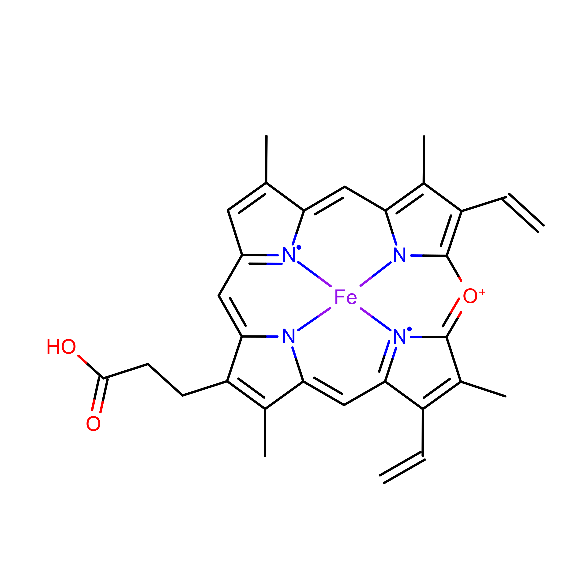
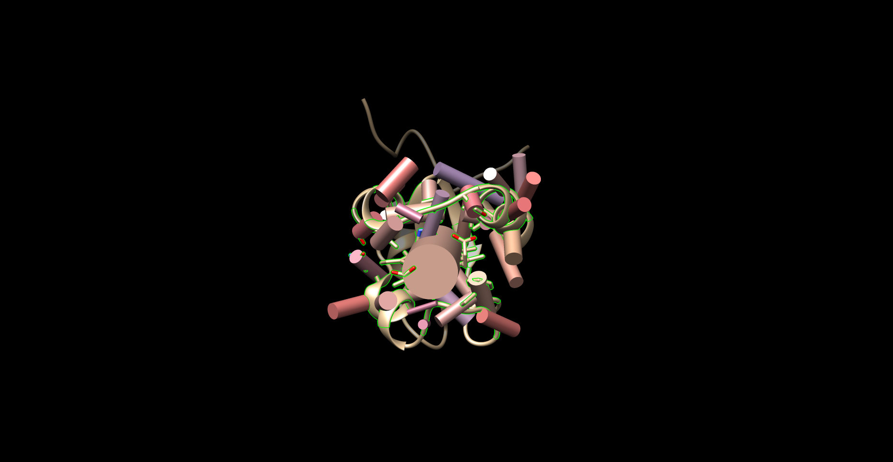

---
#####################
##  output format  ##
#####################
# The lines below makes the 'knit' button build the entire thesis 
# Edit the line 'thesis_formats <- "pdf"' to the formats you want
# The format options are: 'pdf', 'bs4', 'gitbook', 'word'
# E.g. you can build both pdf and html with 'thesis_formats <- c("pdf", "bs4")'
knit: (function(input, ...) {
    thesis_formats <- c("word");
    
    source("scripts_and_filters/knit-functions.R");
    knit_thesis(input, thesis_formats, ...)
  })

#####################
## thesis metadata ##
#####################
title: Structural Analysis of Hemoprotein Binding Sites
# #title: |
#   `oxforddown`: \
#   An Oxford University Thesis \
#   Template for R Markdown
author: Patrick Finnerty
college: Biosciences
university: Universtat Autònoma de Barcelona
university-logo: templates/UABlogo.pdf
university-logo-width: 8cm
submitted-text: Academic Tutor -- Prof. Jean-Didier Maréchal, Dept. of Chemistry  Thesis submitted for the degree of
degree: Master of Science
degreedate: Fall 2021
abstract: |
  `r paste(readLines("front-and-back-matter/_abstract.Rmd"), collapse = '\n  ')`
acknowledgements: |
  `r paste(readLines("front-and-back-matter/_acknowledgements.Rmd"), collapse = '\n  ')`
dedication: 
abbreviations: |
  `r paste(readLines("front-and-back-matter/_abbreviations.Rmd"), collapse = '\n  ')`

#######################
## bibliography path ##
#######################
bibliography: [bibliography/pat.bib,bibliography/super.bib,bibliography/hayashi.bib]
# bibliography/references.bib, bibliography/additional-references.bib]

########################
## PDF layout options ###
#########################
### submitting a master's thesis ###
# set masters-submission: true for an alternative, anonymous title page with 
# candidate number and word count
masters-submission: false
candidate-number: 123456
word-count: "10,052"

# if you want to use a different title page altogether, provide a path to a 
# .tex file here and it will override the default Oxford one
# alternative-title-page: templates/alt-title-page-example.tex

### abbreviations ###
abbreviations-width: 3.2cm
abbreviations-heading: List of Abbreviations


### citation and bibliography style ###
bibliography-heading-in-pdf: Works Cited

# biblatex options #
# unless you run into 'biber' error messages, use natbib as it lets you customise your bibliography directly
use-biblatex: true
bib-latex-options: "style=numeric-comp, sorting=none, backend=biber, maxcitenames=2, useprefix, doi=true, isbn=false, uniquename=false" #for science, you might want style=numeric-comp, sorting=none for numerical in-text citation with references in order of appearance
#original options:
  #style=authoryear
  #sorting=nyt

# natbib options #
# natbib runs into fewer errors than biblatex, but to customise your bibliography you need to fiddle with .bst files
use-natbib: false # to use natbib, set this to true, and change "output:bookdown::pdf_book:citation_package:" to "natbib"
natbib-citation-style: authoryear #for science, you might want numbers,square
natbib-bibliography-style: templates/ACM-Reference-Format.bst #e.g. "plainnat", unsrtnat, or path to a .bst file

### correction highlighting ###
corrections: true

### link highlighting ###
colored-not-bordered-links: true # true = highlight links by coloring text; false = highlight links with a border

# Set the link text/border coloring here, in RGB. 
# Comment out a variable to use whatever the text's existing color is.
# If printing a physical version of your thesis, you'll want to comment out all of these.
urlcolor-rgb: "0,0,139"     # web addresses
citecolor-rgb: "0,33,71"    # citations
linkcolor-rgb: "0,0,139"    # links to sections in your thesis

# Make page number, not text, be link in TOC, LOF, and LOT. Otherwise, section link
# highlighting may look a bit excessive.
toc-link-page-numbers: true

### binding / margins ###
page-layout: nobind #'nobind' for equal margins (PDF output), 'twoside' for two-sided binding (mirror margins and blank pages), leave blank for one-sided binding (left margin > right margin)

### position of page numbers ###
ordinary-page-number-foot-or-head: foot #'foot' puts page number in footer, 'head' in header
ordinary-page-number-position: C  #C = center, R = right, L = left. If page layout is 'twoside', O = odd pages and E = even pages. E.g. RO,LE puts the page number to the right on odd pages and left on even pages
chapter-page-number-foot-or-head: foot #you may want it to be different on the chapter pages
chapter-page-number-position: C

### position of running header ###
running-header: true #indicate current chapter/section in header?
running-header-foot-or-head: head
running-header-position-leftmark: LO #marks the chapter. If layout is 'nobind', only this is used.
running-header-position-rightmark: RE  #marks the section.


### draft mark ###
draft-mark: false # add a DRAFT mark?
draft-mark-foot-or-head: foot ##'foot' = in footer, 'head' = in header
draft-mark-position: C

### section numbering ###
section-numbering-depth: 2 # to which depth should headings be numbered?

### tables of content ###
toc-depth: 1 # to which depth should headings be included in table of contents?
lof: true # include list of figures in front matter?
lot: true # include list of tables in front matter?
mini-toc: true  # include mini-table of contents at start of each chapter? (this just prepares it; you must also add \minitoc after the chapter titles)
mini-lot: false  # include mini-list of tables by start of each chapter?
mini-lof: false  # include mini-list of figures by start of each chapter?

### code block spacing ###
space-before-code-block: 10pt
space-after-code-block: 8pt

### linespacing ###
linespacing: 22pt plus2pt # 22pt is official for submission & library copies
frontmatter-linespacing: 17pt plus1pt minus1pt #spacing in roman-numbered pages (acknowledgments, table of contents, etc.)

### other stuff ###
abstractseparate: false  # include front page w/ abstract for examination schools?
includeline-num: false #show line numbering in PDF?


#####################
## output details  ##
#####################
output:
  bookdown::pdf_book:
    citation_package: biblatex
    template: templates/template.tex
    keep_tex: true
    pandoc_args: "--lua-filter=scripts_and_filters/colour_and_highlight.lua"
    # We redefine the figure environment to avoid floating, per: https://stackoverflow.com/questions/16626462/figure-position-in-markdown-when-converting-to-pdf-with-knitr-and-pandoc
    # Only affects pdf output upon running index.Rmd
    # Comment out the next three lines to return to default 'float' behavior of figures
    fig_caption: yes 
    includes:
      in_header: preamble-latex.tex
  bookdown::bs4_book: 
    css: 
      - templates/bs4_style.css
      - templates/corrections.css # remove to stop highlighting corrections
    theme:
      primary: "#6D1919"
    repo: https://github.com/ulyngs/oxforddown
    pandoc_args: "--lua-filter=scripts_and_filters/colour_and_highlight.lua"
  bookdown::gitbook:
    css: templates/style.css
    config:
      sharing:
        facebook: false
        twitter: yes
        all: false
  bookdown::word_document2:
    toc: true   
link-citations: true
documentclass: book
always_allow_html: true #this allows html stuff in word (.docx) output
---


```{r install_packages, include=FALSE}
source('scripts_and_filters/install_packages_if_missing.R')
```

```{r create_chunk_options, include=FALSE, eval=knitr::is_latex_output()}
source('scripts_and_filters/create_chunk_options.R')
source('scripts_and_filters/wrap_lines.R')
```

<!--
  Include the create_chunk_options chunk above at the top of your index.Rmd file
This will include code to create additional chunk options (e.g. for adding author references to savequotes)
and to make sure lines in code soft wrap
If you need to create your own additional chunk options, edit the file scripts/create_chunk_options.R
-->

<!-- This chunk includes the front page content in HTML output -->
```{r ebook-welcome, child = 'front-and-back-matter/_welcome-ebook.Rmd', eval=knitr::is_html_output()}
```

<!--chapter:end:index.Rmd-->

---
#########################################
# options for knitting a single chapter #
#########################################
output:
  bookdown::pdf_document2:
    template: templates/brief_template.tex
    citation_package: biblatex
  bookdown::html_document2: default
  bookdown::word_document2: default
documentclass: book
#bibliography: [bibliography/references.bib, bibliography/additional-references.bib]
---

# Lay Summary {.unnumbered}

```{=tex}
\adjustmtc
\markboth{Lay Summary}{}
```

We investigated how heme, a molecule involved in many biological processes, binds to proteins. The study was conducted computationally. 3D structures of proteins were downloaded from a database, and run through software specialized for viewing molecules. This software was used to examine the region on the protein where heme binds (binding pocket). The software also predicted the volume and surface areas of the binding pocket. The data produced were analyzed using statistical software.

We found that a greater proportion of the binding pocket associates with the hydrophobic and uncharged parts of the heme molecules more frequently, and therefore likely more strongly, than previously thought. These results suggest that these hydrophobic, electrically inert parts of the pockets may be very important to consider when studying, or designing proteins containing heme. We also report the volume and surface area data that were predicted, which support the above conclusion and may also be of help when studying or designing these proteins.

<!--chapter:end:00-lay-summary.Rmd-->

---
#########################################
# options for knitting a single chapter #
#########################################
output:
  bookdown::pdf_document2:
    template: templates/brief_template.tex
    citation_package: biblatex
    extra_dependencies: 
  bookdown::html_document2: default
  bookdown::word_document2: default
documentclass: book
#bibliography: [bibliography/references.bib, bibliography/additional-references.bib]
---

# Introduction {.unnumbered}

```{=tex}
\adjustmtc
\markboth{Introduction}{}
```
<!-- For PDF output, include these two LaTeX commands after unnumbered chapter headings, otherwise the mini table of contents and the running header will show the previous chapter -->

Proteins that contain metal ion cofactor(s) are known as metalloproteins, and they compose approximately 40\% of all proteins. The metal ion can be free, or complexed with another molecule. One such molecule is heme, a complex of iron and a porphyrin ring. Heme is employed by many metalloproteins to catalyze a broad range of reactions[@Poulos2014]. 

There are many types of heme; but all of them are a coordination complex composed of an iron atom coordinated and bound to a modified porphyrin ring. Porphyins are composed of four pyrrole subunits (pentagonal structures of four carbons and a nitrogen) that are bound together via methine (i.e. carbon) bridges. Porphyrins are considered macrocycles, molecules with large ring structures. The ring within porphyrins is heterocyclic, and considered aromatic, and therefore acts as a large resonant structure capable of transferring electrons. Coupled with an iron atom to enable reduction-oxidation reactions and the macrocycle of the porphyrin ring, the overall heme complex is therefore highly suited for reactions involving electron transfer[@Kleingardner2015]. 

<!-- heme-b is proliferate it gets to have its own couple paragraphs -->
Proteins containing heme are known as hemoproteins - hemoglobin and myoglobin are well-known examples, using heme to store and transport oxygen. Other examples of hemoproteins are peroxidases, catalases (a type of peroxidase), nitric oxide synthases, heme oxygenases, and cytochrome p450s. Peroxidases and catalases catalyze oxidation-reduction reactions using a histidine-bound heme, with catalases in particular specializing in the decomposition of hydrogen peroxide. Nitric oxide synthases catalyze the reaction of L-arginine into nitric oxide, which is vitally important to cellular signaling [@Poulos2014]. Free heme molecules may be released upon degradation of hemoproteins (especially hemoglobin), however, heme is prooxidative and therefore toxic to cells and must be cleared. Heme oxygenases assist in the degradation of heme, and are regarded as potential therapeutics, due to anti-inflammatory effects[@Araujo2012].

The enzymes with arguably the most potential applications, cytochrome P450s function as powerful monooxygenases. They participate in many reactions: capable oxidizing a wide range of substrates, including carbohydrates, steroids, fatty acids; catalyzing hormone degradation and synthesis; and degrading the majority of drugs[@Poulos2014]. Due to their extraordinary utility and range of reactions, cytochrome p450s are of great interest in the protein engineering field. Cytochrome P450s have the potential to be used  in industrial biocatalysis, e.g. in pharmaceutical production, bioremediation of environmental pollutants[@Du2017; @Lalonde2016]. The limiting factor preventing its deployment has been the struggle to increase enzymatic efficiency and therefore yield of processes employing the enzyme[@Girvan2016; @Li2020]. 

Thus far, only heme-b and its respective hemoproteins have been discussed (although heme-b  is the most abundant and most employed type of heme). Other types of heme are structurally and chemically different, and are used to achieve different chemical reactions. In this study, we examined heme-b, heme-c, verdoheme, and siroheme. Their structures are shown in Figures 1-5, and each heme is individually discussed below.


## Types of Heme

### Heme-b

```{r structHEM, echo=FALSE,out.width="50%",fig.cap="Heme-b (HEM)",fig.show="hold",fig.align='center'}
knitr::include_graphics("figures/HEM.png")
```

The most common heme is heme-b. It is employed by the vast majority of hemoproteins. It is composed of an iron and porphyrin ring complex with attached vinyl and ethyl groups, and with the addition of two propionate groups. The iron atom is usually coordinated to a histidine or cysteine, depending on the enzyme[@Poulos2014; @Kleingardner2015].

The two propionate groups stabilize the heme in the pocket by forming polar interactions with salt bridges formed by arginine residues in the binding environment[@Barrows2005]. This behavior is the same for heme-b and likely verdoheme. It has also been suggested that the propionate groups may also serve to exclude solvent from the binding environment, potentially acting to expel and repel water molecules [@hayashi2009role].

### Heme-c


```{r structHEC, echo=FALSE,out.width="50%",fig.cap="Heme-c (HEC)",fig.show="hold",fig.align='center'}
knitr::include_graphics("figures/HEC.png")
```

Heme-c is derived from heme-b. It is fairly similar to heme, with two notable differences: the iron atom binds, with few exceptions, covalently to cysteine residues in the binding pocket; and its two vinyl groups form thioether bonds with amino acids in the protein binding pocket. Its function is much more specific than heme-b, mostly serving as an electron carrier rather than catalyzing a plethora of reactions. The reason for this is not abundantly clear, but several studies suggest that because of its covalent bonding, heme-c has an electronic potential that is can be far lower and in general more broad, and more specifiable, than heme-b. [@Bowman2008; @Kleingardner2015]

### Siroheme 

```{r structSRM, echo=FALSE,out.width="50%",fig.cap="Siroheme (SRM)",fig.show="hold",fig.align='center'}
knitr::include_graphics("figures/SRM.png")
```

Siroheme is even more limited in its applications, but highly specialized for its role. It is still an iron atom-porphyrin coordination complex, but it contains far more carboxyl and propionate groups than the other types of heme, making it highly polar. It is used exclusively in sulfite and nitrite reductases, which catalyze the reduction of the sulfates and nitrates plants uptake from the ground, providing the sources of nitrogen and sulfur used to produce nitrogen and sulfur-containing amino acids[@Tripathy2010]. The reason for the use of siroheme in this reaction rather than heme-b is not completely understood. But one study suggests that the bridge that siroheme forms between its catalyic iron atom, and the protein matrix environment (which also necessarily involves another cofactor, a cluster of cubane for electron transfer and provision) is more efficient at channeling electrons than the bridge that could be formed by heme.[@Branzanic2019] 

### Verdoheme

```{r structVEA, echo=FALSE,out.width="50%",fig.cap="Verdoheme (VEA)",fig.align='center'}

```
```{r structVER, echo=FALSE,out.width="50%",fig.cap="Verdoheme (VER)",fig.align='center'}

```

Lastly, verdoheme is an intermediate product in the degradation of heme-b by heme oxygenase. When heme oxygenase degrades heme-b, biliverdin, carbon monoxide, and iron are produced; verdoheme is the precusor to bilverdin[@Lai2010; @Sato2007]. While a product of prior reactions wthin heme oxygenase, verdoheme appears to be oriented and bound differently [@Lad2004]. The two structures used in the study, VEA and VER, are verdoheme at different stages of degradation, either partially oxidized or containing one less propionate group.

In summary, heme molecules can have very different structures and functions; they enable and catalyze an extraordinary amount, and extraordinarily diverse set of chemical reactions. They are important, not only as a study of how one class of molecule can be involved in a broad swath of reactions, but because hemoproteins have the potential to be of great value in biocatalysis, bioremediation, and pharmaceutical applications. 

There is a significant barrier to the employment of hemoproteins in these areas, however: improving their efficiency far beyond what is found in nature. This is the field of artifical metalloproteins, or metalloenzymes: engineering metalloenzymes to improve them; increasing efficiency, stability, or even to introduce new reactions to heme's repetoire.

There are multiple methods employed to design these molecules, but rational design in particular (basically, the mutation of certain residues based on an understanding of the structure-function relationships) is at least partially hampered by an incomplete understanding of the binding environment for heme. For example, the importance of the binding environment was noted in a study seeking to design *de novo* heme-c based enzymes, and found the binding environment likely to be of importance in modulating redox potential [@Ishida2004].

A fairly recent study conducted a structural analysis of 125 hemoprotein chains[@Li2011]. The study suggested hemoproteins undergo small conformational changes during binding; and that apo-form (ligand-containing) proteins may therefore be suitable for bioinformatics-based prediction and protein design. Additionally, the heme binding environments for both heme-b and heme-c were analyzed, and relative frequencies per amino acid were reported. Cysteine, histidine, phenylalanine, methionine, and tyrosine were found to be the most abundant residues within the binding environments of both heme-b and heme-c. 

<!-- Don't repeat their analysis, I think... -->
<!-- Heme-c in particular exhibited a very high frequency of cysteine residues in the binding environment; reasonable given the necessary formation of thioether bonds. Nonpolar residues, aromatic and hydrophobic, were found to have greater than background frequency, suggesting importance interacting with the porphyrin ring. Arginine was in     -->

The aforementioned study was published in 2011 -- since then the PDB has been populated with far more hemoproteins. The focus of the study was on conformational differences induced by heme-binding, rather than the binding environment, although the relative frequencies of amino acids were reported. Interactions of the more abundant residues with heme-b or heme-c, including interactions with the porphyrin ring, were briefly discussed and this discussion will not be reproduced here. 

In this study, we present research focused on elucidating the binding environment of multiple heme molecules: heme-b (HEM), heme-c (HEC), siroheme (SER), and verdoheme (VEA/VER). A diverse set of PDBs was assembled. UCSF Chimera was used to both extract and predict properties of a diverse set of hemoproteins. R was used to analyze the results. A robust and high-throughput framework was constructed to process the datasets for each heme molecule, requiring only inputs of which ligand was to be examined per dataset.

The properties extracted and predicted of the heme molecules' binding environments were: the amino acid frequencies; the distances of the amino acids from the heme iron; the volume of the binding pocket; and the surface areas of both the hemes and the binding pocket. These data can be expected to be of use, or at least of interest, to efforts in artifical metalloenzyme design.

Additionally, angular data for the residues within the binding environment were obtained. These data were produced more for exploratory purposes and are not discussed extensively in this study. Specifically, planar angles and the angle between residues' alpha-carbon, beta-carbon, and heme iron (CA-CB-Fe) were obtained.

These results may be of use in rational design of hemoproteins in future studies, or at least, improve the understanding of the heme binding environment. 

<!--chapter:end:01-introduction.Rmd-->

---
#########################################
# options for knitting a single chapter #
#########################################
output:
  bookdown::pdf_document2:
    template: templates/brief_template.tex
    citation_package: biblatex
  bookdown::html_document2: default
  bookdown::word_document2: default
documentclass: book
#bibliography: [bibliography/references.bib, bibliography/additional-references.bib]
---


```{=tex}
\adjustmtc
\markboth{Methods}{}
```

# Methods {#methods}
<!-- \minitoc -->
All scripts (as well as raw data, results, and this document) are available on GitHub[@Finnerty_hemebinding_2021].


## Datasets
\noindent A list of PDBs was assembled that represented either a representative sample of a variety of proteins, with a resolution better than 3A, (HEM and HEC) or, all proteins containing these ligands were downloaded from the PDB (in the case of SRM, VER, VEA). Not all downloaded PDBs were appropriate for this study (e.g. contained superimposed structures) and therefore the amount of PDBs was culled. The datasets are current as of 16 August 2021. 

The size of the datasets actually used in the study were as follows: HEM (n=58), HEC(n=13), SRM (n=9), VER (n=2) and VEA (n=2), which are merged for a combined n=4 for VERDOHEME. 

The name of all proteins used in the study and their source organism are provided tables within Appendix \@ref(molOrgSec).

## Pre-processing
Many of the PDBs downloaded were multimeric structures. The number of subunits per protein would skew results and overrepresent especially large multimeric proteins. Therefore, to only allow for one heme binding site per PDB, all downloaded PDBs were converted to monomeric structures. This was achieved by saving a single chain (chain A) of each PDB and eliminating all other chains. The single chain was then saved as a PDB and used in all subsequent scripts. Part of the script is reproduced below:
<!-- BTW, need install.packages('reticulate') for this to work -->
```{python eval=FALSE}
from chimera import runCommand as rc
# select chain A, a single unit
rc("sel :.a")
# select everything else
rc("sel invert sel")
# delete everything else besides that chain A
rc("del sel")
# now save the monomer:
rc(("write format pdb 0 "+unexpandedResultPath+activeLigand+"/%s")%
  (fn + ".mono.pdb"))
```

## Processing Monomers

UCSF-Chimera was used to generate all data in this study. Multiple Python scripts were employed to achieve a high-throughput process where all monomeric PDBs could be processed in the same session. 

Chimera was used to predict the following qualities: Volume of the ligand binding pocket, accessible and excluded surface area of the ligand, and accessible and excluded surface area of the binding pocket. These calculations require a population of atoms to be selected for the calculation. 

Atoms were selected within a distance cutoff, to be considered as potentially interacting with the ligand or forming the binding pocket. Distance cutoffs from the ligand of 5A and 7A were chosen; for the predicted qualities, the algorithms were run twice to get values at 5A and 7A. For the distance and angle calculations, only the 7A distance cutoff was used, as the cutoff does not factor into any calculations and may be set during analysis.

As these cutoffs are selected arbitrarily, data from the 5A and 7A runs are overlaid in the figures reported in Appendix \@ref(a-figures). Data tables are also provided in Appendix \@ref(a-tables).

### Amino Acid Frequency
Amino acids within the bounds of the lower and upper distance cutoff were selected and recorded. These were then counted for frequency per residue.

### Volume Calculations

Volume of the binding pocket was predicted via Surfnet [@Laskowski1995], and run with default parameters of Grid Interval = 1.0 and Distance Cutoff = 10.0 (the latter option does not relate to the distance cutoff from the ligand). Surfnet is the molecular volume calculation tool implemented within UCSF Chimera. The script used selects the residues around heme to consider as the bounds of the pocket, but effectively ignores heme's presence as its calculates the volume, as if the pocket were empty:
```{python eval=FALSE}
from chimera import runCommand as rc
# Select the atoms within 7A of heme. 
#Then, of that selection, keep everything but heme.
rc("sel :"+activeLigand+" za < "+angstromDistance)
# this is the syntax that accomplishes our desired selection
rc("sel sel &~:"+activeLigand) 
interface_surfnet("sel","sel")
rc("sop split #") # acquire the individual pockets that have been generated
rc("measure volume #") # measures volume of individual pockets
# in R we keep only the largest volume
```

Surfnet, at least in this investigation, was prone to generating very small volumes. During analysis these were removed and only the largest volume generated is recorded, since the largest volume generated and identified is most likely the binding pocket. Two figures below demonstrate a run where one good pocket is produced, and one where a few very small "bubbles" are generated:


```{r goodExample, echo=FALSE,out.width="70%",fig.cap="Good Example of Surfnet Run (1B2V)",fig.show="hold",fig.align='center'}
knitr::include_graphics("figures/1B2V.good.png")
```


```{r badExample, echo=FALSE,out.width="70%",fig.cap="Non-Ideal Example of Surfnet Run (1DKH)",fig.show="hold",fig.align='center'}
knitr::include_graphics("figures/1DKH.bad.png")
```


### Surface Area Calculations {#SAmethods}

Solvent excluded and solvent accessible surface areas of both the ligand and the binding pocket were calculated using Chimera's "surf" algorithm, which itself is an implementation of a program called MSMS [@Sanner1996]. 

These two measures are similar but not the same. Solvent accessible surface area represents the surface area of the protein that a solvent molecule (i.e. water) may interact with. It is calculated by rolling a sphere on the Van der Waals surface of the protein, and the *center of the sphere* is recorded as the bounds of the accessible surface area. Solvent excluded surface area is calculated the same way, rolling a sphere on the Van der Waals surface of the protein, but instead the *point of contact of the sphere against the Van der Waals surface* is recorded as the excluded surface area. The solvent excluded surface area  may therefore be considered the bounds of the protein itself, versus the solvent accessible surface area, which can be considered the bounds at which a solvent may interact with the protein[@Sanner1996].  

### Distance Calculations

Distances of amino acids from the ligand could not be calculated accurately nor precisely in a direct way. Instead, distances for each atom composing a residue were calculated. This was achieved using a built-in function of chimera; the syntax is not straightforward, but part of the script is shown below. The distances of all atoms within a residue were averaged, and this value was taken as the mean distance of the entire residue and used in subsequent steps.
```{python eval=FALSE}
from chimera import runCommand as rc
#select and define the Fe atom
rc("sel :HEM@Fe") 
# index to acquire the one atom selected
fe = chimera.selection.currentAtoms()[0] 
# select all atoms within angstromDistance of Fe (also de-selects Fe)
rc("sel sel za < "+settings.angstromDistance) 
# define this selection of atoms within distance as a list
nearbyAtoms = chimera.selection.currentAtoms()
# parse and print the distances (and coordinates) of these atoms 
for i in nearbyAtoms:
  print "Atom being analyzed...", i, "... Distance to Fe...",
  #prints distance between atom i and the Fe atom
  i.coord().distance(fe.coord())  
```


The data produced in this step therefore include the mean distance of each amino acid. Distances are traceable per residue and atoms in each residue; this data was used to construct the distributions of amino acids over distance, and the angular data below are cross-referenced with this list of distances. 

### Planar Angle Calculations

Individual residues and the ligand were defined as axes. The angle between each residue's axis and the axis of the ligand were calculated. Each axis functions essentially as a separate plane. This employed the "define axis", and "angle" functions of Chimera; the Axes/Planes/Centroids Structural Analysis function of Chimera via GUI. 

```{r axesExample, echo=FALSE,out.width="100%",fig.cap="Example of Planar Angles Calculation (1B5M)",fig.show="hold",fig.align='center'}

```

### CA-CB-Fe Calculations
Residues within the distance cutoff were examined one by one. The angle of between each residue's carbon alpha (CA) and carbon beta (CB) and the Fe of the ligand was calculated, using the "angle" function of Chimera. The ligand nor the Fe atom were compared with themselves.

## Import to R
The data produced by Chimera and the Python scripts were stored as .txt files. These files were imported to R and processed from .txt files into organized data formats. All plots and tables were constructed using R and imported directly to this document using Rmarkdown. 

<!--chapter:end:02-methods.Rmd-->

---
#########################################
# options for knitting a single chapter #
#########################################
output:
  bookdown::pdf_document2:
    template: templates/brief_template.tex
    citation_package: biblatex
  bookdown::html_document2: default
  bookdown::word_document2: default
documentclass: book
#bibliography: [bibliography/references.bib, bibliography/additional-references.bib]
---

```{=tex}
\adjustmtc
\markboth{Introduction}{}
```

<!-- Leave this section empty unless a real results section becomes justified somehow -->

<!--chapter:end:03-results.Rmd-->

---
#########################################
# options for knitting a single chapter #
#########################################
output:
  bookdown::pdf_document2:
    template: templates/brief_template.tex
    citation_package: biblatex
  bookdown::html_document2: default
  bookdown::word_document2: default
documentclass: book
#bibliography: [bibliography/references.bib, bibliography/additional-references.bib]
---


```{=tex}
\adjustmtc
\markboth{Discussion}{}
```


# Results and Discussion {#discussion}
<!-- \minitoc -->


## Analysis of Residues Nearby Each Heme Molecule {#disc-aaFreq}

We began the study by acquiring data to elucidate and quantify the propensity of amino acids to interact with heme (HEM, HEC, SRM, VEA/VER) in its binding environment. This study focused on potential interactions with the entire heme molecule, including the porphyrin ring and attached groups; therefore, any amino acids with potential interactons with the heme iron, porphyrin ring, or groups on the porphyrin ring (e.g. vinyl, propionate groups), were included in the data gathered for this section. A potentially interacting amino acid was therefore defined as any amino acid with at least one atom within the distance cutoffs (5 and 7 Angstroms (A)) from the heme *molecule*. 

Amino acid frequencies were obtained for residues within the distance cutoffs of 5A and 7A - these data are overlaid in several figures in Appendix \@ref(figs-aaFreqOverlaid). The trends in these data are very similar and therefore only the data pertaining to the 7A distance cutoff are discussed below.


### Heme-b

#### Amino Acid Frequencies in Binding Pocket

Figure \@ref(fig:HEM-AAfreq) plots the frequency of each residue within 7A of heme-b. 

<!-- Immediately below is Figure \@ref(fig:HEM-AAfreqAll), which plots the frequency of each residue within the entire monomer.  -->

```{r HEM-AAfreq,fig.cap="HEM: AA Frequency within 7A",echo=FALSE, message= FALSE, warning=FALSE, results=FALSE}
load("mainData.RData")
activeLigand = "HEM"
library(dplyr) 
library(data.table)
library(tidyr)
library(ggplot2) 
library(stringr)
library(knitr)
library(clipr) # Linux) sudo apt-get install xclip ... R)install.packages("clipr")  
source("~/heme-binding/scripts/r/addpdbcol.R")
library(kableExtra) 

print(ggplot(eval(parse(text=paste(activeLigand,"_aaFreqDf",sep=""))),aes(x= reorder(Residue,-Freq),y=Freq))  +
      geom_bar(stat="identity",position = "identity", alpha=1) +
      labs(x = "Residue",y="Frequency", title = paste(activeLigand,": AA Frequency within 7A of ",activeLigand,sep='')) +
      theme(axis.text.x = element_text(angle = 45, vjust = 1, hjust=1)))

```


```{r HEM-t-AAfreq,echo=FALSE, message= FALSE, warning=FALSE}
# declarations

load("mainData.RData")
activeLigand = "HEM"
library(dplyr) 
library(data.table)
library(tidyr)
library(ggplot2) 
library(stringr)
library(knitr)
library(clipr) # Linux) sudo apt-get install xclip ... R)install.packages("clipr")  
source("~/heme-binding/scripts/r/addpdbcol.R")
library(kableExtra) 

HEM_aaFreqDf %>%
  kable(longtable = T, booktabs = T, caption = "HEM: AA Frequency Table within 7A") %>%
  kable_styling(latex_options = c("striped","repeat_header"))

```


Beginning at the left of Figure \@ref(fig:HEM-AAfreq) and moving right, large, nonpolar amino acids appear most frequently within 7A: LEU and PHE; ILE appears less frequently than these two amino acids but nonetheless is in high frequency. Small, nonpolar amino acids ALA and VAL also appear very frequently. As the majority of the heme-b molecule is made up of the nonpolar porphyrin ring, these amino acids are therefore likely in such high frequency to provide the nonpolar interactions with the pyrole groups and methyl and vinyl groups. 

Tyrosine, arginine, histidine appear next most frequently. The two propionate groups on heme make polar interactions with salt bridges formed between arginine groups within the binding environment[@Barrows2005]. Therefore, the tyrosine and histidine likely form polar interactions with the portion of the propionate groups not interacting with the arginine salt bridges. This, in addition to the nonpolar interactions above, likely provides as hospitable of a binding environment as possible to coordinate the heme. It should be noted histidine is one of the residues that coordinates the iron atom, and this may therefore increase its frequency in the binding pocket.

Glycine is a small residue and cannot form significant interactions within its environment; however, its frequency, or lack thereof (compared to background frequency, discussed below), suggests the binding pocket may not require as much flexibility or spatial considerations as in the rest of the protein.

Next appear serine, glutamate (glutamic acid) and aspartate (aspartic acid) and lysine. These are polar residues, and glutamate and aspartate are negatively charged; lysine is polar too, but positively charged (at pH 7). The negative charge on glutamate and aspartate may explain why they are fairly infrequent: although polar, the negative charge may induce a repulsion effect with the propionate groups. Or, it may be that other amino acids are preferable, as is likely the case for lysine. Lysine is polar and positively charged; but arginine residues forms the salt bridges necessary for propionate to make polar interactions. And histidine coordinates the heme iron. Therefore the infrequency of lysine may be less due to a problem with lysine and more due to a preference for other polar amino acids.

Proline is a small nonpolar amino acid in low frequency; the trend for heme-b, at least, appears to be to favor large nonpolar amino acids in the binding pocket. This may suggest that a large amount of nonpolar interactions, per residue, is favored in the binding pocket, perhaps because of the limited space available to position residues to interact with heme.

Asparagine and glutamine are both medium-sized polar amino acids; given the trends already discussed it is surprising these are not in greater abundance. But as with proline, it may simply be a matter of maximizing the benefit of the interactions that may be formed with the heme; while asparagine and glutamine are polar, amino acids like arginine and histidine are both polar and positively charged (and arginine forms salt bridges), capable of stronger interactions with the electronegative propionate groups.

Methionine and tryptophan appear very infrequently in the binding pocket. Tryptophan is very surprising to find as second-to-least frequent. It is a large nonpolar amino acid - but perhaps its single, potential hydrogen bond, although weak, is enough to prefer completely nonpolar residues. Or, with its size, it is preferable to have more numerous, smaller nonpolar residues that can favorably interact with the porphyrin while reducing steric hindrance of other residues in the environment. The reason for methionine's low frequency is not clear, perhaps for similar reasons as with proline, where more intensely nonpolar residues are preferred, rather than less nonpolar residues being unfavorable.

Cystine appears most infrequently of all the amino acids in the binding pocket. This is quite  surprising - cystine is the other highly conserved residue that may coordinate the heme iron. Perhaps the sample of PDBs used in this study mostly use histidine to coordinate the iron - but this would only account for one residue in the binding pocket per pdb. Therefore these results suggest that while cystidine may be well suited to coordinate the iron in heme, it is poorly suited to form any nonpolar interactions with the porphyrin ring, leaving the task up to other, more suitably, intensely nonpolar amino acids.

Moving away from discussing individual amino acid populations, what is especially notable of the data for heme-b is that nonpolar residues appear in much greater frequency than polar residues. Nonpolar interactions with heme are therefore more numerous than polar interactions. Their multiplicity may also suggest that they are potentially of greater importance than previously thought. At the very least, these results suggest that polar interactions and coordination of the iron atom, while necessary for heme binding, are insufficient, and that nonpolar interactions and the population of nonpolar residues in the binding pocket should be considered when examining the binding environment of heme.

#### Comparison with Background Amino Acid Frequencies

While the frequencies of amino acids in the binding pocket have been discussed, it may also be of interest to compare against the background amino acid frequency, the general frequency of amino acids within the entire monomer. The degree to which any results may affect the significance of the frequencies of the amino acids in the binding pocket is unclear - those amino acids are interacting with the heme. However, an in depth examination of similarities and differences may reveal that some amino acids may simply be extremely highly conserved by chance and by virtue of their numerous population, rather than some chemical benefit.

```{r HEM-AAfreqAll,fig.cap="HEM: AA Frequency of Monomer",echo=FALSE, message= FALSE, warning=FALSE, results=FALSE}
load("mainData.RData")
activeLigand = "HEM"
library(dplyr) 
library(data.table)
library(tidyr)
library(ggplot2) 
library(stringr)
library(knitr)
library(clipr) # Linux) sudo apt-get install xclip ... R)install.packages("clipr")  
source("~/heme-binding/scripts/r/addpdbcol.R")
library(kableExtra) 

print(ggplot(eval(parse(text=paste(activeLigand,"_aaFreqAllDf",sep=""))),aes(x= reorder(Residue,-Freq),y=Freq))  +
      geom_bar(stat="identity",position = "identity", alpha=0.65) +
      labs(x = "Residue",y="Frequency", title = paste(activeLigand,": AA Frequency of Monomer",sep='')) +
      theme(axis.text.x = element_text(angle = 45, vjust = 1, hjust=1)))

```


Figure \@ref(fig:HEM-AAfreqAll) documents the frequencies of amino acids overall within the monomer.

Leucine and alanine, as in the binding pocket frequencies, are highly frequent in the overall monomer. This may suggest their prevalence in the binding pocket may simply be due to a high population of leucine and alanine in hemoproteins.

However, after these two amino acids the tendencies in frequency for the binding pocket and the monomer at large diverge. Glycine is in high frequency - likely due to more complex geometry e.g. helices outside the binding pocket. In interest of brevity, the remaining frequencies are summed up thus: the same trends that appear to exist in the binding pocket do not appear to exist in the monomer at large. While the order of frequencies in conserved binding pockets can be rationalized, justifying the overall frequencies in monomers invites significant speculation. 


#### Distributon of Amino Acids by Distance

```{r HEM-AAdist,fig.cap="HEM: Residue Distribution by Distance",echo=FALSE, message= FALSE, warning=FALSE, results=FALSE}
load("mainData.RData")
activeLigand = "HEM"
library(dplyr) 
library(data.table)
library(tidyr)
library(ggplot2) 
library(stringr)
library(knitr)
library(clipr) # Linux) sudo apt-get install xclip ... R)install.packages("clipr")  
source("~/heme-binding/scripts/r/addpdbcol.R")
library(kableExtra) 

eval(parse(text=paste(activeLigand,"_distList$mean_distances",sep=""))) %>%
      dplyr::select(Residue_Code,Mean_Distance) -> tmpDist 
   
   distanceDist <- ggplot(tmpDist,aes(x=Residue_Code,y=(as.numeric(as.character(Mean_Distance))),fill=Residue_Code)) + 
      geom_violin(trim=FALSE) +
      labs(title = paste(activeLigand,": Distribution of Residues by Mean_Distance",sep=''), x="Residue",y="Mean_Distance (Å)") +
      theme(axis.text.x = element_text(angle = 45, vjust = 1, hjust=1))

   print(distanceDist)
   
```

After an exhaustive exploration of the relative frequencies of amino acids in the binding pocket, Figure \@ref(fig:HEM-AAdist) below is fairly straightfoward. It plots the distribution of amino acids in the binding pocket against their distance from the iron of the heme. 

We find that only a few residues come in close contact (<4A) of the heme: cysteine, histidine, and tyrosine. Most residues center their distribution at around 6A, although lysine seems more biased than the remaining residues to be a bit closer. Cysteine and histidine may be at least in part explained to be close due to their use as coordinating residues; histidine, being in greater frequency, may also be this close due to favorable interactions with the porphyrin ring. 

The proximity of tyrosine  however, is more notable. It cannot form coordination bonds with the heme iron, but tyrosine residues do interact with the propionate groups. Tyrosine is also required for redox reactions, and part of the population of tyrosine residues may therefore be in close proximity to heme to facilitate electron transfer in various enzymes [@Poulos2014]. These results suggest that of all potentially interacting polar/positively charged residues, tyrosine is the most likely at least to be in close proximity to the heme molecule. Whether this illustrates an importance of tyrosine to interact with propionate groups, or instead the need for tyrosine to be in close proximity in order to form such interactions, or simply demonstrates involvement in oxidation/reduction reactions, is beyond the scope of this study. 

### Heme-c


#### Amino Acid Frequencies in Binding Pocket

```{r HEC-AAfreq,fig.cap="HEC: AA Frequency within 7A",echo=FALSE, message= FALSE, warning=FALSE, results=FALSE}
load("mainData.RData")
activeLigand = "HEC"
library(dplyr) 
library(data.table)
library(tidyr)
library(ggplot2) 
library(stringr)
library(knitr)
library(clipr) # Linux) sudo apt-get install xclip ... R)install.packages("clipr")  
source("~/heme-binding/scripts/r/addpdbcol.R")
library(kableExtra) 

print(ggplot(eval(parse(text=paste(activeLigand,"_aaFreqDf",sep=""))),aes(x= reorder(Residue,-Freq),y=Freq))  +
      geom_bar(stat="identity",position = "identity", alpha=1) +
      labs(x = "Residue",y="Frequency", title = paste(activeLigand,": AA Frequency within 7A of ",activeLigand,sep='')) +
      theme(axis.text.x = element_text(angle = 45, vjust = 1, hjust=1)))

```

Leucine and alanine again are highly frequent for HEC, followed by quite similar trends, and therefore HEC will not be as thoroughly discussed as HEM. The most notable differences may be that GLY and CYS are in far higher frequency than in heme. Heme-c almost always forms covalent bonds with cysteine residues, and this may explain that frequency. But as for the high frequency of glycine, the reason for its abundance is unclear, although it seems it may have an important role in heme-c pockets. 

```{r HEC-t-AAfreq,echo=FALSE, message= FALSE, warning=FALSE}
# declarations

load("mainData.RData")
activeLigand = "HEC"
library(dplyr) 
library(data.table)
library(tidyr)
library(ggplot2) 
library(stringr)
library(knitr)
library(clipr) # Linux) sudo apt-get install xclip ... R)install.packages("clipr")  
source("~/heme-binding/scripts/r/addpdbcol.R")
library(kableExtra) 

HEC_aaFreqDf %>%
  kable(longtable = T, booktabs = T, caption = "HEC: AA Frequency Table within 7A") %>%
  kable_styling(latex_options = c("striped","repeat_header"))

```


<!-- perhaps the covalent binding of CYS is sufficient for other interactions to be of lesser importance, to be unnecessary to stabilize the heme-c, and therefore the shape of the binding pocket may become of greater importance, and rather than maximizing other favorable interactions, more glycines are included in order to shape the pocket correctly. -->
#### Comparison with Background Amino Acid Frequencies

```{r HEC-AAfreqAll,fig.cap="HEC: AA Frequency of Monomer",echo=FALSE, message= FALSE, warning=FALSE, results=FALSE}
load("mainData.RData")
activeLigand = "HEC"
library(dplyr) 
library(data.table)
library(tidyr)
library(ggplot2) 
library(stringr)
library(knitr)
library(clipr) # Linux) sudo apt-get install xclip ... R)install.packages("clipr")  
source("~/heme-binding/scripts/r/addpdbcol.R")
library(kableExtra) 

print(ggplot(eval(parse(text=paste(activeLigand,"_aaFreqAllDf",sep=""))),aes(x= reorder(Residue,-Freq),y=Freq))  +
      geom_bar(stat="identity",position = "identity", alpha=0.65) +
      labs(x = "Residue",y="Frequency", title = paste(activeLigand,": AA Frequency of Monomer",sep='')) +
      theme(axis.text.x = element_text(angle = 45, vjust = 1, hjust=1)))

```

Generally, the heme-c monomer AA frequency profile appears similar to the heme-b monomer, with a high frequency of alanine and leucine, followed by a divergence in the frequency of amino acids and therefore a struggle to form any meaningful discussion when it comes to comparing the binding pocket frequencies against background frequencies.  

#### Distributon of Amino Acids by Distance

```{r HEC-AAdist,fig.cap="HEC: Residue Distribution by Distance",echo=FALSE, message= FALSE, warning=FALSE, results=FALSE}
load("mainData.RData")
activeLigand = "HEC"
library(dplyr) 
library(data.table)
library(tidyr)
library(ggplot2) 
library(stringr)
library(knitr)
library(clipr) # Linux) sudo apt-get install xclip ... R)install.packages("clipr")  
source("~/heme-binding/scripts/r/addpdbcol.R")
library(kableExtra) 

eval(parse(text=paste(activeLigand,"_distList$mean_distances",sep=""))) %>%
      dplyr::select(Residue_Code,Mean_Distance) -> tmpDist 
   
   distanceDist <- ggplot(tmpDist,aes(x=Residue_Code,y=(as.numeric(as.character(Mean_Distance))),fill=Residue_Code)) + 
      geom_violin(trim=FALSE) +
      labs(title = paste(activeLigand,": Distribution of Residues by Mean_Distance",sep=''), x="Residue",y="Mean_Distance (Å)") +
      theme(axis.text.x = element_text(angle = 45, vjust = 1, hjust=1))

   print(distanceDist)
   
```

The distribution of amino acids over distance from the heme iron for HEC is similar to HEM, with some exceptions. Cys, His, Tyr again are amongst the closest residues to HEC, likely for the same reasons of very strong polar interactions or coordination. Additionally, cysteine forms covalent, thioether bonds with heme-c, providing further justification for its proximity. However, for heme-c, lysine and methionine also are very proximal. The methionine residues are nonpolar, small, neutral; lysine is polar and positively charged; neither of these residues are favored to be included in the heme-b binding environment despite very similar structures. The reason for their inclusion so close to the binding pocket is therefore unclear, but based on their distribution, and lysine being even more close proximity than heme, the results suggest these two residues may have important roles.

### Verdoheme

#### Amino Acid Frequencies in Binding Pocket

```{r VERDOHEME-AAfreq,fig.cap="VERDOHEME: AA Frequency within 7A",echo=FALSE, message= FALSE, warning=FALSE, results=FALSE}
load("mainData.RData")
activeLigand = "VERDOHEME"
library(dplyr) 
library(data.table)
library(tidyr)
library(ggplot2) 
library(stringr)
library(knitr)
library(clipr) # Linux) sudo apt-get install xclip ... R)install.packages("clipr")  
source("~/heme-binding/scripts/r/addpdbcol.R")
library(kableExtra) 

print(ggplot(eval(parse(text=paste(activeLigand,"_aaFreqDf",sep=""))),aes(x= reorder(Residue,-Freq),y=Freq))  +
      geom_bar(stat="identity",position = "identity", alpha=1) +
      labs(x = "Residue",y="Frequency", title = paste(activeLigand,": AA Frequency within 7A of ",activeLigand,sep='')) +
      theme(axis.text.x = element_text(angle = 45, vjust = 1, hjust=1)))

```

```{r VERDOHEME-t-AAfreq,echo=FALSE, message= FALSE, warning=FALSE}
# declarations

load("mainData.RData")
activeLigand = "VERDOHEME"
library(dplyr) 
library(data.table)
library(tidyr)
library(ggplot2) 
library(stringr)
library(knitr)
library(clipr) # Linux) sudo apt-get install xclip ... R)install.packages("clipr")  
source("~/heme-binding/scripts/r/addpdbcol.R")
library(kableExtra) 

VERDOHEME_aaFreqDf %>%
  kable(longtable = T, booktabs = T, caption = "VERDOHEME: AA Frequency Table within 7A") %>%
  kable_styling(latex_options = c("striped","repeat_header"))

```

The frequqency of amino acids in the binding pocket for verdoheme is dissimilar from heme-b and heme-c above. This is fairly surprising, given that verdoheme is an intermediate in the binding pocket for heme-b within heme oxygenases. 

<!-- The results discussed below may be attributable to the small sample size of verdoheme PDBs (n=4, combining VEA and VER), and should be appreciated with some skepticism. Nonetheless, the results will be discussed. -->

Leucine and alanine are again most frequent, but after these, results diverge. Tyrosine and arginine are next most frequent - surprising, given that this is still the same pocket that bound heme-b. The data for heme-b indicate more frequent nonpolar residues before tyrosine. Chemically, it may be that as heme-b is oxidized, there is greater need for polar interactions; this would help to explain the high frequency of polar residues, but does not explain the shift in amino acid frequencies within what would be expected to be a similar binding pocket - all verdoheme PDBs in this in study were sourced from heme oxgenase proteins. Some heme oxygenases are included for heme-b, but they are amongst a diverse set of proteins. Therefore, the heme oxygenase environment may simply be host to more polar residues than normal for hemoproteins. This also agrees with tyrosine's inclusion in redox reactions, and it may be favored to be present in heme oxygenase. These results indicate more about the heme oxygenase environment than the verdoheme binding environment - however, these two are inseparable, given verdoheme only appears in heme oxygenase. A dedicated investigation to the heme binding environment for heme oxygenase, may therefore be warranted in future study. 

Glycine is the next most frequent - it is in lower frequency, relatively, for heme-b. As with other heme molecules, it is not clear as to what the role of glycine is in binding verdoheme. 

#### Comparison with Background Amino Acid Frequencies

```{r VERDOHEME-AAfreqAll,fig.cap="VERDOHEME: AA Frequency of Monomer",echo=FALSE, message= FALSE, warning=FALSE, results=FALSE}
load("mainData.RData")
activeLigand = "VERDOHEME"
library(dplyr) 
library(data.table)
library(tidyr)
library(ggplot2) 
library(stringr)
library(knitr)
library(clipr) # Linux) sudo apt-get install xclip ... R)install.packages("clipr")  
source("~/heme-binding/scripts/r/addpdbcol.R")
library(kableExtra) 

print(ggplot(eval(parse(text=paste(activeLigand,"_aaFreqAllDf",sep=""))),aes(x= reorder(Residue,-Freq),y=Freq))  +
      geom_bar(stat="identity",position = "identity", alpha=0.65) +
      labs(x = "Residue",y="Frequency", title = paste(activeLigand,": AA Frequency of Monomer",sep='')) +
      theme(axis.text.x = element_text(angle = 45, vjust = 1, hjust=1)))

```

Besides the frequencies of leucine and alanine, which have been found for heme-b and heme-c above to be highly frequent in hemoproteins at large, the frequency profiles for the verdoheme binding environment and monomers is shown to be quite dissimilar, supporting the results for the binding environment as unique, not simply due to background frequency. 

#### Distributon of Amino Acids by Distance

The low sample size for verdoheme leads here to a poor figure with few residues plotted. This is likely attributable to an insufficient amount of distances and residues to cross-reference against each other, an operation that successfully occurs for all similar graphs. Regardless, the data that are plotted will be discussed.

The highly conserved histidine for hemoproteins is exclusively within 5A for verdoheme. This result again suggests that at least some of the data for verdoheme may be highly biased because of the small sample size - heme-b data included a greater range for histidine. Or, perhaps for heme oxygenases heme is solely present to coordinate the iron atom, leading to all His residues being nearby verdoheme. The close proximity of glycine to verdoheme is also unexpected and unable to be explained without further study. The remainder of the residues plotted appear to follow the trends seen in for the other types of heme, with distance values centered around 6A and unremarkable distributions.

```{r VERDOHEME-AAdist,fig.cap="VERDOHEME: Residue Distribution by Distance",echo=FALSE, message= FALSE, warning=FALSE, results=FALSE}
load("mainData.RData")
activeLigand = "VERDOHEME"
library(dplyr) 
library(data.table)
library(tidyr)
library(ggplot2) 
library(stringr)
library(knitr)
library(clipr) # Linux) sudo apt-get install xclip ... R)install.packages("clipr")  
source("~/heme-binding/scripts/r/addpdbcol.R")
library(kableExtra) 

eval(parse(text=paste(activeLigand,"_distList$mean_distances",sep=""))) %>%
      dplyr::select(Residue_Code,Mean_Distance) -> tmpDist 
   
   distanceDist <- ggplot(tmpDist,aes(x=Residue_Code,y=(as.numeric(as.character(Mean_Distance))),fill=Residue_Code)) + 
      geom_violin(trim=FALSE) +
      labs(title = paste(activeLigand,": Distribution of Residues by Mean_Distance",sep=''), x="Residue",y="Mean_Distance (Å)") +
      theme(axis.text.x = element_text(angle = 45, vjust = 1, hjust=1))

   print(distanceDist)
   
```

### Siroheme

#### Amino Acid Frequencies in Binding Pocket

```{r SRM-AAfreq,fig.cap="SRM: AA Frequency within 7A",echo=FALSE, message= FALSE, warning=FALSE, results=FALSE}
load("mainData.RData")
activeLigand = "SRM"
library(dplyr) 
library(data.table)
library(tidyr)
library(ggplot2) 
library(stringr)
library(knitr)
library(clipr) # Linux) sudo apt-get install xclip ... R)install.packages("clipr")  
source("~/heme-binding/scripts/r/addpdbcol.R")
library(kableExtra) 

print(ggplot(eval(parse(text=paste(activeLigand,"_aaFreqDf",sep=""))),aes(x= reorder(Residue,-Freq),y=Freq))  +
      geom_bar(stat="identity",position = "identity", alpha=1) +
      labs(x = "Residue",y="Frequency", title = paste(activeLigand,": AA Frequency within 7A of ",activeLigand,sep='')) +
      theme(axis.text.x = element_text(angle = 45, vjust = 1, hjust=1)))

```


```{r SRM-t-AAfreq,echo=FALSE, message= FALSE, warning=FALSE}
# declarations

load("mainData.RData")
activeLigand = "SRM"
library(dplyr) 
library(data.table)
library(tidyr)
library(ggplot2) 
library(stringr)
library(knitr)
library(clipr) # Linux) sudo apt-get install xclip ... R)install.packages("clipr")  
source("~/heme-binding/scripts/r/addpdbcol.R")
library(kableExtra) 

SRM_aaFreqDf %>%
  kable(longtable = T, booktabs = T, caption = "SRM: AA Frequency Table within 7A") %>%
  kable_styling(latex_options = c("striped","repeat_header"))

```

Siroheme, with a structure highly dissimilar to the other heme molecules examined, should be expected to have a different amino acid frequency profile -- and indeed we confirm this in our results. 

Nonpolar residues are not the  most abundant in the siroheme binding pocket. In fact, disproportionately frequent to the rest of the residues in the binding pocket is arginine. Siroheme is saturated with carboxyl and propionate groups; the entire porphyrin ring surrounded by polar, electronegative groups. And therefore a polar, positively charged amino acid such as arginine is reasonable to expect in the binding pocket -- what is striking, however is the extreme preference for arginine; such a profile does not exist for the other types of heme. This can be at least explained; siroheme contains propionate groups that likely still form polar interactions with arginine salt bridges, and the carboxyl groups may also form polar interactions with arginine, therefore highly favoring arginine's presence in the binding pocket.

Arginine is followed by other polar amino acids: glutamine, cystine, lysine, threonine, and asparagine; a more homogenous trend than seen for the other heme molecules, in that the trend is not interrupted by residues of opposing polarity as for other types of heme. Though these results could be expected, they demonstrate the extent to which siroheme's binding pocket is dominated by polar residues. The preference for arginine out of all polar amino acids may be attributed to its positive charge, and ability to form salt bridges that interact with the propionate groups; lysine also has a positive charge and is polar, but does not form salt bridge interactions with the propionate  groups. Cysteine is used to coordinate the iron of siroheme, and while this did not significantly affect the frequency for other heme molecules, it is still possible this increases the value for cysteine for siroheme.

After this group of polar amino acids, glycine is the next most frequent. Glycine has been situated at about a median frequency for other heme molecules, so perhaps its frequency here, slightly above the median, is of note. Again, for glycine in particular, the reason for its particular frequency cannot be determined from this data, but it appears to have some role.

Finally we come to several nonpolar amino acids: alanine, phenylalanine, and valine. These amino acids define roughly the median of the frequency data. With all the polar groups on siroheme, it might be expected that only polar interactions would be desirable. However, the not minuscule frequency of these residues suggests nonpolar interactions still occur in the binding pocket; the porphyrin ring remains, as well as some methyl groups.

After these nonpolar residues the remaining frequencies do not follow a clear trend but regardless are discussed. After aspartate the remaining frequencies are considerably lower. This may be an artefact of a small sample size, or may suggest the remaining residues form, if any, far less favorable interactions with the heme. 

Aspartate appears next most frequently; it is a polar, negatively charged amino acid (at pH 7). Siroheme is saturated with other electronegative groups; perhaps there is some repulsion between these groups and aspartate -- this could explain why, despite being a polar residue, arginine does not appear very frequently in the binding pocket. 

Leucine is the first of the residues of diminished frequency. It is nonpolar. It, and, skipping a frequency, methionine, isoleucine, and proline, appear less frequently, and therefore are likely disfavored from forming the relatively few nonpolar interactions that do occur. Why is not clear - other small, nonpolar residues, and other lengthy nonpolar residues appear in the pocket in greater frequency.      

Serine appears just less frequently than leucine, and in this context may likely be considered a polar residue that is not as strongly polar or positively charged and therefore less preferred to include in the binding pocket to form polar interactions with siroheme as other residues.

Histidine appears quite infrequently. As with siroheme, other, more strongly polar and perhaps less bulky residues are likely preferred. 

Tryptophan is the least frequent nonpolar residue. The presence of a weak hydrogen bond and its size may preclude its inclusion in the binding pocket in lieu of more uniformly nonpolar residues that take up less space and can better form interactions with the few nonpolar areas of siroheme.

Tyrosine and glutamate are the least frequent polar residues. This is in stark opposition to the other heme molecules - tyrosine seemed to be favored for other heme molecules to form interactions with the propionate groups. Glutamate is also extremely infrequent, even in spite of its similarity to aspartate. Both are electronegative at pH 7 - glutamate's extra carbon may provide sufficient steric hindrance to render it less favored. In either case, the infrequency of these residues and the tendencies of other, more intensely polar or nonpolar amino acids to be more populous, suggests tyrosine and glutamate, in the siroheme binding environment, do not interact strongly enough to be favored over other polar residues.

#### Comparison with Background Amino Acid Frequencies

```{r SRM-AAfreqAll,fig.cap="SRM: AA Frequency of Monomer",echo=FALSE, message= FALSE, warning=FALSE, results=FALSE}
load("mainData.RData")
activeLigand = "SRM"
library(dplyr) 
library(data.table)
library(tidyr)
library(ggplot2) 
library(stringr)
library(knitr)
library(clipr) # Linux) sudo apt-get install xclip ... R)install.packages("clipr")  
source("~/heme-binding/scripts/r/addpdbcol.R")
library(kableExtra) 

print(ggplot(eval(parse(text=paste(activeLigand,"_aaFreqAllDf",sep=""))),aes(x= reorder(Residue,-Freq),y=Freq))  +
      geom_bar(stat="identity",position = "identity", alpha=0.65) +
      labs(x = "Residue",y="Frequency", title = paste(activeLigand,": AA Frequency of Monomer",sep='')) +
      theme(axis.text.x = element_text(angle = 45, vjust = 1, hjust=1)))

```

Compared to the other heme molecules, siroheme's binding pocket amino acid frequencies are even more different than the background frequencies. Arginine is far and away the most frequent amino acid in the binding pocket; leucine is the most populous amino acid in the monomer overall, seeming to follow a trend amongst the hemoproteins examined so far. Again, discussing the remainder of the frequencies of the monomer would be  conjecture, but it is worthwhile to note that the pocket frequencies appear unique against the background.  

#### Distributon of Amino Acids by Distance

Residues appear less uniformly distributed over distance for siroheme binding pockets when compared against the distribution for other heme molecules. Cysteine is the only residue that comes within 5A of siroheme; it is used to coordinate the iron in siroheme, so this result is expected. The lack of other residues being within 5A, differing from other heme molecules, suggests the many carboxyl and propionate groups on siroheme prevent, or preclude the need for closer interaction except for coordinating residues. 


```{r SRM-AAdist,fig.cap="SRM: Residue Distribution by Distance",echo=FALSE, message= FALSE, warning=FALSE, results=FALSE}
load("mainData.RData")
activeLigand = "SRM"
library(dplyr) 
library(data.table)
library(tidyr)
library(ggplot2) 
library(stringr)
library(knitr)
library(clipr) # Linux) sudo apt-get install xclip ... R)install.packages("clipr")  
source("~/heme-binding/scripts/r/addpdbcol.R")
library(kableExtra) 

eval(parse(text=paste(activeLigand,"_distList$mean_distances",sep=""))) %>%
      dplyr::select(Residue_Code,Mean_Distance) -> tmpDist 
   
   distanceDist <- ggplot(tmpDist,aes(x=Residue_Code,y=(as.numeric(as.character(Mean_Distance))),fill=Residue_Code)) + 
      geom_violin(trim=FALSE) +
      labs(title = paste(activeLigand,": Distribution of Residues by Mean_Distance",sep=''), x="Residue",y="Mean_Distance (Å)") +
      theme(axis.text.x = element_text(angle = 45, vjust = 1, hjust=1))

   print(distanceDist)
   
```


## Volume of Heme Binding Pockets

Figures are shown below. 
<!-- can be found in Appendix \@ref(figs-vol). -->

Volume results were rather spread out, with close agreement only found for heme-b. In general, volume for all heme molecules regardless of distance cutoff centered at approximately 1200 A³. This result may be useful in protein engineering efforts, especially for selection or design of binding pockets. 


```{r HEM-Volume,fig.cap="HEM: Volume of Binding Pocket",echo=FALSE, message= FALSE, warning=FALSE, results=FALSE}

#    # ### VOLUME ####
load("mainData.RData")
activeLigand = "HEM"
library(dplyr) 
library(data.table)
library(tidyr)
library(ggplot2) 
library(stringr)
library(knitr)
library(clipr) # Linux) sudo apt-get install xclip ... R)install.packages("clipr")  
source("~/heme-binding/scripts/r/addpdbcol.R")
library(kableExtra)

   rm(tmp5A,tmp7A,tmpBoth)
   colName = 'volume_data'
   tmp7A <- data.frame(df7A = eval(parse(text=(paste(activeLigand,"_MERGED_DF$",colName,sep="")))))
   tmp5A <- data.frame(df5A = eval(parse(text=(paste("ls5A$",activeLigand,"_5A_MERGED_DF$",colName,sep="")))))
   tmp7A$Distance_Cutoff = '7A'
   tmp5A$Distance_Cutoff = '5A'
   tmp7A %>%
      dplyr::rename(
         df5A = df7A #hopefuly does not append, rm() should take care of that
      ) -> tmp7A
   tmpBoth <- rbind(tmp5A,tmp7A)
   print(
      ggplot(tmpBoth, aes(x=df5A,fill=Distance_Cutoff,color=)) +
         geom_histogram(position="identity",alpha=0.4)
      + labs(x="Volume (A³)",y="Frequency",title = paste(activeLigand,": Volume (A³)"))
   )
    
```

```{r HEC-Volume,fig.cap="HEC: Volume of Binding Pocket",echo=FALSE, message= FALSE, warning=FALSE, results=FALSE}

#    # ### VOLUME ####
load("mainData.RData")
activeLigand = "HEC"
library(dplyr) 
library(data.table)
library(tidyr)
library(ggplot2) 
library(stringr)
library(knitr)
library(clipr) # Linux) sudo apt-get install xclip ... R)install.packages("clipr")  
source("~/heme-binding/scripts/r/addpdbcol.R")
library(kableExtra)

   rm(tmp5A,tmp7A,tmpBoth)
   colName = 'volume_data'
   tmp7A <- data.frame(df7A = eval(parse(text=(paste(activeLigand,"_MERGED_DF$",colName,sep="")))))
   tmp5A <- data.frame(df5A = eval(parse(text=(paste("ls5A$",activeLigand,"_5A_MERGED_DF$",colName,sep="")))))
   tmp7A$Distance_Cutoff = '7A'
   tmp5A$Distance_Cutoff = '5A'
   tmp7A %>%
      dplyr::rename(
         df5A = df7A #hopefuly does not append, rm() should take care of that
      ) -> tmp7A
   tmpBoth <- rbind(tmp5A,tmp7A)
   print(
      ggplot(tmpBoth, aes(x=df5A,fill=Distance_Cutoff,color=)) +
         geom_histogram(position="identity",alpha=0.4)
      + labs(x="Volume (A³)",y="Frequency",title = paste(activeLigand,": Volume (A³)"))
   )
    
```

```{r SRM-Volume,fig.cap="SRM: Volume of Binding Pocket",echo=FALSE, message= FALSE, warning=FALSE, results=FALSE}

#    # ### VOLUME ####
load("mainData.RData")
activeLigand = "SRM"
library(dplyr) 
library(data.table)
library(tidyr)
library(ggplot2) 
library(stringr)
library(knitr)
library(clipr) # Linux) sudo apt-get install xclip ... R)install.packages("clipr")  
source("~/heme-binding/scripts/r/addpdbcol.R")
library(kableExtra)

   rm(tmp5A,tmp7A,tmpBoth)
   colName = 'volume_data'
   tmp7A <- data.frame(df7A = eval(parse(text=(paste(activeLigand,"_MERGED_DF$",colName,sep="")))))
   tmp5A <- data.frame(df5A = eval(parse(text=(paste("ls5A$",activeLigand,"_5A_MERGED_DF$",colName,sep="")))))
   tmp7A$Distance_Cutoff = '7A'
   tmp5A$Distance_Cutoff = '5A'
   tmp7A %>%
      dplyr::rename(
         df5A = df7A #hopefuly does not append, rm() should take care of that
      ) -> tmp7A
   tmpBoth <- rbind(tmp5A,tmp7A)
   print(
      ggplot(tmpBoth, aes(x=df5A,fill=Distance_Cutoff,color=)) +
         geom_histogram(position="identity",alpha=0.4)
      + labs(x="Volume (A³)",y="Frequency",title = paste(activeLigand,": Volume (A³)"))
   )
    
```

```{r VERDOHEME-Volume,fig.cap="VERDOHEME: Volume of Binding Pocket",echo=FALSE, message= FALSE, warning=FALSE, results=FALSE}

#    # ### VOLUME ####
load("mainData.RData")
activeLigand = "VERDOHEME"
library(dplyr) 
library(data.table)
library(tidyr)
library(ggplot2) 
library(stringr)
library(knitr)
library(clipr) # Linux) sudo apt-get install xclip ... R)install.packages("clipr")  
source("~/heme-binding/scripts/r/addpdbcol.R")
library(kableExtra)

   rm(tmp5A,tmp7A,tmpBoth)
   colName = 'volume_data'
   tmp7A <- data.frame(df7A = eval(parse(text=(paste(activeLigand,"_MERGED_DF$",colName,sep="")))))
   tmp5A <- data.frame(df5A = eval(parse(text=(paste("ls5A$",activeLigand,"_5A_MERGED_DF$",colName,sep="")))))
   tmp7A$Distance_Cutoff = '7A'
   tmp5A$Distance_Cutoff = '5A'
   tmp7A %>%
      dplyr::rename(
         df5A = df7A #hopefuly does not append, rm() should take care of that
      ) -> tmp7A
   tmpBoth <- rbind(tmp5A,tmp7A)
   print(
      ggplot(tmpBoth, aes(x=df5A,fill=Distance_Cutoff,color=)) +
         geom_histogram(position="identity",alpha=0.4)
      + labs(x="Volume (A³)",y="Frequency",title = paste(activeLigand,": Volume (A³)"))
   )
    
```

## Surface Areas of Heme Molecules and Their Binding Pockets

### Surface Area of Heme Molecules

Both solvent accessible and solvent excluded surface areas were calculated for heme molecules and binding pockets. The differences between these two measures were discussed in Section \@ref(SAmethods). The results are extremely similar for solvent accessible and solvent excluded surface areas; and therefore only solvent accessible surface area, a measure more practically interpreted into chemical phenomena, is discussed below. Figures and data for solvent excluded surface areas are available in Appendix \@ref(figs-ligExcSA), \@ref(figs-pocketExcSA), and \@ref(a-VSA). Solvent accessible surface area figures are shown below; data tables are available in Appendix \@ref(a-VSA).

The solvent accessible surface area for all heme *molecules* themselves centers around values of 1000 A². This result is reasonable, given the similarity in size and structure of all heme molecules, in spite of the attached groups. Figures are shown below; full data tables are available in Appendix \@ref(a-VSA). The extreme outliers are likely artefacts of the method used to calculate surface area and potential conflicts with the method used to convert multimeric proteins to monomers. 

## Ligand Solvent Accessible Surface Area{#figs-ligAccSA}

```{r HEM-Ligand-AccessibleSA,fig.cap="HEM: Ligand Accessible Surface Area",echo=FALSE, message= FALSE, warning=FALSE, results=FALSE}
   # Ligand Accessible Surface Area
load("mainData.RData")
activeLigand = "HEM"
library(dplyr) 
library(data.table)
library(tidyr)
library(ggplot2) 
library(stringr)
library(knitr)
library(clipr) # Linux) sudo apt-get install xclip ... R)install.packages("clipr")  
source("~/heme-binding/scripts/r/addpdbcol.R")
library(kableExtra)

   rm(tmp5A,tmp7A,tmpBoth)
   colName = paste(activeLigand,"_Accessible_SA",sep="")
   tmp7A <- data.frame(df7A = eval(parse(text=(paste(activeLigand,"_MERGED_DF$",colName,sep="")))))
   tmp5A <- data.frame(df5A = eval(parse(text=(paste("ls5A$",activeLigand,"_5A_MERGED_DF$",colName,sep="")))))
   tmp7A$Distance_Cutoff = '7A'
   tmp5A$Distance_Cutoff = '5A'
   tmp7A %>%
      dplyr::rename(
         df5A = df7A #hopefuly does not append, rm() should take care of that
      ) -> tmp7A
   tmpBoth <- rbind(tmp5A,tmp7A)
   print(
      ggplot(tmpBoth, aes(x=df5A,fill=Distance_Cutoff,color=)) +
         geom_histogram(position="identity",alpha=0.4)
      + labs(x="Surface Area (A²)",y="Frequency",title = paste(activeLigand,": Ligand Accessible SA (A²)"))
   )
```

```{r HEC-Ligand-AccessibleSA,fig.cap="HEC: Ligand Accessible Surface Area",echo=FALSE, message= FALSE, warning=FALSE, results=FALSE}
   # Ligand Accessible Surface Area
load("mainData.RData")
activeLigand = "HEC"
library(dplyr) 
library(data.table)
library(tidyr)
library(ggplot2) 
library(stringr)
library(knitr)
library(clipr) # Linux) sudo apt-get install xclip ... R)install.packages("clipr")  
source("~/heme-binding/scripts/r/addpdbcol.R")
library(kableExtra)

   rm(tmp5A,tmp7A,tmpBoth)
   colName = paste(activeLigand,"_Accessible_SA",sep="")
   tmp7A <- data.frame(df7A = eval(parse(text=(paste(activeLigand,"_MERGED_DF$",colName,sep="")))))
   tmp5A <- data.frame(df5A = eval(parse(text=(paste("ls5A$",activeLigand,"_5A_MERGED_DF$",colName,sep="")))))
   tmp7A$Distance_Cutoff = '7A'
   tmp5A$Distance_Cutoff = '5A'
   tmp7A %>%
      dplyr::rename(
         df5A = df7A #hopefuly does not append, rm() should take care of that
      ) -> tmp7A
   tmpBoth <- rbind(tmp5A,tmp7A)
   print(
      ggplot(tmpBoth, aes(x=df5A,fill=Distance_Cutoff,color=)) +
         geom_histogram(position="identity",alpha=0.4)
      + labs(x="Surface Area (A²)",y="Frequency",title = paste(activeLigand,": Ligand Accessible SA (A²)"))
   )
```

```{r SRM-Ligand-AccessibleSA,fig.cap="SRM: Ligand Accessible Surface Area",echo=FALSE, message= FALSE, warning=FALSE, results=FALSE}
   # Ligand Accessible Surface Area
load("mainData.RData")
activeLigand = "SRM"
library(dplyr) 
library(data.table)
library(tidyr)
library(ggplot2) 
library(stringr)
library(knitr)
library(clipr) # Linux) sudo apt-get install xclip ... R)install.packages("clipr")  
source("~/heme-binding/scripts/r/addpdbcol.R")
library(kableExtra)

   rm(tmp5A,tmp7A,tmpBoth)
   colName = paste(activeLigand,"_Accessible_SA",sep="")
   tmp7A <- data.frame(df7A = eval(parse(text=(paste(activeLigand,"_MERGED_DF$",colName,sep="")))))
   tmp5A <- data.frame(df5A = eval(parse(text=(paste("ls5A$",activeLigand,"_5A_MERGED_DF$",colName,sep="")))))
   tmp7A$Distance_Cutoff = '7A'
   tmp5A$Distance_Cutoff = '5A'
   tmp7A %>%
      dplyr::rename(
         df5A = df7A #hopefuly does not append, rm() should take care of that
      ) -> tmp7A
   tmpBoth <- rbind(tmp5A,tmp7A)
   print(
      ggplot(tmpBoth, aes(x=df5A,fill=Distance_Cutoff,color=)) +
         geom_histogram(position="identity",alpha=0.4)
      + labs(x="Surface Area (A²)",y="Frequency",title = paste(activeLigand,": Ligand Accessible SA (A²)"))
   )
```

```{r VERDOHEME-Ligand-AccessibleSA,fig.cap="VERDOHEME: Ligand Accessible Surface Area",echo=FALSE, message= FALSE, warning=FALSE, results=FALSE}
   # Ligand Accessible Surface Area
load("mainData.RData")
activeLigand = "VERDOHEME"
library(dplyr) 
library(data.table)
library(tidyr)
library(ggplot2) 
library(stringr)
library(knitr)
library(clipr) # Linux) sudo apt-get install xclip ... R)install.packages("clipr")  
source("~/heme-binding/scripts/r/addpdbcol.R")
library(kableExtra)

   rm(tmp5A,tmp7A,tmpBoth)
   colName = paste(activeLigand,"_Accessible_SA",sep="")
   tmp7A <- data.frame(df7A = eval(parse(text=(paste(activeLigand,"_MERGED_DF$",colName,sep="")))))
   tmp5A <- data.frame(df5A = eval(parse(text=(paste("ls5A$",activeLigand,"_5A_MERGED_DF$",colName,sep="")))))
   tmp7A$Distance_Cutoff = '7A'
   tmp5A$Distance_Cutoff = '5A'
   tmp7A %>%
      dplyr::rename(
         df5A = df7A #hopefuly does not append, rm() should take care of that
      ) -> tmp7A
   tmpBoth <- rbind(tmp5A,tmp7A)
   print(
      ggplot(tmpBoth, aes(x=df5A,fill=Distance_Cutoff,color=)) +
         geom_histogram(position="identity",alpha=0.4)
      + labs(x="Surface Area (A²)",y="Frequency",title = paste(activeLigand,": Ligand Accessible SA (A²)"))
   )
```


### Surface Area of Binding Pockets

## Pocket Solvent Accessible Surface Area{#figs-pocketAccSA}

```{r HEM-Pocket-AccessibleSA,fig.cap="HEM: Pocket Accessible Surface Area",echo=FALSE, message= FALSE, warning=FALSE, results=FALSE}
   # Pocket Acessible histo
load("mainData.RData")
activeLigand = "HEM"
library(dplyr) 
library(data.table)
library(tidyr)
library(ggplot2) 
library(stringr)
library(knitr)
library(clipr) # Linux) sudo apt-get install xclip ... R)install.packages("clipr")  
source("~/heme-binding/scripts/r/addpdbcol.R")
library(kableExtra)


   rm(tmp5A,tmp7A,tmpBoth)
   colName = "Pocket_Accessible_SA"
   tmp7A <- data.frame(df7A = eval(parse(text=(paste(activeLigand,"_MERGED_DF$",colName,sep="")))))
   tmp5A <- data.frame(df5A = eval(parse(text=(paste("ls5A$",activeLigand,"_5A_MERGED_DF$",colName,sep="")))))
   tmp7A$Distance_Cutoff = '7A'
   tmp5A$Distance_Cutoff = '5A'
   tmp7A %>%
      dplyr::rename(
         df5A = df7A #hopefuly does not append, rm() should take care of that
      ) -> tmp7A
   tmpBoth <- rbind(tmp5A,tmp7A)
   print(
      ggplot(tmpBoth, aes(x=df5A,fill=Distance_Cutoff,color=)) +
         geom_histogram(position="identity",alpha=0.4)
      + labs(title = paste(activeLigand,"Pocket Acessible SA (A²)"))
   )
```

```{r HEC-Pocket-AccessibleSA,fig.cap="HEC: Pocket Accessible Surface Area",echo=FALSE, message= FALSE, warning=FALSE, results=FALSE}
   # Pocket Acessible histo
load("mainData.RData")
activeLigand = "HEC"
library(dplyr) 
library(data.table)
library(tidyr)
library(ggplot2) 
library(stringr)
library(knitr)
library(clipr) # Linux) sudo apt-get install xclip ... R)install.packages("clipr")  
source("~/heme-binding/scripts/r/addpdbcol.R")
library(kableExtra)


   rm(tmp5A,tmp7A,tmpBoth)
   colName = "Pocket_Accessible_SA"
   tmp7A <- data.frame(df7A = eval(parse(text=(paste(activeLigand,"_MERGED_DF$",colName,sep="")))))
   tmp5A <- data.frame(df5A = eval(parse(text=(paste("ls5A$",activeLigand,"_5A_MERGED_DF$",colName,sep="")))))
   tmp7A$Distance_Cutoff = '7A'
   tmp5A$Distance_Cutoff = '5A'
   tmp7A %>%
      dplyr::rename(
         df5A = df7A #hopefuly does not append, rm() should take care of that
      ) -> tmp7A
   tmpBoth <- rbind(tmp5A,tmp7A)
   print(
      ggplot(tmpBoth, aes(x=df5A,fill=Distance_Cutoff,color=)) +
         geom_histogram(position="identity",alpha=0.4)
      + labs(title = paste(activeLigand,"Pocket Acessible SA (A²)"))
   )
```

```{r SRM-Pocket-AccessibleSA,fig.cap="SRM: Pocket Accessible Surface Area",echo=FALSE, message= FALSE, warning=FALSE, results=FALSE}
   # Pocket Acessible histo
load("mainData.RData")
activeLigand = "SRM"
library(dplyr) 
library(data.table)
library(tidyr)
library(ggplot2) 
library(stringr)
library(knitr)
library(clipr) # Linux) sudo apt-get install xclip ... R)install.packages("clipr")  
source("~/heme-binding/scripts/r/addpdbcol.R")
library(kableExtra)


   rm(tmp5A,tmp7A,tmpBoth)
   colName = "Pocket_Accessible_SA"
   tmp7A <- data.frame(df7A = eval(parse(text=(paste(activeLigand,"_MERGED_DF$",colName,sep="")))))
   tmp5A <- data.frame(df5A = eval(parse(text=(paste("ls5A$",activeLigand,"_5A_MERGED_DF$",colName,sep="")))))
   tmp7A$Distance_Cutoff = '7A'
   tmp5A$Distance_Cutoff = '5A'
   tmp7A %>%
      dplyr::rename(
         df5A = df7A #hopefuly does not append, rm() should take care of that
      ) -> tmp7A
   tmpBoth <- rbind(tmp5A,tmp7A)
   print(
      ggplot(tmpBoth, aes(x=df5A,fill=Distance_Cutoff,color=)) +
         geom_histogram(position="identity",alpha=0.4)
      + labs(title = paste(activeLigand,"Pocket Acessible SA (A²)"))
   )
```

```{r VERDOHEME-Pocket-AccessibleSA,fig.cap="VERDOHEME: Pocket Accessible Surface Area",echo=FALSE, message= FALSE, warning=FALSE, results=FALSE}
   # Pocket Acessible histo
load("mainData.RData")
activeLigand = "VERDOHEME"
library(dplyr) 
library(data.table)
library(tidyr)
library(ggplot2) 
library(stringr)
library(knitr)
library(clipr) # Linux) sudo apt-get install xclip ... R)install.packages("clipr")  
source("~/heme-binding/scripts/r/addpdbcol.R")
library(kableExtra)


   rm(tmp5A,tmp7A,tmpBoth)
   colName = "Pocket_Accessible_SA"
   tmp7A <- data.frame(df7A = eval(parse(text=(paste(activeLigand,"_MERGED_DF$",colName,sep="")))))
   tmp5A <- data.frame(df5A = eval(parse(text=(paste("ls5A$",activeLigand,"_5A_MERGED_DF$",colName,sep="")))))
   tmp7A$Distance_Cutoff = '7A'
   tmp5A$Distance_Cutoff = '5A'
   tmp7A %>%
      dplyr::rename(
         df5A = df7A #hopefuly does not append, rm() should take care of that
      ) -> tmp7A
   tmpBoth <- rbind(tmp5A,tmp7A)
   print(
      ggplot(tmpBoth, aes(x=df5A,fill=Distance_Cutoff,color=)) +
         geom_histogram(position="identity",alpha=0.4)
      + labs(title = paste(activeLigand,"Pocket Acessible SA (A²)"))
   )
```


The surface area of binding pockets is more varied than the heme surface areas. 

Heme-b and verdoheme, being highly similar molecules, with the same propionate groups, and one the derivative of the other, have quite similar surface areas, centering around 10,000-11,000 A². This is useful as a baseline to discuss the surface area of the binding pockets of the other two heme molecules below.

The surface area of the binding pocket of heme-c is considerably lower than that of heme-b and verdoheme. Its values center around 7500 A². Heme-c is bound covalently to the hemoprotein, forming thioether bonds with cysteine residues at two sites; this result suggests that the covalent bonds may exclude these sites from interacting with water molecules. Further study would be required to confirm this phenomenon.

The surface area of siroheme's binding pocket is far greater than that for other heme molecules: values center around 21000 A². Siroheme's extra groups on the porphyrin ring do not appear to affect its own surface area, per above. However, it is effectively a very polar molecule and appropriately the binding pocket is highly saturated with very polar amino acids, as seen in the amino acid frequency analysis. The binding pocket is therefore completely different from the other heme molecules, and these populous, polar amino acids favorably interact with aqueous solvent, negating the need to bury any hydrophobic residues and reduce surface area.


## Angular Data

As briefly mentioned in the introduction, angular data was generated but will not be discussed extensively. Figures may be found in Appendix \@ref(figs-planarAll) and \@ref(figs-cabAll) data tables may be found in Appendix \@ref(a-planarTab) and \@ref(a-cabTab). Amongst the results are tight distributions of planar angles and CA-CB-Fe angles for some residues; but much of the data demonstrates a broad range of angles that may be formed. The data may be useful for protein engineering and residue placement, but cannot be productively discussed and are therefore relegated to the appendices.

## Limitations of the Study

A high throughput framework was built to conduct this study. However, guaranteeing the quality of PDBs to enable the scripts to function properly proved challenging, and the sample size is small, although diverse. This problem only exists for heme-b and heme-c -- for siroheme and verdoheme, all structures in the PDB capable of being used, were used. Heme-b and heme-c would only require more trial and error, or pre-processing, to be input to the framework that has been built.

Although many hypotheses have been suggested in the discussion to explain the data, limited experimental data exists to confirm them. Future work may include wet lab experiments to confirm these hypotheses, such as mutating several hemoproteins to contain higher or lower percentages of nonpolar residues in the binding pocket, and observing how the binding of heme is affected. 

Some of these data could also be analyzed more thoroughly, for example eliminating the coordinating amino acids from the amino acid frequency data. This was not possible here due to how the framework is constructed: coordinating residues are not identified, nor is a definition proposed to identify coordinating residues. Manual input of known coordinating residues would be necessary to be certain that they could be eliminated from the final dataset analyzed, but this was beyond the scope of this study. 

UCSF-Chimera was used to generate all data used in this study; many algorithms have remained unchanged for some time (surface area calculations are sourced from MSMS (1996) and volume calculations from Surfnet (1995)). It would be well to compare with any new algorithms that are developed to calculate surface area or volume, or with any experimental data that may be used confirm these numbers. 

The reason being for this desired orthogonality is that the algorithms themselves may certainly introduce bias based off how they work. Surfnet generates 3D-contour surfaces to identify cavities; in practice, many small "bubbles" or insignificant cavities were generated in the study, and are filtered out during analysis -- the parameters chosen can also significantly influence the behavior of the algorithm; in this study, the default parameters appeared to generate the most reasonable binding pocket. But this assessment is based off subjective visual observation by the author, and therefore introduces further bias. One may expect applying the same algorithm with the same parameters to many PDBs may at least introduce the same bias to all samples, but the algorithm may distort some PDBs more than others depending on the shape and size of their binding pocket. 

<!--chapter:end:04-discussion.Rmd-->

---
#########################################
# options for knitting a single chapter #
#########################################
output:
  bookdown::pdf_document2:
    template: templates/brief_template.tex
    citation_package: biblatex
  bookdown::html_document2: default
  bookdown::word_document2: default
documentclass: book
#bibliography: [bibliography/references.bib, bibliography/additional-references.bib]
---


```{=tex}
\adjustmtc
\markboth{Conclusion}{}
```


# Conclusion {#conclusion}

A knowledge gap in the binding environment for heme exists in the present literature. A high-throughput framework employing UCSF Chimera  was constructed to process diverse sets of hemoproteins and output information about their binding pockets: amino acid frequencies and distances from heme, volume, surface area, angles. Data was gathered and predicted from representative and varied datasets for heme-b, heme-c, verdoheme, and siroheme, and their respective hemoproteins. R was used to analyze all data.

The results of this study suggest that binding pockets for hemoproteins have some requirements for binding that may have been overlooked to date. The data and their trends observed in this study demonstrate several phenomena. 

First, the heme binding environments for heme-b, heme-c, and verdoheme contain high populations of nonpolar amino acids, suggesting nonpolar interactions may be of greater importance than previously thought to providing the necessary interactions to bind heme. The binding environment for siroheme, by contrast, is shown to be extremely enriched with polar amino acids, which is not very surprising; but this binding environment also still contains many nonpolar amino acids, reinforcing the idea that the polar interactions for all heme molecules, while necessary, may be insufficient for heme binding.

Second, most of the volume data for the binding pockets of all heme molecules centers around a value of 1200 A³. Surface areas of heme-b and verdoheme binding pockets are similar, approximately 10000 A², the surface area for heme-c is less, approximately 7500 A², and for siroheme is approximately 21000 A². These values may be useful in the design of artifical metalloenzymes.

Additionally, the seeming conservation of the volume size but the variety in pocket surface areas demonstrates that while the heme molecules may be of similar size and, besides attached groups, similar structure, the attached groups will significantly affect what interactions occur in the binding pockets, and therefore the shape and exposure to solvent in the binding pockets. Siroheme is strongly polar and its binding pocket has a large surface area and is therefore highly solvent exposed, as compared to heme-b which has more nonpolar groups that must be buried and therefore requiring a smaller surface area.

Finally, angular data were generated; but the phenomena observed, such as some residues having tight ranges of angles in relation to heme or the heme iron,  cannot be interpreted as useful results, except perhaps for some protein engineering efforts that may have interest in the range or distribution of possible angles for a specific residue.

These results may be useful for the rational design of hemoproteins, with the importance of nonpolar interactions in particular likely of great interest. The framework constructed for this study can be applied to any list of PDBs and their respective ligands, thereby facilitating similar research for other proteins.

<!--chapter:end:05-conclusion.Rmd-->

`r if(knitr:::is_latex_output()) '\\startappendices'`

`r if(!knitr:::is_latex_output()) '# (APPENDIX) Appendix {-}'` 

<!-- If you feel it necessary to include an appendix, it goes here. The first appendix should include the commands above. -->


# Figures{#a-figures}
<!-- \minitoc -->
<!-- Figures begin here  -->

## AA Frequency {#figs-aaFreqOverlaid}
```{r HEM-AAfreqOverlaid,fig.cap="HEM: AA Frequency",echo=FALSE, message= FALSE, warning=FALSE, results=FALSE}
load("mainData.RData")
activeLigand = "HEM"
library(dplyr) 
library(data.table)
library(tidyr)
library(ggplot2) 
library(stringr)
library(knitr)
library(clipr) # Linux) sudo apt-get install xclip ... R)install.packages("clipr")  
source("~/heme-binding/scripts/r/addpdbcol.R")
library(kableExtra) 

   # AA FReq ----
   rm(tmp5A,tmp7A,tmpBoth)
   head(HEM_aaFreqDf)
   tmp7A <- data.frame(df7A = eval(parse(text=(paste(activeLigand,"_aaFreqDf",sep="")))))
                          #HEM_aaFreqDf)
   tmp5A <- data.frame(df5A = eval(parse(text=(paste("ls5A$",activeLigand,"_5A_aaFreqDf",sep="")))))
   tmp7A$ang = '7'
   tmp5A$ang = '5'
   head(tmp7A)
   tmp7A
   tmp7A %>%
      dplyr::rename(
         df5A.Residue = df7A.Residue
      ) -> tmp7A
   merge(tmp5A,tmp7A,by = 'df5A.Residue') -> tmpBoth
   #alternative: left_join(tmp5A,tmp7A,by='df5A.Residue')
   tmpBoth %>%
      dplyr::rename(
         Residue = df5A.Residue
      ) -> tmpBoth
   tmpBoth
   
   library(reshape) #ONLY LOAD THIS HERE. IF YOU LOAD EALIER,
   # ALL CASE OF RENAME() FROM DPLYR PACKAGE IN ALL SCRIPTS GETS FUCKED UP.
   # PUTTING IT HERE, ONLY BELOW THIS LIBRARY LOAD DO YOU NEED NEED TO SPECIFY DPLYR::XXX
   
   to_plot <- reshape::melt((data.frame(x=tmpBoth$Residue,`Distance_5A`=tmpBoth$df5A.Freq,`Distance_7A`=tmpBoth$df7A.Freq)),id="x")
#   detach("package:reshape", unload=TRUE) #maybe avoid the problem anyway lol
   
   print(ggplot(to_plot,aes(x= reorder(x,-value),y=value,fill=variable)) + 
            geom_bar(stat="identity",position = "identity", alpha=.4) +
            labs(x = "Residue",y="Frequency", title = paste(activeLigand,": AA Frequency",sep='')) +
            scale_fill_discrete(name = "Distance Cutoff")+
            theme(axis.text.x = element_text(angle = 45, vjust = 1, hjust=1)))
   
```

```{r HEC-AAfreqOverlaid,fig.cap="HEC: AA Frequency",echo=FALSE, message= FALSE, warning=FALSE, results=FALSE}
load("mainData.RData")
activeLigand = "HEC"
library(dplyr) 
library(data.table)
library(tidyr)
library(ggplot2) 
library(stringr)
library(knitr)
library(clipr) # Linux) sudo apt-get install xclip ... R)install.packages("clipr")  
source("~/heme-binding/scripts/r/addpdbcol.R")
library(kableExtra) 

   # AA FReq ----
   rm(tmp5A,tmp7A,tmpBoth)
   head(HEM_aaFreqDf)
   tmp7A <- data.frame(df7A = eval(parse(text=(paste(activeLigand,"_aaFreqDf",sep="")))))
                          #HEM_aaFreqDf)
   tmp5A <- data.frame(df5A = eval(parse(text=(paste("ls5A$",activeLigand,"_5A_aaFreqDf",sep="")))))
   tmp7A$ang = '7'
   tmp5A$ang = '5'
   head(tmp7A)
   tmp7A
   tmp7A %>%
      dplyr::rename(
         df5A.Residue = df7A.Residue
      ) -> tmp7A
   merge(tmp5A,tmp7A,by = 'df5A.Residue') -> tmpBoth
   #alternative: left_join(tmp5A,tmp7A,by='df5A.Residue')
   tmpBoth %>%
      dplyr::rename(
         Residue = df5A.Residue
      ) -> tmpBoth
   tmpBoth
   
   library(reshape) #ONLY LOAD THIS HERE. IF YOU LOAD EALIER,
   # ALL CASE OF RENAME() FROM DPLYR PACKAGE IN ALL SCRIPTS GETS FUCKED UP.
   # PUTTING IT HERE, ONLY BELOW THIS LIBRARY LOAD DO YOU NEED NEED TO SPECIFY DPLYR::XXX
   
   to_plot <- reshape::melt((data.frame(x=tmpBoth$Residue,`Distance_5A`=tmpBoth$df5A.Freq,`Distance_7A`=tmpBoth$df7A.Freq)),id="x")
#   detach("package:reshape", unload=TRUE) #maybe avoid the problem anyway lol
   
   print(ggplot(to_plot,aes(x= reorder(x,-value),y=value,fill=variable)) + 
            geom_bar(stat="identity",position = "identity", alpha=.4) +
            labs(x = "Residue",y="Frequency", title = paste(activeLigand,": AA Frequency",sep='')) +
            scale_fill_discrete(name = "Distance Cutoff")+
            theme(axis.text.x = element_text(angle = 45, vjust = 1, hjust=1)))
   
```

```{r SRM-AAfreqOverlaid,fig.cap="SRM: AA Frequency",echo=FALSE, message= FALSE, warning=FALSE, results=FALSE}
load("mainData.RData")
activeLigand = "SRM"
library(dplyr) 
library(data.table)
library(tidyr)
library(ggplot2) 
library(stringr)
library(knitr)
library(clipr) # Linux) sudo apt-get install xclip ... R)install.packages("clipr")  
source("~/heme-binding/scripts/r/addpdbcol.R")
library(kableExtra) 

   # AA FReq ----
   rm(tmp5A,tmp7A,tmpBoth)
   head(HEM_aaFreqDf)
   tmp7A <- data.frame(df7A = eval(parse(text=(paste(activeLigand,"_aaFreqDf",sep="")))))
                          #HEM_aaFreqDf)
   tmp5A <- data.frame(df5A = eval(parse(text=(paste("ls5A$",activeLigand,"_5A_aaFreqDf",sep="")))))
   tmp7A$ang = '7'
   tmp5A$ang = '5'
   head(tmp7A)
   tmp7A
   tmp7A %>%
      dplyr::rename(
         df5A.Residue = df7A.Residue
      ) -> tmp7A
   merge(tmp5A,tmp7A,by = 'df5A.Residue') -> tmpBoth
   #alternative: left_join(tmp5A,tmp7A,by='df5A.Residue')
   tmpBoth %>%
      dplyr::rename(
         Residue = df5A.Residue
      ) -> tmpBoth
   tmpBoth
   
   library(reshape) #ONLY LOAD THIS HERE. IF YOU LOAD EALIER,
   # ALL CASE OF RENAME() FROM DPLYR PACKAGE IN ALL SCRIPTS GETS FUCKED UP.
   # PUTTING IT HERE, ONLY BELOW THIS LIBRARY LOAD DO YOU NEED NEED TO SPECIFY DPLYR::XXX
   
   to_plot <- reshape::melt((data.frame(x=tmpBoth$Residue,`Distance_5A`=tmpBoth$df5A.Freq,`Distance_7A`=tmpBoth$df7A.Freq)),id="x")
#   detach("package:reshape", unload=TRUE) #maybe avoid the problem anyway lol
   
   print(ggplot(to_plot,aes(x= reorder(x,-value),y=value,fill=variable)) + 
            geom_bar(stat="identity",position = "identity", alpha=.4) +
            labs(x = "Residue",y="Frequency", title = paste(activeLigand,": AA Frequency",sep='')) +
            scale_fill_discrete(name = "Distance Cutoff")+
            theme(axis.text.x = element_text(angle = 45, vjust = 1, hjust=1)))
   
```

```{r VERDOHEME-AAfreqOverlaid,fig.cap="VERDOHEME: AA Frequency",echo=FALSE, message= FALSE, warning=FALSE, results=FALSE}
load("mainData.RData")
activeLigand = "VERDOHEME"
library(dplyr) 
library(data.table)
library(tidyr)
library(ggplot2) 
library(stringr)
library(knitr)
library(clipr) # Linux) sudo apt-get install xclip ... R)install.packages("clipr")  
source("~/heme-binding/scripts/r/addpdbcol.R")
library(kableExtra) 

   # AA FReq ----
   rm(tmp5A,tmp7A,tmpBoth)
   head(HEM_aaFreqDf)
   tmp7A <- data.frame(df7A = eval(parse(text=(paste(activeLigand,"_aaFreqDf",sep="")))))
                          #HEM_aaFreqDf)
   tmp5A <- data.frame(df5A = eval(parse(text=(paste("ls5A$",activeLigand,"_5A_aaFreqDf",sep="")))))
   tmp7A$ang = '7'
   tmp5A$ang = '5'
   head(tmp7A)
   tmp7A
   tmp7A %>%
      dplyr::rename(
         df5A.Residue = df7A.Residue
      ) -> tmp7A
   merge(tmp5A,tmp7A,by = 'df5A.Residue') -> tmpBoth
   #alternative: left_join(tmp5A,tmp7A,by='df5A.Residue')
   tmpBoth %>%
      dplyr::rename(
         Residue = df5A.Residue
      ) -> tmpBoth
   tmpBoth
   
   library(reshape) #ONLY LOAD THIS HERE. IF YOU LOAD EALIER,
   # ALL CASE OF RENAME() FROM DPLYR PACKAGE IN ALL SCRIPTS GETS FUCKED UP.
   # PUTTING IT HERE, ONLY BELOW THIS LIBRARY LOAD DO YOU NEED NEED TO SPECIFY DPLYR::XXX
   
   to_plot <- reshape::melt((data.frame(x=tmpBoth$Residue,`Distance_5A`=tmpBoth$df5A.Freq,`Distance_7A`=tmpBoth$df7A.Freq)),id="x")
#   detach("package:reshape", unload=TRUE) #maybe avoid the problem anyway lol
   
   print(ggplot(to_plot,aes(x= reorder(x,-value),y=value,fill=variable)) + 
            geom_bar(stat="identity",position = "identity", alpha=.4) +
            labs(x = "Residue",y="Frequency", title = paste(activeLigand,": AA Frequency",sep='')) +
            scale_fill_discrete(name = "Distance Cutoff")+
            theme(axis.text.x = element_text(angle = 45, vjust = 1, hjust=1)))
   
```


<!-- ## Volume{#figs-vol} -->


## Ligand Excluded Surface Area{#figs-ligExcSA}

```{r HEM-Ligand-ExcludedSA,fig.cap="HEM: Ligand Excluded Suface Area",echo=FALSE, message= FALSE, warning=FALSE, results=FALSE}

   # Ligand Excluded Surface Area
load("mainData.RData")
activeLigand = "HEM"
library(dplyr) 
library(data.table)
library(tidyr)
library(ggplot2) 
library(stringr)
library(knitr)
library(clipr) # Linux) sudo apt-get install xclip ... R)install.packages("clipr")  
source("~/heme-binding/scripts/r/addpdbcol.R")
library(kableExtra)

   rm(tmp5A,tmp7A,tmpBoth)
   colName = paste(activeLigand,"_Excluded_SA",sep="")
   tmp7A <- data.frame(df7A = eval(parse(text=(paste(activeLigand,"_MERGED_DF$",colName,sep="")))))
   tmp5A <- data.frame(df5A = eval(parse(text=(paste("ls5A$",activeLigand,"_5A_MERGED_DF$",colName,sep="")))))
   tmp7A$Distance_Cutoff = '7A'
   tmp5A$Distance_Cutoff = '5A'
   tmp7A %>%
      dplyr::rename(
         df5A = df7A #hopefuly does not append, rm() should take care of that
      ) -> tmp7A
   tmpBoth <- rbind(tmp5A,tmp7A)
   print(
      ggplot(tmpBoth, aes(x=df5A,fill=Distance_Cutoff,color=)) +
         geom_histogram(position="identity",alpha=0.4)
      + labs(x="Surface Area (A²)",y="Frequency",title = paste(activeLigand,": Ligand Excluded SA (A²)"))
   )
```

```{r HEC-Ligand-ExcludedSA,fig.cap="HEC: Ligand Excluded Suface Area",echo=FALSE, message= FALSE, warning=FALSE, results=FALSE}

   # Ligand Excluded Surface Area
load("mainData.RData")
activeLigand = "HEC"
library(dplyr) 
library(data.table)
library(tidyr)
library(ggplot2) 
library(stringr)
library(knitr)
library(clipr) # Linux) sudo apt-get install xclip ... R)install.packages("clipr")  
source("~/heme-binding/scripts/r/addpdbcol.R")
library(kableExtra)

   rm(tmp5A,tmp7A,tmpBoth)
   colName = paste(activeLigand,"_Excluded_SA",sep="")
   tmp7A <- data.frame(df7A = eval(parse(text=(paste(activeLigand,"_MERGED_DF$",colName,sep="")))))
   tmp5A <- data.frame(df5A = eval(parse(text=(paste("ls5A$",activeLigand,"_5A_MERGED_DF$",colName,sep="")))))
   tmp7A$Distance_Cutoff = '7A'
   tmp5A$Distance_Cutoff = '5A'
   tmp7A %>%
      dplyr::rename(
         df5A = df7A #hopefuly does not append, rm() should take care of that
      ) -> tmp7A
   tmpBoth <- rbind(tmp5A,tmp7A)
   print(
      ggplot(tmpBoth, aes(x=df5A,fill=Distance_Cutoff,color=)) +
         geom_histogram(position="identity",alpha=0.4)
      + labs(x="Surface Area (A²)",y="Frequency",title = paste(activeLigand,": Ligand Excluded SA (A²)"))
   )
```

```{r SRM-Ligand-ExcludedSA,fig.cap="SRM: Ligand Excluded Suface Area",echo=FALSE, message= FALSE, warning=FALSE, results=FALSE}

   # Ligand Excluded Surface Area
load("mainData.RData")
activeLigand = "SRM"
library(dplyr) 
library(data.table)
library(tidyr)
library(ggplot2) 
library(stringr)
library(knitr)
library(clipr) # Linux) sudo apt-get install xclip ... R)install.packages("clipr")  
source("~/heme-binding/scripts/r/addpdbcol.R")
library(kableExtra)

   rm(tmp5A,tmp7A,tmpBoth)
   colName = paste(activeLigand,"_Excluded_SA",sep="")
   tmp7A <- data.frame(df7A = eval(parse(text=(paste(activeLigand,"_MERGED_DF$",colName,sep="")))))
   tmp5A <- data.frame(df5A = eval(parse(text=(paste("ls5A$",activeLigand,"_5A_MERGED_DF$",colName,sep="")))))
   tmp7A$Distance_Cutoff = '7A'
   tmp5A$Distance_Cutoff = '5A'
   tmp7A %>%
      dplyr::rename(
         df5A = df7A #hopefuly does not append, rm() should take care of that
      ) -> tmp7A
   tmpBoth <- rbind(tmp5A,tmp7A)
   print(
      ggplot(tmpBoth, aes(x=df5A,fill=Distance_Cutoff,color=)) +
         geom_histogram(position="identity",alpha=0.4)
      + labs(x="Surface Area (A²)",y="Frequency",title = paste(activeLigand,": Ligand Excluded SA (A²)"))
   )
```

```{r VERDOHEME-Ligand-ExcludedSA,fig.cap="VERDOHEME: Ligand Excluded Suface Area",echo=FALSE, message= FALSE, warning=FALSE, results=FALSE}

   # Ligand Excluded Surface Area
load("mainData.RData")
activeLigand = "VERDOHEME"
library(dplyr) 
library(data.table)
library(tidyr)
library(ggplot2) 
library(stringr)
library(knitr)
library(clipr) # Linux) sudo apt-get install xclip ... R)install.packages("clipr")  
source("~/heme-binding/scripts/r/addpdbcol.R")
library(kableExtra)

   rm(tmp5A,tmp7A,tmpBoth)
   colName = paste(activeLigand,"_Excluded_SA",sep="")
   tmp7A <- data.frame(df7A = eval(parse(text=(paste(activeLigand,"_MERGED_DF$",colName,sep="")))))
   tmp5A <- data.frame(df5A = eval(parse(text=(paste("ls5A$",activeLigand,"_5A_MERGED_DF$",colName,sep="")))))
   tmp7A$Distance_Cutoff = '7A'
   tmp5A$Distance_Cutoff = '5A'
   tmp7A %>%
      dplyr::rename(
         df5A = df7A #hopefuly does not append, rm() should take care of that
      ) -> tmp7A
   tmpBoth <- rbind(tmp5A,tmp7A)
   print(
      ggplot(tmpBoth, aes(x=df5A,fill=Distance_Cutoff,color=)) +
         geom_histogram(position="identity",alpha=0.4)
      + labs(x="Surface Area (A²)",y="Frequency",title = paste(activeLigand,": Ligand Excluded SA (A²)"))
   )
```


## Pocket Excluded Surface Area{#figs-pocketExcSA}

```{r HEM-Pocket-ExcludedSA,fig.cap="HEM: Pocket Excluded Surface Area",echo=FALSE, message= FALSE, warning=FALSE, results=FALSE}
   # Pocket Excluded SA
load("mainData.RData")
activeLigand = "HEM"
library(dplyr) 
library(data.table)
library(tidyr)
library(ggplot2) 
library(stringr)
library(knitr)
library(clipr) # Linux) sudo apt-get install xclip ... R)install.packages("clipr")  
source("~/heme-binding/scripts/r/addpdbcol.R")
library(kableExtra)

   rm(tmp5A,tmp7A,tmpBoth)
   colName = "Pocket_Excluded_SA"
   tmp7A <- data.frame(df7A = eval(parse(text=(paste(activeLigand,"_MERGED_DF$",colName,sep="")))))
   tmp5A <- data.frame(df5A = eval(parse(text=(paste("ls5A$",activeLigand,"_5A_MERGED_DF$",colName,sep="")))))
   tmp7A$Distance_Cutoff = '7A'
   tmp5A$Distance_Cutoff = '5A'
   tmp7A %>%
      dplyr::rename(
         df5A = df7A #hopefuly does not append, rm() should take care of that
      ) -> tmp7A
   tmpBoth <- rbind(tmp5A,tmp7A)
   print(
      ggplot(tmpBoth, aes(x=df5A,fill=Distance_Cutoff,color=)) +
         geom_histogram(position="identity",alpha=0.4)
      + labs(x="Surface Area A²",y="Frequency",title = paste(activeLigand,": Pocket Excluded SA (A²)"))
   )
```

```{r HEC-Pocket-ExcludedSA,fig.cap="HEC: Pocket Excluded Surface Area",echo=FALSE, message= FALSE, warning=FALSE, results=FALSE}
   # Pocket Excluded SA
load("mainData.RData")
activeLigand = "HEC"
library(dplyr) 
library(data.table)
library(tidyr)
library(ggplot2) 
library(stringr)
library(knitr)
library(clipr) # Linux) sudo apt-get install xclip ... R)install.packages("clipr")  
source("~/heme-binding/scripts/r/addpdbcol.R")
library(kableExtra)

   rm(tmp5A,tmp7A,tmpBoth)
   colName = "Pocket_Excluded_SA"
   tmp7A <- data.frame(df7A = eval(parse(text=(paste(activeLigand,"_MERGED_DF$",colName,sep="")))))
   tmp5A <- data.frame(df5A = eval(parse(text=(paste("ls5A$",activeLigand,"_5A_MERGED_DF$",colName,sep="")))))
   tmp7A$Distance_Cutoff = '7A'
   tmp5A$Distance_Cutoff = '5A'
   tmp7A %>%
      dplyr::rename(
         df5A = df7A #hopefuly does not append, rm() should take care of that
      ) -> tmp7A
   tmpBoth <- rbind(tmp5A,tmp7A)
   print(
      ggplot(tmpBoth, aes(x=df5A,fill=Distance_Cutoff,color=)) +
         geom_histogram(position="identity",alpha=0.4)
      + labs(x="Surface Area A²",y="Frequency",title = paste(activeLigand,": Pocket Excluded SA (A²)"))
   )
```

```{r SRM-Pocket-ExcludedSA,fig.cap="SRM: Pocket Excluded Surface Area",echo=FALSE, message= FALSE, warning=FALSE, results=FALSE}
   # Pocket Excluded SA
load("mainData.RData")
activeLigand = "SRM"
library(dplyr) 
library(data.table)
library(tidyr)
library(ggplot2) 
library(stringr)
library(knitr)
library(clipr) # Linux) sudo apt-get install xclip ... R)install.packages("clipr")  
source("~/heme-binding/scripts/r/addpdbcol.R")
library(kableExtra)

   rm(tmp5A,tmp7A,tmpBoth)
   colName = "Pocket_Excluded_SA"
   tmp7A <- data.frame(df7A = eval(parse(text=(paste(activeLigand,"_MERGED_DF$",colName,sep="")))))
   tmp5A <- data.frame(df5A = eval(parse(text=(paste("ls5A$",activeLigand,"_5A_MERGED_DF$",colName,sep="")))))
   tmp7A$Distance_Cutoff = '7A'
   tmp5A$Distance_Cutoff = '5A'
   tmp7A %>%
      dplyr::rename(
         df5A = df7A #hopefuly does not append, rm() should take care of that
      ) -> tmp7A
   tmpBoth <- rbind(tmp5A,tmp7A)
   print(
      ggplot(tmpBoth, aes(x=df5A,fill=Distance_Cutoff,color=)) +
         geom_histogram(position="identity",alpha=0.4)
      + labs(x="Surface Area A²",y="Frequency",title = paste(activeLigand,": Pocket Excluded SA (A²)"))
   )
```

```{r VERDOHEME-Pocket-ExcludedSA,fig.cap="VERDOHEME: Pocket Excluded Surface Area",echo=FALSE, message= FALSE, warning=FALSE, results=FALSE}
   # Pocket Excluded SA
load("mainData.RData")
activeLigand = "VERDOHEME"
library(dplyr) 
library(data.table)
library(tidyr)
library(ggplot2) 
library(stringr)
library(knitr)
library(clipr) # Linux) sudo apt-get install xclip ... R)install.packages("clipr")  
source("~/heme-binding/scripts/r/addpdbcol.R")
library(kableExtra)

   rm(tmp5A,tmp7A,tmpBoth)
   colName = "Pocket_Excluded_SA"
   tmp7A <- data.frame(df7A = eval(parse(text=(paste(activeLigand,"_MERGED_DF$",colName,sep="")))))
   tmp5A <- data.frame(df5A = eval(parse(text=(paste("ls5A$",activeLigand,"_5A_MERGED_DF$",colName,sep="")))))
   tmp7A$Distance_Cutoff = '7A'
   tmp5A$Distance_Cutoff = '5A'
   tmp7A %>%
      dplyr::rename(
         df5A = df7A #hopefuly does not append, rm() should take care of that
      ) -> tmp7A
   tmpBoth <- rbind(tmp5A,tmp7A)
   print(
      ggplot(tmpBoth, aes(x=df5A,fill=Distance_Cutoff,color=)) +
         geom_histogram(position="identity",alpha=0.4)
      + labs(x="Surface Area A²",y="Frequency",title = paste(activeLigand,": Pocket Excluded SA (A²)"))
   )
```


## All Planar Angles{#figs-planarAll}

```{r HEM-planarAll,fig.cap="HEM: All Planar Angles",echo=FALSE, message= FALSE, warning=FALSE, results=FALSE}

   # all planar angles
   # yeah keep the as.numeric(as.character),easiest way to solve the problem
load("mainData.RData")
activeLigand = "HEM"
library(dplyr) 
library(data.table)
library(tidyr)
library(ggplot2) 
library(stringr)
library(knitr)
library(clipr) # Linux) sudo apt-get install xclip ... R)install.packages("clipr")  
source("~/heme-binding/scripts/r/addpdbcol.R")
library(kableExtra)


   planarAllPlot <- ggplot(eval(parse(text=paste(activeLigand,"_allDistPlanarDf",sep=''))),
                           aes(x=Residue_Code.x,y=as.numeric(as.character(Angle)),fill=Residue_Code.x)) +
      geom_violin(trim=FALSE) +
      labs(title = paste(activeLigand,": All Planar Angles",sep=''), x="Residue",y="Angle") + theme(axis.text.x = element_text(angle = 45, vjust = 1, hjust=1))
   print(planarAllPlot)
```

```{r HEC-planarAll,fig.cap="HEC: All Planar Angles",echo=FALSE, message= FALSE, warning=FALSE, results=FALSE}

   # all planar angles
   # yeah keep the as.numeric(as.character),easiest way to solve the problem
load("mainData.RData")
activeLigand = "HEC"
library(dplyr) 
library(data.table)
library(tidyr)
library(ggplot2) 
library(stringr)
library(knitr)
library(clipr) # Linux) sudo apt-get install xclip ... R)install.packages("clipr")  
source("~/heme-binding/scripts/r/addpdbcol.R")
library(kableExtra)


   planarAllPlot <- ggplot(eval(parse(text=paste(activeLigand,"_allDistPlanarDf",sep=''))),
                           aes(x=Residue_Code.x,y=as.numeric(as.character(Angle)),fill=Residue_Code.x)) +
      geom_violin(trim=FALSE) +
      labs(title = paste(activeLigand,": All Planar Angles",sep=''), x="Residue",y="Angle") + theme(axis.text.x = element_text(angle = 45, vjust = 1, hjust=1))
   print(planarAllPlot)
```

```{r SRM-planarAll,fig.cap="SRM: All Planar Angles",echo=FALSE, message= FALSE, warning=FALSE, results=FALSE}

   # all planar angles
   # yeah keep the as.numeric(as.character),easiest way to solve the problem
load("mainData.RData")
activeLigand = "SRM"
library(dplyr) 
library(data.table)
library(tidyr)
library(ggplot2) 
library(stringr)
library(knitr)
library(clipr) # Linux) sudo apt-get install xclip ... R)install.packages("clipr")  
source("~/heme-binding/scripts/r/addpdbcol.R")
library(kableExtra)


   planarAllPlot <- ggplot(eval(parse(text=paste(activeLigand,"_allDistPlanarDf",sep=''))),
                           aes(x=Residue_Code.x,y=as.numeric(as.character(Angle)),fill=Residue_Code.x)) +
      geom_violin(trim=FALSE) +
      labs(title = paste(activeLigand,": All Planar Angles",sep=''), x="Residue",y="Angle") + theme(axis.text.x = element_text(angle = 45, vjust = 1, hjust=1))
   print(planarAllPlot)
```

```{r VERDOHEME-planarAll,fig.cap="VERDOHEME: All Planar Angles",echo=FALSE, message= FALSE, warning=FALSE, results=FALSE}

   # all planar angles
   # yeah keep the as.numeric(as.character),easiest way to solve the problem
load("mainData.RData")
activeLigand = "VERDOHEME"
library(dplyr) 
library(data.table)
library(tidyr)
library(ggplot2) 
library(stringr)
library(knitr)
library(clipr) # Linux) sudo apt-get install xclip ... R)install.packages("clipr")  
source("~/heme-binding/scripts/r/addpdbcol.R")
library(kableExtra)


   planarAllPlot <- ggplot(eval(parse(text=paste(activeLigand,"_allDistPlanarDf",sep=''))),
                           aes(x=Residue_Code.x,y=as.numeric(as.character(Angle)),fill=Residue_Code.x)) +
      geom_violin(trim=FALSE) +
      labs(title = paste(activeLigand,": All Planar Angles",sep=''), x="Residue",y="Angle") + theme(axis.text.x = element_text(angle = 45, vjust = 1, hjust=1))
   print(planarAllPlot)
```

## All CA-CB-Fe Angles {#figs-cabAll}

```{r HEM-cab-All,fig.cap="HEM: All CA-CB-Fe Angles",echo=FALSE, message= FALSE, warning=FALSE, results=FALSE}

   # all cabs with distance intersect
load("mainData.RData")
activeLigand = "HEM"
library(dplyr) 
library(data.table)
library(tidyr)
library(ggplot2) 
library(stringr)
library(knitr)
library(clipr) # Linux) sudo apt-get install xclip ... R)install.packages("clipr")  
source("~/heme-binding/scripts/r/addpdbcol.R")
library(kableExtra)


   cabAllPlot <- ggplot(eval(parse(text=paste(activeLigand,"_allDistCabDf",sep=''))),
                        aes(x=Residue_Code.x,y=as.numeric(as.character(Angle)),fill=Residue_Code.x)) +
      geom_violin(trim=FALSE) +
      labs(title = paste(activeLigand,": All CA-CB-Fe Angles",sep=''), x="Residue",y="Angle") + theme(axis.text.x = element_text(angle = 45, vjust = 1, hjust=1))
   print(cabAllPlot)
   
```

```{r HEC-cab-All,fig.cap="HEC: All CA-CB-Fe Angles",echo=FALSE, message= FALSE, warning=FALSE, results=FALSE}

   # all cabs with distance intersect
load("mainData.RData")
activeLigand = "HEC"
library(dplyr) 
library(data.table)
library(tidyr)
library(ggplot2) 
library(stringr)
library(knitr)
library(clipr) # Linux) sudo apt-get install xclip ... R)install.packages("clipr")  
source("~/heme-binding/scripts/r/addpdbcol.R")
library(kableExtra)


   cabAllPlot <- ggplot(eval(parse(text=paste(activeLigand,"_allDistCabDf",sep=''))),
                        aes(x=Residue_Code.x,y=as.numeric(as.character(Angle)),fill=Residue_Code.x)) +
      geom_violin(trim=FALSE) +
      labs(title = paste(activeLigand,": All CA-CB-Fe Angles",sep=''), x="Residue",y="Angle") + theme(axis.text.x = element_text(angle = 45, vjust = 1, hjust=1))
   print(cabAllPlot)
   
```

```{r SRM-cab-All,fig.cap="SRM: All CA-CB-Fe Angles",echo=FALSE, message= FALSE, warning=FALSE, results=FALSE}

   # all cabs with distance intersect
load("mainData.RData")
activeLigand = "SRM"
library(dplyr) 
library(data.table)
library(tidyr)
library(ggplot2) 
library(stringr)
library(knitr)
library(clipr) # Linux) sudo apt-get install xclip ... R)install.packages("clipr")  
source("~/heme-binding/scripts/r/addpdbcol.R")
library(kableExtra)


   cabAllPlot <- ggplot(eval(parse(text=paste(activeLigand,"_allDistCabDf",sep=''))),
                        aes(x=Residue_Code.x,y=as.numeric(as.character(Angle)),fill=Residue_Code.x)) +
      geom_violin(trim=FALSE) +
      labs(title = paste(activeLigand,": All CA-CB-Fe Angles",sep=''), x="Residue",y="Angle") + theme(axis.text.x = element_text(angle = 45, vjust = 1, hjust=1))
   print(cabAllPlot)
   
```

```{r VERDOHEME-cab-All,fig.cap="VERDOHEME: All CA-CB-Fe Angles",echo=FALSE, message= FALSE, warning=FALSE, results=FALSE}

   # all cabs with distance intersect
load("mainData.RData")
activeLigand = "VERDOHEME"
library(dplyr) 
library(data.table)
library(tidyr)
library(ggplot2) 
library(stringr)
library(knitr)
library(clipr) # Linux) sudo apt-get install xclip ... R)install.packages("clipr")  
source("~/heme-binding/scripts/r/addpdbcol.R")
library(kableExtra)


   cabAllPlot <- ggplot(eval(parse(text=paste(activeLigand,"_allDistCabDf",sep=''))),
                        aes(x=Residue_Code.x,y=as.numeric(as.character(Angle)),fill=Residue_Code.x)) +
      geom_violin(trim=FALSE) +
      labs(title = paste(activeLigand,": All CA-CB-Fe Angles",sep=''), x="Residue",y="Angle") + theme(axis.text.x = element_text(angle = 45, vjust = 1, hjust=1))
   print(cabAllPlot)
   
```


# Tables{#a-tables}
<!-- \minitoc -->
<!-- Tables begin here  -->


## Molecule Names and Source Organisms{#molOrgSec}
```{r HEM-molOrg,echo=FALSE, message= FALSE, warning=FALSE}
# declarations

load("mainData.RData")
activeLigand = "HEM"
library(dplyr) 
library(data.table)
library(tidyr)
library(ggplot2) 
library(stringr)
library(knitr)
library(clipr) # Linux) sudo apt-get install xclip ... R)install.packages("clipr")  
source("~/heme-binding/scripts/r/addpdbcol.R")
library(kableExtra) 
#source("~/heme-binding/scripts/r/data5A.R") 
#ls5A <- data5A_fn()


HEM_p1DF %>%
  kable(longtable = T, booktabs = T, caption = "HEM: Molecules and Source Organisms") %>%
   kable_styling(full_width = T, latex_options = c("striped","repeat_header")) %>%
                    row_spec(0,angle=45)
```

```{r HEC-molOrg,echo=FALSE, message= FALSE, warning=FALSE}
# declarations

load("mainData.RData")
activeLigand = "HEC"
library(dplyr) 
library(data.table)
library(tidyr)
library(ggplot2) 
library(stringr)
library(knitr)
library(clipr) # Linux) sudo apt-get install xclip ... R)install.packages("clipr")  
source("~/heme-binding/scripts/r/addpdbcol.R")
library(kableExtra) 
#source("~/heme-binding/scripts/r/data5A.R") 
#ls5A <- data5A_fn()


HEC_p1DF %>%
  kable(longtable = T, booktabs = T, caption = "HEC: Molecules and Source Organisms") %>%
   kable_styling(full_width = T, latex_options = c("striped","repeat_header")) %>%
                    row_spec(0,angle=45)
```

```{r SRM-molOrg,echo=FALSE, message= FALSE, warning=FALSE}
# declarations

load("mainData.RData")
activeLigand = "SRM"
library(dplyr) 
library(data.table)
library(tidyr)
library(ggplot2) 
library(stringr)
library(knitr)
library(clipr) # Linux) sudo apt-get install xclip ... R)install.packages("clipr")  
source("~/heme-binding/scripts/r/addpdbcol.R")
library(kableExtra) 
#source("~/heme-binding/scripts/r/data5A.R") 
#ls5A <- data5A_fn()


SRM_p1DF %>%
  kable(longtable = T, booktabs = T, caption = "SRM: Molecules and Source Organisms") %>%
   kable_styling(full_width = T, latex_options = c("striped","repeat_header")) %>%
                    row_spec(0,angle=45)
```

```{r VERDOHEME-molOrg,echo=FALSE, message= FALSE, warning=FALSE}
# declarations

load("mainData.RData")
activeLigand = "VERDOHEME"
library(dplyr) 
library(data.table)
library(tidyr)
library(ggplot2) 
library(stringr)
library(knitr)
library(clipr) # Linux) sudo apt-get install xclip ... R)install.packages("clipr")  
source("~/heme-binding/scripts/r/addpdbcol.R")
library(kableExtra) 
#source("~/heme-binding/scripts/r/data5A.R") 
#ls5A <- data5A_fn()


VERDOHEME_p1DF %>%
  kable(longtable = T, booktabs = T, caption = "VERDOHEME: Molecules and Source Organisms") %>%
   kable_styling(full_width = T, latex_options = c("striped","repeat_header")) %>%
                    row_spec(0,angle=45)
```


## Amino Acid Frequencies at 5A Distance Cutoff{#aaFreq5}
```{r HEM-t-AAfreq5,echo=FALSE, message= FALSE, warning=FALSE}
# declarations

load("mainData.RData")
activeLigand = "HEM"
library(dplyr) 
library(data.table)
library(tidyr)
library(ggplot2) 
library(stringr)
library(knitr)
library(clipr) # Linux) sudo apt-get install xclip ... R)install.packages("clipr")  
source("~/heme-binding/scripts/r/addpdbcol.R")
library(kableExtra) 

ls5A$HEM_5A_aaFreqDf %>%
  kable(longtable = T, booktabs = T, caption = "HEM AA Freq, Cutoff 5A") %>%
  kable_styling(latex_options = c("striped","repeat_header"))

```

```{r HEC-t-AAfreq5,echo=FALSE, message= FALSE, warning=FALSE}
# declarations

load("mainData.RData")
activeLigand = "HEC"
library(dplyr) 
library(data.table)
library(tidyr)
library(ggplot2) 
library(stringr)
library(knitr)
library(clipr) # Linux) sudo apt-get install xclip ... R)install.packages("clipr")  
source("~/heme-binding/scripts/r/addpdbcol.R")
library(kableExtra) 

ls5A$HEC_5A_aaFreqDf %>%
  kable(longtable = T, booktabs = T, caption = "HEC AA Freq") %>%
  kable_styling(latex_options = c("striped","repeat_header"))

```


```{r VERDOHEME-t-AAfreq5,echo=FALSE, message= FALSE, warning=FALSE}
# declarations

load("mainData.RData")
activeLigand = "VERDOHEME"
library(dplyr) 
library(data.table)
library(tidyr)
library(ggplot2) 
library(stringr)
library(knitr)
library(clipr) # Linux) sudo apt-get install xclip ... R)install.packages("clipr")  
source("~/heme-binding/scripts/r/addpdbcol.R")
library(kableExtra) 

ls5A$VERDOHEME_5A_aaFreqDf %>%
  kable(longtable = T, booktabs = T, caption = "VERDOHEME AA Freq") %>%
  kable_styling(latex_options = c("striped","repeat_header"))

```


```{r SRM-t-AAfreq5,echo=FALSE, message= FALSE, warning=FALSE}
# declarations

load("mainData.RData")
activeLigand = "SRM"
library(dplyr) 
library(data.table)
library(tidyr)
library(ggplot2) 
library(stringr)
library(knitr)
library(clipr) # Linux) sudo apt-get install xclip ... R)install.packages("clipr")  
source("~/heme-binding/scripts/r/addpdbcol.R")
library(kableExtra) 

ls5A$SRM_5A_aaFreqDf %>%
  kable(longtable = T, booktabs = T, caption = "SRM AA Freq") %>%
  kable_styling(latex_options = c("striped","repeat_header"))

```


## Distances 

### All Distances from Heme Fe to Atoms of Residues in Binding Pocket 
```{r HEM-t-distancesAll,echo=FALSE, message= FALSE, warning=FALSE}
# declarations

load("mainData.RData")
activeLigand = "HEM"
library(dplyr) 
library(data.table)
library(tidyr)
library(ggplot2) 
library(stringr)
library(knitr)
library(clipr) # Linux) sudo apt-get install xclip ... R)install.packages("clipr")  
source("~/heme-binding/scripts/r/addpdbcol.R")
library(kableExtra) 

HEM_distList$all_distances %>%
  kable(longtable = T, booktabs = T, caption = "HEM: All Distances, Atoms to Fe") %>%
   kable_styling(full_width = T, latex_options = c("striped","repeat_header")) %>%
                    row_spec(0,angle=45)
  
```

```{r HEC-t-distancesAll,echo=FALSE, message= FALSE, warning=FALSE}
# declarations

load("mainData.RData")
activeLigand = "HEC"
library(dplyr) 
library(data.table)
library(tidyr)
library(ggplot2) 
library(stringr)
library(knitr)
library(clipr) # Linux) sudo apt-get install xclip ... R)install.packages("clipr")  
source("~/heme-binding/scripts/r/addpdbcol.R")
library(kableExtra) 

HEC_distList$all_distances %>%
  kable(longtable = T, booktabs = T, caption = "HEC: All Distances, Atoms to Fe") %>%
   kable_styling(full_width = T, latex_options = c("striped","repeat_header")) %>%
                    row_spec(0,angle=45)
  
```

```{r SRM-t-distancesAll,echo=FALSE, message= FALSE, warning=FALSE}
# declarations

load("mainData.RData")
activeLigand = "SRM"
library(dplyr) 
library(data.table)
library(tidyr)
library(ggplot2) 
library(stringr)
library(knitr)
library(clipr) # Linux) sudo apt-get install xclip ... R)install.packages("clipr")  
source("~/heme-binding/scripts/r/addpdbcol.R")
library(kableExtra) 

SRM_distList$all_distances %>%
  kable(longtable = T, booktabs = T, caption = "SRM: All Distances, Atoms to Fe") %>%
   kable_styling(full_width = T, latex_options = c("striped","repeat_header")) %>%
                    row_spec(0,angle=45)
  
```

```{r VERDOHEME-t-distancesAll,echo=FALSE, message= FALSE, warning=FALSE}
# declarations

load("mainData.RData")
activeLigand = "VERDOHEME"
library(dplyr) 
library(data.table)
library(tidyr)
library(ggplot2) 
library(stringr)
library(knitr)
library(clipr) # Linux) sudo apt-get install xclip ... R)install.packages("clipr")  
source("~/heme-binding/scripts/r/addpdbcol.R")
library(kableExtra) 

VERDOHEME_distList$all_distances %>%
  kable(longtable = T, booktabs = T, caption = "VERDOHEME: All Distances, Atoms to Fe") %>%
   kable_styling(full_width = T, latex_options = c("striped","repeat_header")) %>%
                    row_spec(0,angle=45)
  
```


### Mean Distances of Each Residue in Binding Pocket

```{r HEM-t-distancesMean,echo=FALSE, message= FALSE, warning=FALSE}
# declarations

load("mainData.RData")
activeLigand = "HEM"
library(dplyr) 
library(data.table)
library(tidyr)
library(ggplot2) 
library(stringr)
library(knitr)
library(clipr) # Linux) sudo apt-get install xclip ... R)install.packages("clipr")  
source("~/heme-binding/scripts/r/addpdbcol.R")
library(kableExtra) 

HEM_distList$mean_distances %>%
  kable(longtable = T, booktabs = T, caption = "HEM: Mean Distances of Each Residue in Pocket") %>%
   kable_styling(full_width = T, latex_options = c("striped","repeat_header")) %>%
                    row_spec(0,angle=45)
  
```


```{r HEC-t-distancesMean,echo=FALSE, message= FALSE, warning=FALSE}
# declarations

load("mainData.RData")
activeLigand = "HEC"
library(dplyr) 
library(data.table)
library(tidyr)
library(ggplot2) 
library(stringr)
library(knitr)
library(clipr) # Linux) sudo apt-get install xclip ... R)install.packages("clipr")  
source("~/heme-binding/scripts/r/addpdbcol.R")
library(kableExtra) 

HEC_distList$mean_distances %>%
  kable(longtable = T, booktabs = T, caption = "HEC: Mean Distances of Each Residue in Pocket") %>%
   kable_styling(full_width = T, latex_options = c("striped","repeat_header")) %>%
                    row_spec(0,angle=45)
  
```


```{r SRM-t-distancesMean,echo=FALSE, message= FALSE, warning=FALSE}
# declarations

load("mainData.RData")
activeLigand = "SRM"
library(dplyr) 
library(data.table)
library(tidyr)
library(ggplot2) 
library(stringr)
library(knitr)
library(clipr) # Linux) sudo apt-get install xclip ... R)install.packages("clipr")  
source("~/heme-binding/scripts/r/addpdbcol.R")
library(kableExtra) 

SRM_distList$mean_distances %>%
  kable(longtable = T, booktabs = T, caption = "SRM: Mean Distances of Each Residue in Pocket") %>%
   kable_styling(full_width = T, latex_options = c("striped","repeat_header")) %>%
                    row_spec(0,angle=45)
  
```


```{r VERDOHEME-t-distancesMean,echo=FALSE, message= FALSE, warning=FALSE}
# declarations

load("mainData.RData")
activeLigand = "VERDOHEME"
library(dplyr) 
library(data.table)
library(tidyr)
library(ggplot2) 
library(stringr)
library(knitr)
library(clipr) # Linux) sudo apt-get install xclip ... R)install.packages("clipr")  
source("~/heme-binding/scripts/r/addpdbcol.R")
library(kableExtra) 

VERDOHEME_distList$mean_distances %>%
  kable(longtable = T, booktabs = T, caption = "VERDOHEME: Mean Distances of Each Residue in Pocket") %>%
   kable_styling(full_width = T, latex_options = c("striped","repeat_header")) %>%
                    row_spec(0,angle=45)
  
```


## Volume and Surface Areas {#a-VSA}

### Tables of Volume and Surface Areas, Distance Cutoff 7A
```{r HEM-volSA7,echo=FALSE, message= FALSE, warning=FALSE}
# declarations

load("mainData.RData")
activeLigand = "HEM"
library(dplyr) 
library(data.table)
library(tidyr)
library(ggplot2) 
library(stringr)
library(knitr)
library(clipr) # Linux) sudo apt-get install xclip ... R)install.packages("clipr")  
source("~/heme-binding/scripts/r/addpdbcol.R")
library(kableExtra) 

HEM_p2DF %>%
  kable(longtable = T, booktabs = T, caption = "HEM: Volume and Surface Areas, Cutoff 7A") %>%
   kable_styling(full_width = T, latex_options = c("striped","repeat_header")) %>%
                    row_spec(0,angle=45)
  
```

```{r HEC-volSA7,echo=FALSE, message= FALSE, warning=FALSE}
# declarations

load("mainData.RData")
activeLigand = "HEC"
library(dplyr) 
library(data.table)
library(tidyr)
library(ggplot2) 
library(stringr)
library(knitr)
library(clipr) # Linux) sudo apt-get install xclip ... R)install.packages("clipr")  
source("~/heme-binding/scripts/r/addpdbcol.R")
library(kableExtra) 

HEC_p2DF %>%
  kable(longtable = T, booktabs = T, caption = "HEC: Volume and Surface Areas, Cutoff 7A") %>%
   kable_styling(full_width = T, latex_options = c("striped","repeat_header")) %>%
                    row_spec(0,angle=45)
  
```

```{r SRM-volSA7,echo=FALSE, message= FALSE, warning=FALSE}
# declarations

load("mainData.RData")
activeLigand = "SRM"
library(dplyr) 
library(data.table)
library(tidyr)
library(ggplot2) 
library(stringr)
library(knitr)
library(clipr) # Linux) sudo apt-get install xclip ... R)install.packages("clipr")  
source("~/heme-binding/scripts/r/addpdbcol.R")
library(kableExtra) 

SRM_p2DF %>%
  kable(longtable = T, booktabs = T, caption = "SRM: Volume and Surface Areas, Cutoff 7A") %>%
   kable_styling(full_width = T, latex_options = c("striped","repeat_header")) %>%
                    row_spec(0,angle=45)
  
```

```{r VERDOHEME-volSA7,echo=FALSE, message= FALSE, warning=FALSE}
# declarations

load("mainData.RData")
activeLigand = "VERDOHEME"
library(dplyr) 
library(data.table)
library(tidyr)
library(ggplot2) 
library(stringr)
library(knitr)
library(clipr) # Linux) sudo apt-get install xclip ... R)install.packages("clipr")  
source("~/heme-binding/scripts/r/addpdbcol.R")
library(kableExtra) 

VERDOHEME_p2DF %>%
  kable(longtable = T, booktabs = T, caption = "VERDOHEME: Volume and Surface Areas, Cutoff 7A") %>%
   kable_styling(full_width = T, latex_options = c("striped","repeat_header")) %>%
                    row_spec(0,angle=45)
  
```

### Tables of Volume and Surface Areas, Distance Cutoff 5A
```{r HEM-volSA5,echo=FALSE, message= FALSE, warning=FALSE}
# declarations

load("mainData.RData")
activeLigand = "HEM"
library(dplyr) 
library(data.table)
library(tidyr)
library(ggplot2) 
library(stringr)
library(knitr)
library(clipr) # Linux) sudo apt-get install xclip ... R)install.packages("clipr")  
source("~/heme-binding/scripts/r/addpdbcol.R")
library(kableExtra) 


ls5A$HEM_5A_p2DF %>%
  kable(longtable = T, booktabs = T, caption = "HEM: Volume and Surface Areas, Cutoff 5A") %>%
   kable_styling(full_width = T, latex_options = c("striped","repeat_header")) %>%
                    row_spec(0,angle=45)
  
```


```{r HEC-volSA5,echo=FALSE, message= FALSE, warning=FALSE}
# declarations

load("mainData.RData")
activeLigand = "HEC"
library(dplyr) 
library(data.table)
library(tidyr)
library(ggplot2) 
library(stringr)
library(knitr)
library(clipr) # Linux) sudo apt-get install xclip ... R)install.packages("clipr")  
source("~/heme-binding/scripts/r/addpdbcol.R")
library(kableExtra) 

ls5A$HEC_5A_p2DF %>%
  kable(longtable = T, booktabs = T, caption = "HEC: Volume and Surface Areas, Cutoff 5A") %>%
   kable_styling(full_width = T, latex_options = c("striped","repeat_header")) %>%
                    row_spec(0,angle=45)
  
```

```{r SRM-volSA5,echo=FALSE, message= FALSE, warning=FALSE}
# declarations

load("mainData.RData")
activeLigand = "SRM"
library(dplyr) 
library(data.table)
library(tidyr)
library(ggplot2) 
library(stringr)
library(knitr)
library(clipr) # Linux) sudo apt-get install xclip ... R)install.packages("clipr")  
source("~/heme-binding/scripts/r/addpdbcol.R")
library(kableExtra) 

ls5A$SRM_5A_p2DF %>%
  kable(longtable = T, booktabs = T, caption = "SRM: Volume and Surface Areas, Cutoff 5A") %>%
   kable_styling(full_width = T, latex_options = c("striped","repeat_header")) %>%
                    row_spec(0,angle=45)
  
```

```{r VERDOHEME-volSA5,echo=FALSE, message= FALSE, warning=FALSE}
# declarations

load("mainData.RData")
activeLigand = "VERDOHEME"
library(dplyr) 
library(data.table)
library(tidyr)
library(ggplot2) 
library(stringr)
library(knitr)
library(clipr) # Linux) sudo apt-get install xclip ... R)install.packages("clipr")  
source("~/heme-binding/scripts/r/addpdbcol.R")
library(kableExtra) 

ls5A$VERDOHEME_5A_p2DF %>%
  kable(longtable = T, booktabs = T, caption = "VERDOHEME: Volume and Surface Areas, Cutoff 5A") %>%
   kable_styling(full_width = T, latex_options = c("striped","repeat_header")) %>%
                    row_spec(0,angle=45)
  
```


## All Planar Angles {#a-planarTab}
```{r HEM-t-planarAll,echo=FALSE, message= FALSE, warning=FALSE}
# declarations

load("mainData.RData")
activeLigand = "HEM"
library(dplyr) 
library(data.table)
library(tidyr)
library(ggplot2) 
library(stringr)
library(knitr)
library(clipr) # Linux) sudo apt-get install xclip ... R)install.packages("clipr")  
source("~/heme-binding/scripts/r/addpdbcol.R")
library(kableExtra) 

HEM_allDistPlanarDf %>%
  kable(longtable = T, booktabs = T, caption = "HEM: All Planar Angles") %>%
   kable_styling(full_width = T, latex_options = c("striped","repeat_header")) %>%
                    row_spec(0,angle=45)
  
```

```{r HEC-t-planarAll,echo=FALSE, message= FALSE, warning=FALSE}
# declarations

load("mainData.RData")
activeLigand = "HEC"
library(dplyr) 
library(data.table)
library(tidyr)
library(ggplot2) 
library(stringr)
library(knitr)
library(clipr) # Linux) sudo apt-get install xclip ... R)install.packages("clipr")  
source("~/heme-binding/scripts/r/addpdbcol.R")
library(kableExtra) 

HEC_allDistPlanarDf %>%
  kable(longtable = T, booktabs = T, caption = "HEC: All Planar Angles") %>%
   kable_styling(full_width = T, latex_options = c("striped","repeat_header")) %>%
                    row_spec(0,angle=45)
  
```

```{r SRM-t-planarAll,echo=FALSE, message= FALSE, warning=FALSE}
# declarations

load("mainData.RData")
activeLigand = "SRM"
library(dplyr) 
library(data.table)
library(tidyr)
library(ggplot2) 
library(stringr)
library(knitr)
library(clipr) # Linux) sudo apt-get install xclip ... R)install.packages("clipr")  
source("~/heme-binding/scripts/r/addpdbcol.R")
library(kableExtra) 

SRM_allDistPlanarDf %>%
  kable(longtable = T, booktabs = T, caption = "SRM: All Planar Angles") %>%
   kable_styling(full_width = T, latex_options = c("striped","repeat_header")) %>%
                    row_spec(0,angle=45)
  
```

```{r VERDOHEME-t-planarAll,echo=FALSE, message= FALSE, warning=FALSE}
# declarations

load("mainData.RData")
activeLigand = "VERDOHEME"
library(dplyr) 
library(data.table)
library(tidyr)
library(ggplot2) 
library(stringr)
library(knitr)
library(clipr) # Linux) sudo apt-get install xclip ... R)install.packages("clipr")  
source("~/heme-binding/scripts/r/addpdbcol.R")
library(kableExtra) 

VERDOHEME_allDistPlanarDf %>%
  kable(longtable = T, booktabs = T, caption = "VERDOHEME: All Planar Angles") %>%
   kable_styling(full_width = T, latex_options = c("striped","repeat_header")) %>%
                    row_spec(0,angle=45)
  
```

## All CA-CB-Fe Angles {#a-cabTab}
```{r HEM-t-cabAll,echo=FALSE, message= FALSE, warning=FALSE}
# declarations

load("mainData.RData")
activeLigand = "HEM"
library(dplyr) 
library(data.table)
library(tidyr)
library(ggplot2) 
library(stringr)
library(knitr)
library(clipr) # Linux) sudo apt-get install xclip ... R)install.packages("clipr")  
source("~/heme-binding/scripts/r/addpdbcol.R")
library(kableExtra) 

HEM_allDistCabDf %>%
  kable(longtable = T, booktabs = T, caption = "HEM: All CA-CB-Fe Angles") %>%
   kable_styling(full_width = T, latex_options = c("striped","repeat_header")) %>%
                    row_spec(0,angle=45)
  
```

```{r HEC-t-cabAll,echo=FALSE, message= FALSE, warning=FALSE}
# declarations

load("mainData.RData")
activeLigand = "HEC"
library(dplyr) 
library(data.table)
library(tidyr)
library(ggplot2) 
library(stringr)
library(knitr)
library(clipr) # Linux) sudo apt-get install xclip ... R)install.packages("clipr")  
source("~/heme-binding/scripts/r/addpdbcol.R")
library(kableExtra) 

HEC_allDistCabDf %>%
  kable(longtable = T, booktabs = T, caption = "HEC: All CA-CB-Fe Angles") %>%
   kable_styling(full_width = T, latex_options = c("striped","repeat_header")) %>%
                    row_spec(0,angle=45)
  
```

```{r SRM-t-cabAll,echo=FALSE, message= FALSE, warning=FALSE}
# declarations

load("mainData.RData")
activeLigand = "SRM"
library(dplyr) 
library(data.table)
library(tidyr)
library(ggplot2) 
library(stringr)
library(knitr)
library(clipr) # Linux) sudo apt-get install xclip ... R)install.packages("clipr")  
source("~/heme-binding/scripts/r/addpdbcol.R")
library(kableExtra) 

SRM_allDistCabDf %>%
  kable(longtable = T, booktabs = T, caption = "SRM: All CA-CB-Fe Angles") %>%
   kable_styling(full_width = T, latex_options = c("striped","repeat_header")) %>%
                    row_spec(0,angle=45)
  
```

```{r VERDOHEME-t-cabAll,echo=FALSE, message= FALSE, warning=FALSE}
# declarations

load("mainData.RData")
activeLigand = "VERDOHEME"
library(dplyr) 
library(data.table)
library(tidyr)
library(ggplot2) 
library(stringr)
library(knitr)
library(clipr) # Linux) sudo apt-get install xclip ... R)install.packages("clipr")  
source("~/heme-binding/scripts/r/addpdbcol.R")
library(kableExtra) 

VERDOHEME_allDistCabDf %>%
  kable(longtable = T, booktabs = T, caption = "VERDOHEME: All CA-CB-Fe Angles") %>%
   kable_styling(full_width = T, latex_options = c("striped","repeat_header")) %>%
                    row_spec(0,angle=45)
  
```

<!--chapter:end:front-and-back-matter/98-appendices.Rmd-->

`r if(!knitr:::is_latex_output()) '# References {-}'`

<!-- If you're outputting to LaTeX, the heading and references will be generated by the OxThesis LaTeX template. This .Rmd file serves only to add the References headline to gitbook output before  the references are added by pandoc -->

<!--chapter:end:front-and-back-matter/99-references.Rmd-->

