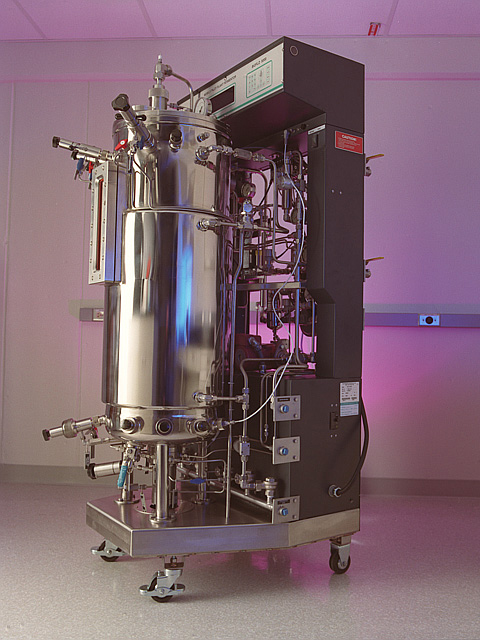
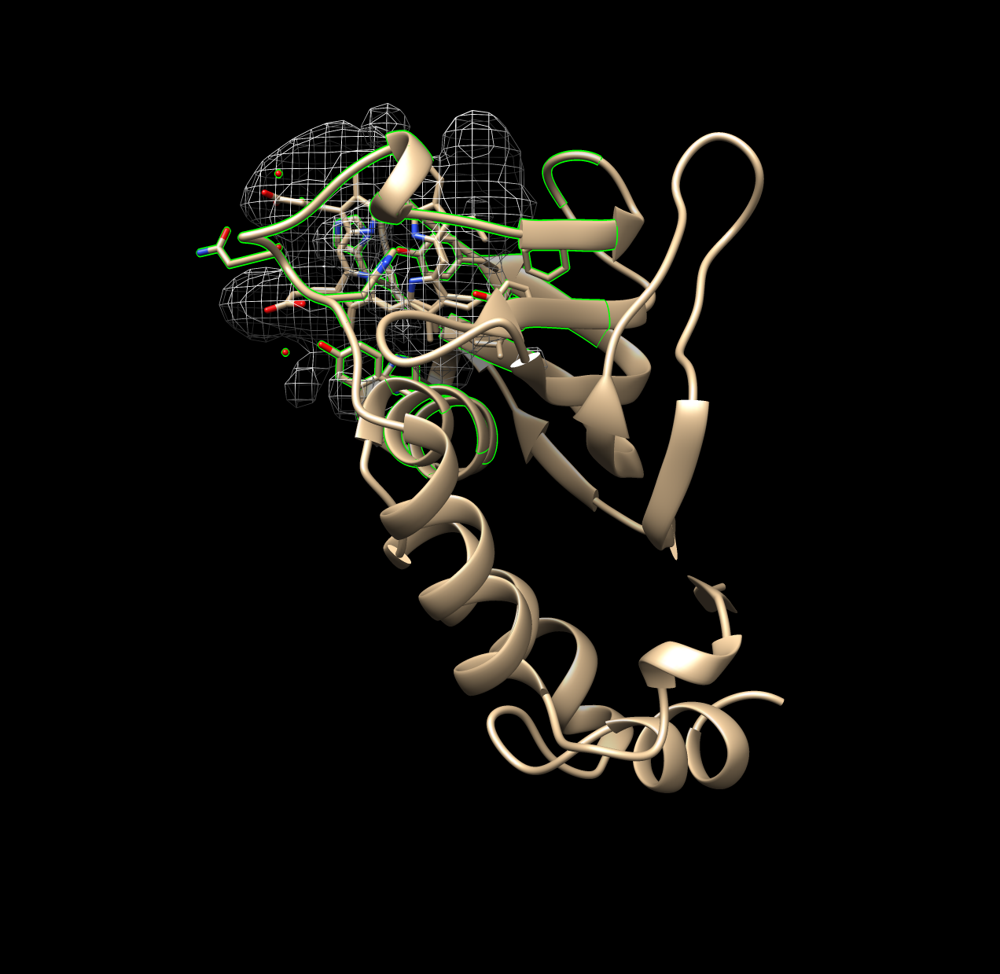

```{r, load_refs, include=FALSE, cache=FALSE}
library(RefManageR)
BibOptions(check.entries = FALSE,
           bib.style = "authoryear",
           cite.style = "numeric", #alphabetic
           style = "markdown", 
           hyperlink = TRUE,
           dashed = TRUE) #can add super = TRUE to have numeric cites be superscripts
myBib <- ReadBib("./super.bib", check = FALSE)

```

```{r input_data, echo=FALSE}
load("mainData.RData")
```


# Outline

Introduction
- What's a hemoprotein? What's heme? 
--

- How hemoproteins are used, COULD be used, and why they aren't (YET!)
--


Methods
- Generation and acquisition of data
- Processing of data
- High throughput implementation
--


Results and Discussion
- Figures, data and implications
- Limitations of the study 
--


Conclusion
- Q&A 10 minutes

---
class: inverse, center, middle

# Introduction


---
# Hemoproteins

--

Hemoprotein = Any protein containing a heme, used for its chemistry
--

Hemoproteins encompass a broad range of enzyzmes:
--


Peroxidases and Catalases
- Oxidation-reduction (Redox) reactions

--

**Sulfite and Nitrite Reductases**
- Unique reaction *channeling* many electrons at once

--

**Heme Oxygenases!** 
- Degradation of heme released from digestion of hemoproteins

--

Cytochrome P450s
- Monooxygenases; insertion of oxygen into molecules
- *EXTREMELY USEFUL!!*

---

# Cytochrome P450s

.pull-left[
Physiological Importance:
- Hormone degradation and synthesis
- Degrade the majority of all drugs! (`r Citet(myBib,"Poulos2014")`)
]

--

.pull-right[
**Oxidize**:
- Carbohydrates
- Steroids
- Fatty Acids
]

--

.pull-left[
- Industrial Biocatalysis e.g. pharmaceutical production (`r Citet(myBib, "Du2017")`,`r Citet(myBib, "Lalonde2016")`)
- Bioremediation of CONTAMINACION (`r Citet(myBib, "Girvan2016")`,`r Citet(myBib, "Li2020")`)

... The issue is efficiency. 
]

.pull-right[



]
---

# But the heme! What is heme?

--

There is not just one heme amongst all hemoproteins!

--

But in general, a heme is a coordination complex composed of an iron atom coordinated and bound to a modified porphyrin ring. A porphyrin ring looks like:

--


Macrocycle!
Highly variable!  
Image from: https://commons.wikimedia.org/wiki/File:Porphin-18e.png
---

# Heme-b
 


---

# Heme varies too!

In this study, we examined a few hemes:

--

.pull-left[
- Heme-b
  - Most common
  - Porphyrin + 2 propionates
  - Propionates interact with Arg salt bridges
- Heme-c
  - Cytochromes-c
  - Porphyrin + 2 propionates + 2 vinyl groups
  - Vinyl groups covalently bind to hemoproteins via thioether bonds w. Cys
  - Electron carrier (maybe bc. better e- potential range) (`r Citet(myBib, "Bowman2008")`,`r Citet(myBib, "Kleingardner2015")`)
]
--
.pull-right[


]

---

# Heme varies too!

In this study, we examined a few hemes:

.pull-left[
- Verdoheme
  - Only in heme oxygenase
  - An intermediate of the degradation process
  - Heme-b + propionates removed + O insertion
- Siroheme
  - Only in nitrite/sulfite reductase
  - Very structurally different
  - Many propionate + carboxyl groups
  - Effectively *very* polar
  - Channels LOTS of e- 
]

--

.pull-right[


]

---

# How to Improve Efficiency?

Well:
--

- <input type="checkbox" checked> Coordination in Binding Pocket</input>
--

- <input type="checkbox" checked> Bonding to Residues in Binding Pocket</input>
--

- <input type="checkbox" checked> Purpose of Heme in Reactions </input>
--

- <input type="checkbox" unchecked> Binding Pocket/Environment</input>
--

- <input type="checkbox" unchecked> Variability of Environments</input>


---
# Prior Work

Structural analysis in 2011 (`r Citet(myBib, "Li2011")`)

--

- 125 Hemoprotein chains (not 125 proteins)

- heme-b and heme-c

--

They found or suggested:
  
- hemoproteins undergo small conformational changes during binding

--
  
- ligand-containing proteins may therefore suitable for prediction/design

--
  
- CYS, HIS, PHE, MET, TYR most abudant residues
  
--

Study in 2011

--

Focus on conformational differences induced by *binding to the environment*

---

# All caught up!

We want to better understand hemoproteins... 
--
at least, to design better hemoproteins to implement better industrial processes, new chemical processes.

--

.pull-left[

Collect data on the binding environment:

- Frequency of amino acids in binding pocket
- Distances of amino acids in binding pocket
- Volume of the binding pocket
- Surface Areas of binding pocket and hemes
- Angles, planar and CA-CB-Fe, (not discussed)
]

--

.pull-right[

Variation by type of heme:
- Heme-b
- Heme-c
- Verdoheme
- Siroheme

]

Hopefully useful for design, and hopefully informative.


---

class: inverse, center, middle

# Methods

---

# Datasets

- Downloaded a diverse set of proteins for HEM (n=58) and HEC (n=13)

--

- Or all proteins that were usable, were used, SRM (n=9) and VER (n=2) and VEA (n=2)

--

VEA and VER merged

--

- The datasets are current as of 16 August 2021. 

--
 
- Table of all this in the back if desired

---

# Pre-processing

Many of the PDBs downloaded were multimeric structures. 

--

So, only grabbed chain A, therefore monomer to represent all PDBs

--

<!-- BTW, need install.packages('reticulate') for this to work -->
```{python eval=FALSE}
from chimera import runCommand as rc
# select chain A, a single unit
rc("sel :.a")
# select everything else
rc("sel invert sel")
# delete everything else besides that chain A
rc("del sel")
# now save the monomer:
rc(("write format pdb 0 "+unexpandedResultPath+activeLigand+"/%s")%
  (fn + ".mono.pdb"))
```

---
# Chimera and Selection

UCSF-Chimera was used to generate all data in this study:
- AA Freq
- V
- SA, heme and pocket
- Distances
- Angles

--

Algorithms discussed in next slides - but the AA selected were:

--

- within 5A or 7A for AA freq, V, SA

--

- within 7A for distance and angles (filter/cross-reference later)

---

# Amino Acid Frequency

Amino acids within the bounds of the lower and upper distance cutoff were selected and recorded. These were then counted for frequency per residue.


```{python eval=FALSE}
# GET RESIDUES
rc("sel :"+activeLigand+" zr < "+angstromDistance)#7.0")
for i in chimera.selection.currentResidues():
   print i
```

Example output (in text file):
```
ARG 143.A
GLY 447.A
ASN 145.A
TRP 146.A
GLN 147.A
ARG 149.A
CYS 446.A
LYS 454.A
```
---

# Volume Method

Volume of the binding pocket was predicted via Surfnet (`r Citet(myBib,"Laskowski1995")`).

```{python eval=FALSE}
from chimera import runCommand as rc
# Select the atoms within 7A of heme. 
#Then, of that selection, keep everything but heme.
rc("sel :"+activeLigand+" za < "+angstromDistance)
# this is the syntax that accomplishes our desired selection
rc("sel sel &~:"+activeLigand) 
interface_surfnet("sel","sel")
rc("sop split #") # acquire the individual pockets that have been generated
rc("measure volume #") # measures volume of individual pockets
# in R we keep only the largest volume
```


---

# Surfnet Runs

.pull-left[

Good run



]
.pull-right[

Bad run


]


---

# Surface Area Method
<!-- # attempt using this method -->

<!-- .center[] -->
Solvent excluded and solvent accessible surface areas of both the ligand and the binding pocket were calculated using Chimera's "surf" algorithm, which itself is an implementation of a program called MSMS 
(`r Citet(myBib,"Sanner1996")`). 


.center[

]

Figure Source: https://commons.wikimedia.org/wiki/File:Accessible_surface.svg
and https://en.wikipedia.org/wiki/Accessible_surface_area
---

# Surface Area Run

.pull-left[
```{python eval=FALSE}
from chimera import runCommand as rc
rc("sel :"+activeLigand+" za <"+angstromDistance)
rc("del :"+activeLigand)
rc("surf sel")
```
]

.pull-right[


]

---

# Distance Method

--

1. Select ALL atoms **within 7A of heme**

--

1. For EVERY atom, output atom name, host residue, and **distance to Fe**

--

1. Assign mean distance to each residue: Average distance of all atoms within each residue is the assigned distance per residue *(introduces bias for residues ~7A)*

--

1. Introduces bias for residues on the fringes, but was, at least initially, the preferred method in order to avoid inclusion of very far off residues and bias results. But this can be changed easily and does not affect the rest of the code; the most interesting results are also unaffected. **za -> zr in code below**

--

<!-- Distances of amino acids from the ligand could not be calculated accurately nor precisely in a direct way. Instead, distances for each atom composing a residue were calculated. This was achieved using a built-in function of chimera; the syntax is not straightforward, but part of the script is shown below. The distances of all atoms within a residue were averaged, and this value was taken as the mean distance of the entire residue and used in subsequent steps. -->

```{python eval=FALSE}
from chimera import runCommand as rc
#select and define the Fe atom
rc("sel :HEM@Fe") 
# index to acquire the one atom selected
fe = chimera.selection.currentAtoms()[0] 
# select all atoms within angstromDistance of Fe (also de-selects Fe)
rc("sel sel za < "+settings.angstromDistance) 
# define this selection of atoms within distance as a list
nearbyAtoms = chimera.selection.currentAtoms()
# parse and print the distances (and coordinates) of these atoms 
for i in nearbyAtoms:
  print "Atom being analyzed...", i, "... Distance to Fe...",
  #prints distance between atom i and the Fe atom
  i.coord().distance(fe.coord())  
```

---

# Distances TXT file to dataframe

Output from UCSF Chimera:
```
Atom being analyzed... HIS 63.A CA ... Distance to Fe... 6.22215951258
Atom being analyzed... HIS 63.A N ... Distance to Fe... 6.97919092732
Atom being analyzed... GLY 62.A O ... Distance to Fe... 6.36589734444
Atom being analyzed... HEM 201.A C3B ... Distance to Fe... 4.25208066716
Atom being analyzed... HEM 201.A C2B ... Distance to Fe... 4.29567235715
Atom being analyzed... HEM 201.A C1B ... Distance to Fe... 3.09004110005
```


--

After R processing:
```{r echo=TRUE}
head(HEM_distList$mean_distances)
```


---

# Angles Data

--

1. Planar Angle (heme = plane, residue as a whole = axis)

--

1. Ca-Cb-Fe Angle (Ca and Cb of ea. residue v. Fe of heme)

--
```{r axesExample, echo=FALSE,out.width="100%",fig.cap="Example of Planar Angles Calculation (1B5M)",fig.show="hold",fig.align='center'}
knitr::include_graphics("0_Thesis/figures/1B5M.axes.png")
```


---

# Txt processing in R

--
```
#0, chain A: HASA
1B2V.pdb.mono.pdb opened
1276 spheres
Surfnet for "sel" - "sel":  volume = 964.9
Surfnet for "sel" - "sel" split ? 2:  volume = 893.6
Surfnet for "sel" - "sel" split ? 6:  volume = 12.474
Surfnet for "sel" - "sel" split ? 7:  volume = 9.4209
Surfnet for "sel" - "sel" split ? 1:  volume = 2.2534
Surfnet for "sel" - "sel" split ? 4:  volume = 2.2888
Surfnet for "sel" - "sel" split ? 3:  volume = 2.9486
Surfnet for "sel" - "sel" split ? 5:  volume = 2.3856
Surfnet for "sel" - "sel" split ? 8:  volume = 39.532
```
]

--

```{r echo=TRUE}
head(HEM_maxVolDf)
```

---

# High Throughput Implementation

--

Inside settings.py:
```{python eval=FALSE}
# specify ligands of interest in pdb's, likely also construct file structure
setLigandList = [
    "HEM",
    "HEC",
    "SRM",
    "VER",
    "VEA"
]
```
--
```{python eval=FALSE}
#### CALCULATE DISTANCES ########
sourcePath = "~/heme-binding/pdb_source_data/1_monomers_processed/"
resultPath = "~/heme-binding/results/only_distances/"

for activeLigand in ligandList:
    activeSourcePath = os.path.expanduser(sourcePath + activeLigand)
    activeResultPath = os.path.expanduser(resultPath + activeLigand)
    calc_distances.d(activeLigand,activeSourcePath,activeResultPath,angstromDistance)
```

```{r eval = FALSE}
# Distances of AA atoms to Fe ------------------
source("~/heme-binding/scripts/r/only_distances.R")
resultPath = "~/heme-binding/results/only_distances/"

for(ligand in 1:(length(ligandList)))
{
   activeLigand = ligandList[[ligand]]
   activeResultPath = paste(resultPath,activeLigand,sep = "")
   distancesList <- distancesFn(activeLigand,activeResultPath)
   assign(paste(activeLigand,"_distList",sep=""),distancesList)
}
```


---

class: inverse, center, middle

# Results

--

# Amino Acid Frequencies

--

# Heme-b

---

# Heme-b (HEM)


---
# Note on Similarity 5A and 7A
.right-column[
```{r HEM-AAfreqOverlaid,fig.cap="HEM: AA Frequency",echo=FALSE, message= FALSE, warning=FALSE, results=FALSE}
load("mainData.RData")
activeLigand = "HEM"
library(dplyr) 
library(data.table)
library(tidyr)
library(ggplot2) 
library(stringr)
library(knitr)
library(clipr) # Linux) sudo apt-get install xclip ... R)install.packages("clipr")  
source("~/heme-binding/scripts/r/addpdbcol.R")
library(kableExtra) 

   # AA FReq ----
   rm(tmp5A,tmp7A,tmpBoth)
   head(HEM_aaFreqDf)
   tmp7A <- data.frame(df7A = eval(parse(text=(paste(activeLigand,"_aaFreqDf",sep="")))))
                          #HEM_aaFreqDf)
   tmp5A <- data.frame(df5A = eval(parse(text=(paste("ls5A$",activeLigand,"_5A_aaFreqDf",sep="")))))
   tmp7A$ang = '7'
   tmp5A$ang = '5'
   head(tmp7A)
   tmp7A
   tmp7A %>%
      dplyr::rename(
         df5A.Residue = df7A.Residue
      ) -> tmp7A
   merge(tmp5A,tmp7A,by = 'df5A.Residue') -> tmpBoth
   #alternative: left_join(tmp5A,tmp7A,by='df5A.Residue')
   tmpBoth %>%
      dplyr::rename(
         Residue = df5A.Residue
      ) -> tmpBoth
   tmpBoth
   
   library(reshape) #ONLY LOAD THIS HERE. IF YOU LOAD EALIER,
   # ALL CASE OF RENAME() FROM DPLYR PACKAGE IN ALL SCRIPTS GETS FUCKED UP.
   # PUTTING IT HERE, ONLY BELOW THIS LIBRARY LOAD DO YOU NEED NEED TO SPECIFY DPLYR::XXX
   
   to_plot <- reshape::melt((data.frame(x=tmpBoth$Residue,`Distance_5A`=tmpBoth$df5A.Freq,`Distance_7A`=tmpBoth$df7A.Freq)),id="x")
#   detach("package:reshape", unload=TRUE) #maybe avoid the problem anyway lol
   
   print(ggplot(to_plot,aes(x= reorder(x,-value),y=value,fill=variable)) + 
            geom_bar(stat="identity",position = "identity", alpha=.4) +
            labs(x = "Residue",y="Frequency", title = paste(activeLigand,": AA Frequency",sep='')) +
            scale_fill_discrete(name = "Distance Cutoff")+
            theme(axis.text.x = element_text(angle = 45, vjust = 1, hjust=1)))
   
```
]
.left-column[
- The trends are Pretty similar, no?
- I take cash, card, and patcoin.
]
---
# HEM AA Freq

.right-column[
```{r HEM-AAfreq0,fig.cap="HEM: AA Frequency within 7A",echo=FALSE, message= FALSE, warning=FALSE, results=FALSE}

activeLigand = "HEM"
library(dplyr) 
library(data.table)
library(tidyr)
library(ggplot2) 
library(stringr)
library(knitr)
library(clipr) # Linux) sudo apt-get install xclip ... R)install.packages("clipr")  
source("~/heme-binding/scripts/r/addpdbcol.R")
library(kableExtra) 
library(gghighlight)
library(plotly)

g <- ggplot(eval(parse(text=paste(activeLigand,"_aaFreqDf",sep=""))),aes(x= reorder(Residue,-Freq),y=Freq))  +
      geom_bar(stat="identity",position = "identity", alpha=1) +
      labs(x = "Residue",y="Frequency", title = paste(activeLigand,": AA Frequency within 7A of ",activeLigand,sep='')) +
      theme(axis.text.x = element_text(angle = 45, vjust = 1, hjust=1))
g #+  gghighlight(Residue == c("LEU","PHE","ALA","ILE","VAL")) #dank
```
]
--

.left-column[

Special text for special people
]

---

# HEM AA Freq (cont'd)
<!-- for the nonpolar at beginning -->
```{r HEM-AAfreq1,fig.cap="HEM: AA Frequency within 7A",echo=FALSE, message= FALSE, warning=FALSE, results=FALSE}

activeLigand = "HEM"
library(dplyr) 
library(data.table)
library(tidyr)
library(ggplot2) 
library(stringr)
library(knitr)
library(clipr) # Linux) sudo apt-get install xclip ... R)install.packages("clipr")  
source("~/heme-binding/scripts/r/addpdbcol.R")
library(kableExtra) 
library(gghighlight)
library(plotly)

g <- ggplot(eval(parse(text=paste(activeLigand,"_aaFreqDf",sep=""))),aes(x= reorder(Residue,-Freq),y=Freq))  +
      geom_bar(stat="identity",position = "identity", alpha=1) +
      labs(x = "Residue",y="Frequency", title = paste(activeLigand,": AA Frequency within 7A of ",activeLigand,sep='')) +
      theme(axis.text.x = element_text(angle = 45, vjust = 1, hjust=1))
g +  gghighlight(Residue == c("LEU","PHE","ALA","ILE","VAL")) #dank
```


Beginning at the left of Figure \@ref(fig:HEM-AAfreq) and moving right, large, nonpolar amino acids appear most frequently within 7A: LEU and PHE; ILE appears less frequently than these two amino acids but nonetheless is in high frequency. Small, nonpolar amino acids ALA and VAL also appear very frequently. As the majority of the heme-b molecule is made up of the nonpolar porphyrin ring, these amino acids are therefore likely in such high frequency to provide the nonpolar interactions with the pyrole groups and methyl and vinyl groups. 


---


# HEM AA Freq (cont'd) 
<!-- FIXME! Make the THR work, very weird error. TYR also gave me issues -->
<!-- for after the nonpolars lol -->

I need to note here that THR was overlooked in the thesis, but falls into this group of polar residue and therefore the implications of the results do not change.
```{r HEM-AAfreq2,fig.cap="HEM: AA Frequency within 7A",echo=FALSE, message= FALSE, warning=FALSE, results=FALSE}

activeLigand = "HEM"
library(dplyr) 
library(data.table)
library(tidyr)
library(ggplot2) 
library(stringr)
library(knitr)
library(clipr) # Linux) sudo apt-get install xclip ... R)install.packages("clipr")  
source("~/heme-binding/scripts/r/addpdbcol.R")
library(kableExtra) 
library(gghighlight)
library(plotly)

g <- ggplot(eval(parse(text=paste(activeLigand,"_aaFreqDf",sep=""))),aes(x= reorder(Residue,-Freq),y=Freq))  +
      geom_bar(stat="identity",position = "identity", alpha=1) +
      labs(x = "Residue",y="Frequency", title = paste(activeLigand,": AA Frequency within 7A of ",activeLigand,sep='')) +
      theme(axis.text.x = element_text(angle = 45, vjust = 1, hjust=1))
g +  gghighlight(Residue %in% c("THR","ARG","HIS","TYR")) #dank
```


Tyrosine, arginine, histidine appear next most frequently. The two propionate groups on heme make polar interactions with salt bridges formed between arginine groups within the binding environment[@Barrows2005]. Therefore, the tyrosine and histidine likely form polar interactions with the portion of the propionate groups not interacting with the arginine salt bridges. This, in addition to the nonpolar interactions above, likely provides as hospitable of a binding environment as possible to coordinate the heme. It should be noted histidine is one of the residues that coordinates the iron atom, and this may therefore increase its frequency in the binding pocket.


---

# HEM AA Freq (cont'd)
<!-- GLY -->
```{r HEM-AAfreq3,fig.cap="HEM: AA Frequency within 7A",echo=FALSE, message= FALSE, warning=FALSE, results=FALSE}

activeLigand = "HEM"
library(dplyr) 
library(data.table)
library(tidyr)
library(ggplot2) 
library(stringr)
library(knitr)
library(clipr) # Linux) sudo apt-get install xclip ... R)install.packages("clipr")  
source("~/heme-binding/scripts/r/addpdbcol.R")
library(kableExtra) 
library(gghighlight)
library(plotly)

g <- ggplot(eval(parse(text=paste(activeLigand,"_aaFreqDf",sep=""))),aes(x= reorder(Residue,-Freq),y=Freq))  +
      geom_bar(stat="identity",position = "identity", alpha=1) +
      labs(x = "Residue",y="Frequency", title = paste(activeLigand,": AA Frequency within 7A of ",activeLigand,sep='')) +
      theme(axis.text.x = element_text(angle = 45, vjust = 1, hjust=1))
g +  gghighlight(Residue == c("GLY")) #dank
```


Glycine is a small residue and cannot form significant interactions within its environment; however, its frequency, or lack thereof (compared to background frequency, discussed below), suggests the binding pocket may not require as much flexibility or spatial considerations as in the rest of the protein.

---

# HEM AA Freq (cont'd)
<!-- ser etc -->
```{r HEM-AAfreq4,fig.cap="HEM: AA Frequency within 7A",echo=FALSE, message= FALSE, warning=FALSE, results=FALSE}

activeLigand = "HEM"
library(dplyr) 
library(data.table)
library(tidyr)
library(ggplot2) 
library(stringr)
library(knitr)
library(clipr) # Linux) sudo apt-get install xclip ... R)install.packages("clipr")  
source("~/heme-binding/scripts/r/addpdbcol.R")
library(kableExtra) 
library(gghighlight)
library(plotly)

gv <- ggplot(eval(parse(text=paste(activeLigand,"_aaFreqDf",sep=""))),aes(x= reorder(Residue,-Freq),y=Freq))  +
      geom_bar(stat="identity",position = "identity", alpha=1) +
      labs(x = "Residue",y="Frequency", title = paste(activeLigand,": AA Frequency within 7A of ",activeLigand,sep='')) +
      theme(axis.text.x = element_text(angle = 45, vjust = 1, hjust=1))
      #gx <- list("SER",'GLU')
      gv +  gghighlight(Residue %in% c("SER","ASP","LYS","GLU"))   #Residue == gx) #dank
```


Next appear serine, glutamate (glutamic acid) and aspartate (aspartic acid) and lysine. These are polar residues, and glutamate and aspartate are negatively charged; lysine is polar too, but positively charged (at pH 7). The negative charge on glutamate and aspartate may explain why they are fairly infrequent: although polar, the negative charge may induce a repulsion effect with the propionate groups. Or, it may be that other amino acids are preferable, as is likely the case for lysine. Lysine is polar and positively charged; but arginine residues forms the salt bridges necessary for propionate to make polar interactions. And histidine coordinates the heme iron. Therefore the infrequency of lysine may be less due to a problem with lysine and more due to a preference for other polar amino acids.


---


# HEM AA Freq (cont'd)
<!-- pro -->
```{r HEM-AAfreq5,fig.cap="HEM: AA Frequency within 7A",echo=FALSE, message= FALSE, warning=FALSE, results=FALSE}

activeLigand = "HEM"
library(dplyr) 
library(data.table)
library(tidyr)
library(ggplot2) 
library(stringr)
library(knitr)
library(clipr) # Linux) sudo apt-get install xclip ... R)install.packages("clipr")  
source("~/heme-binding/scripts/r/addpdbcol.R")
library(kableExtra) 
library(gghighlight)
library(plotly)

gv <- ggplot(eval(parse(text=paste(activeLigand,"_aaFreqDf",sep=""))),aes(x= reorder(Residue,-Freq),y=Freq))  +
      geom_bar(stat="identity",position = "identity", alpha=1) +
      labs(x = "Residue",y="Frequency", title = paste(activeLigand,": AA Frequency within 7A of ",activeLigand,sep='')) +
      theme(axis.text.x = element_text(angle = 45, vjust = 1, hjust=1))
      #gx <- list("SER",'GLU')
      gv +  gghighlight(Residue %in% c("PRO"))   #Residue == gx) #dank
```

Proline is a small nonpolar amino acid in low frequency; the trend for heme-b, at least, appears to be to favor large nonpolar amino acids in the binding pocket. This may suggest that a large amount of nonpolar interactions, per residue, is favored in the binding pocket, perhaps because of the limited space available to position residues to interact with heme.


---


# HEM AA Freq (cont'd)
<!-- asparagine and glutamine -->
```{r HEM-AAfreq7,fig.cap="HEM: AA Frequency within 7A",echo=FALSE, message= FALSE, warning=FALSE, results=FALSE}

activeLigand = "HEM"
library(dplyr) 
library(data.table)
library(tidyr)
library(ggplot2) 
library(stringr)
library(knitr)
library(clipr) # Linux) sudo apt-get install xclip ... R)install.packages("clipr")  
source("~/heme-binding/scripts/r/addpdbcol.R")
library(kableExtra) 
library(gghighlight)
library(plotly)

gv <- ggplot(eval(parse(text=paste(activeLigand,"_aaFreqDf",sep=""))),aes(x= reorder(Residue,-Freq),y=Freq))  +
      geom_bar(stat="identity",position = "identity", alpha=1) +
      labs(x = "Residue",y="Frequency", title = paste(activeLigand,": AA Frequency within 7A of ",activeLigand,sep='')) +
      theme(axis.text.x = element_text(angle = 45, vjust = 1, hjust=1))
      #gx <- list("SER",'GLU')
      gv +  gghighlight(Residue %in% c("ASN","GLN"))   #Residue == gx) #dank
```

Asparagine and glutamine are both medium-sized polar amino acids; given the trends already discussed it is surprising these are not in greater abundance. But as with proline, it may simply be a matter of maximizing the benefit of the interactions that may be formed with the heme; while asparagine and glutamine are polar, amino acids like arginine and histidine are both polar and positively charged (and arginine forms salt bridges), capable of stronger interactions with the electronegative propionate groups.


---


# HEM AA Freq (cont'd)
<!-- met and trp -->
```{r HEM-AAfreq8,fig.cap="HEM: AA Frequency within 7A",echo=FALSE, message= FALSE, warning=FALSE, results=FALSE}

activeLigand = "HEM"
library(dplyr) 
library(data.table)
library(tidyr)
library(ggplot2) 
library(stringr)
library(knitr)
library(clipr) # Linux) sudo apt-get install xclip ... R)install.packages("clipr")  
source("~/heme-binding/scripts/r/addpdbcol.R")
library(kableExtra) 
library(gghighlight)
library(plotly)

gv <- ggplot(eval(parse(text=paste(activeLigand,"_aaFreqDf",sep=""))),aes(x= reorder(Residue,-Freq),y=Freq))  +
      geom_bar(stat="identity",position = "identity", alpha=1) +
      labs(x = "Residue",y="Frequency", title = paste(activeLigand,": AA Frequency within 7A of ",activeLigand,sep='')) +
      theme(axis.text.x = element_text(angle = 45, vjust = 1, hjust=1))
      #gx <- list("SER",'GLU')
      gv +  gghighlight(Residue %in% c("MET","TRP"))   #Residue == gx) #dank
```


Methionine and tryptophan appear very infrequently in the binding pocket. Tryptophan is very surprising to find as second-to-least frequent. It is a large nonpolar amino acid - but perhaps its single, potential hydrogen bond, although weak, is enough to prefer completely nonpolar residues. Or, with its size, it is preferable to have more numerous, smaller nonpolar residues that can favorably interact with the porphyrin while reducing steric hindrance of other residues in the environment. The reason for methionine's low frequency is not clear, perhaps for similar reasons as with proline, where more intensely nonpolar residues are preferred, rather than less nonpolar residues being unfavorable.

---

# HEM AA Freq (cont'd)
<!-- cys  -->
```{r HEM-AAfreq9,fig.cap="HEM: AA Frequency within 7A",echo=FALSE, message= FALSE, warning=FALSE, results=FALSE}

activeLigand = "HEM"
library(dplyr) 
library(data.table)
library(tidyr)
library(ggplot2) 
library(stringr)
library(knitr)
library(clipr) # Linux) sudo apt-get install xclip ... R)install.packages("clipr")  
source("~/heme-binding/scripts/r/addpdbcol.R")
library(kableExtra) 
library(gghighlight)
library(plotly)

gv <- ggplot(eval(parse(text=paste(activeLigand,"_aaFreqDf",sep=""))),aes(x= reorder(Residue,-Freq),y=Freq))  +
      geom_bar(stat="identity",position = "identity", alpha=1) +
      labs(x = "Residue",y="Frequency", title = paste(activeLigand,": AA Frequency within 7A of ",activeLigand,sep='')) +
      theme(axis.text.x = element_text(angle = 45, vjust = 1, hjust=1))
      #gx <- list("SER",'GLU')
      gv +  gghighlight(Residue %in% c("CYS"))   #Residue == gx) #dank
```

Cystine appears most infrequently of all the amino acids in the binding pocket. This is quite  surprising - cystine is the other highly conserved residue that may coordinate the heme iron. Perhaps the sample of PDBs used in this study mostly use histidine to coordinate the iron - but this would only account for one residue in the binding pocket per pdb. Therefore these results suggest that while cystidine may be well suited to coordinate the iron in heme, it is poorly suited to form any nonpolar interactions with the porphyrin ring, leaving the task up to other, more suitably, intensely nonpolar amino acids.


---

# HEM AA Freq (cont'd)
<!-- cys  -->
```{r HEM-AAfreq10,fig.cap="HEM: AA Frequency within 7A",echo=FALSE, message= FALSE, warning=FALSE, results=FALSE}

activeLigand = "HEM"
library(dplyr) 
library(data.table)
library(tidyr)
library(ggplot2) 
library(stringr)
library(knitr)
library(clipr) # Linux) sudo apt-get install xclip ... R)install.packages("clipr")  
source("~/heme-binding/scripts/r/addpdbcol.R")
library(kableExtra) 
library(gghighlight)
library(plotly)

gv <- ggplot(eval(parse(text=paste(activeLigand,"_aaFreqDf",sep=""))),aes(x= reorder(Residue,-Freq),y=Freq))  +
      geom_bar(stat="identity",position = "identity", alpha=1) +
      labs(x = "Residue",y="Frequency", title = paste(activeLigand,": AA Frequency within 7A of ",activeLigand,sep='')) +
      theme(axis.text.x = element_text(angle = 45, vjust = 1, hjust=1))
      #Below is a list of nonpolar residues, nonpolar_res, if you need later
      gv +  gghighlight(Residue %in% c("ALA","VAL","CYS","PRO","LEU","ILE","MET","TRP","PHE"))   #Residue == gx) #dank
```


Moving away from discussing individual amino acid populations, what is especially notable of the data for heme-b is that nonpolar residues appear in much greater frequency than polar residues. Nonpolar interactions with heme are therefore more numerous than polar interactions. Their multiplicity may also suggest that they are potentially of greater importance than previously thought. At the very least, these results suggest that polar interactions and coordination of the iron atom, while necessary for heme binding, are insufficient, and that nonpolar interactions and the population of nonpolar residues in the binding pocket should be considered when examining the binding environment of heme.


---


# Comparison with Background Amino Acid Frequencies

While the frequencies of amino acids in the binding pocket have been discussed, it may also be of interest to compare against the background amino acid frequency, the general frequency of amino acids within the entire monomer. The degree to which any results may affect the significance of the frequencies of the amino acids in the binding pocket is unclear - those amino acids are interacting with the heme. However, an in depth examination of similarities and differences may reveal that some amino acids may simply be extremely highly conserved by chance and by virtue of their numerous population, rather than some chemical benefit.

```{r HEM-AAfreqAll,fig.cap="HEM: AA Frequency of Monomer",echo=FALSE, message= FALSE, warning=FALSE, results=FALSE}
load("mainData.RData")
activeLigand = "HEM"
library(dplyr) 
library(data.table)
library(tidyr)
library(ggplot2) 
library(stringr)
library(knitr)
library(clipr) # Linux) sudo apt-get install xclip ... R)install.packages("clipr")  
source("~/heme-binding/scripts/r/addpdbcol.R")
library(kableExtra) 

print(ggplot(eval(parse(text=paste(activeLigand,"_aaFreqAllDf",sep=""))),aes(x= reorder(Residue,-Freq),y=Freq))  +
      geom_bar(stat="identity",position = "identity", alpha=0.65) +
      labs(x = "Residue",y="Frequency", title = paste(activeLigand,": AA Frequency of Monomer",sep='')) +
      theme(axis.text.x = element_text(angle = 45, vjust = 1, hjust=1)))

```


Leucine and alanine, as in the binding pocket frequencies, are highly frequent in the overall monomer. This may suggest their prevalence in the binding pocket may simply be due to a high population of leucine and alanine in hemoproteins.

However, after these two amino acids the tendencies in frequency for the binding pocket and the monomer at large diverge. Glycine is in high frequency - likely due to more complex geometry e.g. helices outside the binding pocket. In interest of brevity, the remaining frequencies are summed up thus: the same trends that appear to exist in the binding pocket do not appear to exist in the monomer at large. While the order of frequencies in conserved binding pockets can be rationalized, justifying the overall frequencies in monomers invites significant speculation. 

---

# Distributon of Amino Acids by Distance

```{r HEM-AAdist,fig.cap="HEM: Residue Distribution by Distance",echo=FALSE, message= FALSE, warning=FALSE, results=FALSE}
load("mainData.RData")
activeLigand = "HEM"
library(dplyr) 
library(data.table)
library(tidyr)
library(ggplot2) 
library(stringr)
library(knitr)
library(clipr) # Linux) sudo apt-get install xclip ... R)install.packages("clipr")  
source("~/heme-binding/scripts/r/addpdbcol.R")
library(kableExtra) 

eval(parse(text=paste(activeLigand,"_distList$mean_distances",sep=""))) %>%
      dplyr::select(Residue_Code,Mean_Distance) -> tmpDist 
   
   distanceDist <- ggplot(tmpDist,aes(x=Residue_Code,y=(as.numeric(as.character(Mean_Distance))),fill=Residue_Code)) + 
      geom_violin(trim=FALSE) +
      labs(title = paste(activeLigand,": Distribution of Residues by Mean_Distance",sep=''), x="Residue",y="Mean_Distance (Å)") +
      theme(axis.text.x = element_text(angle = 45, vjust = 1, hjust=1))

   print(distanceDist)
   
```


<!-- After an exhaustive exploration of the relative frequencies of amino acids in the binding pocket, Figure \@ref(fig:HEM-AAdist) below is fairly straightfoward. It plots the distribution of amino acids in the binding pocket against their distance from the iron of the heme.  -->

We find that only a few residues come in close contact (<4A) of the heme: cysteine, histidine, and tyrosine. Most residues center their distribution at around 6A, although lysine seems more biased than the remaining residues to be a bit closer. Cysteine and histidine may be at least in part explained to be close due to their use as coordinating residues; histidine, being in greater frequency, may also be this close due to favorable interactions with the porphyrin ring. 

The proximity of tyrosine  however, is more notable. It cannot form coordination bonds with the heme iron, but tyrosine residues do interact with the propionate groups. Tyrosine is also required for redox reactions, and part of the population of tyrosine residues may therefore be in close proximity to heme to facilitate electron transfer in various enzymes [@Poulos2014]. These results suggest that of all potentially interacting polar/positively charged residues, tyrosine is the most likely at least to be in close proximity to the heme molecule. Whether this illustrates an importance of tyrosine to interact with propionate groups, or instead the need for tyrosine to be in close proximity in order to form such interactions, or simply demonstrates involvement in oxidation/reduction reactions, is beyond the scope of this study. 


---

class: inverse, center, middle

# Heme-c

---

# Heme-c (HEC)


---

# HEC AA Freq

```{r HEC-AAfreq,fig.cap="HEC: AA Frequency within 7A",echo=FALSE, message= FALSE, warning=FALSE, results=FALSE}
load("mainData.RData")
activeLigand = "HEC"
library(dplyr) 
library(data.table)
library(tidyr)
library(ggplot2) 
library(stringr)
library(knitr)
library(clipr) # Linux) sudo apt-get install xclip ... R)install.packages("clipr")  
source("~/heme-binding/scripts/r/addpdbcol.R")
library(kableExtra) 
library(gghighlight)
library(plotly)

g <- ggplot(eval(parse(text=paste(activeLigand,"_aaFreqDf",sep=""))),aes(x= reorder(Residue,-Freq),y=Freq))  +
      geom_bar(stat="identity",position = "identity", alpha=1) +
      labs(x = "Residue",y="Frequency", title = paste(activeLigand,": AA Frequency within 7A of ",activeLigand,sep='')) +
      theme(axis.text.x = element_text(angle = 45, vjust = 1, hjust=1))
g +  gghighlight(Residue %in% c("LEU","ALA","GLY","CYS","LYS"))   #Residue == gx) #dank

```

Leucine and alanine again are highly frequent for HEC, followed by quite similar trends, and therefore HEC will not be as thoroughly discussed as HEM. The most notable differences may be that GLY and CYS are in far higher frequency than in heme. Heme-c almost always forms covalent bonds with cysteine residues, and this may explain that frequency. But as for the high frequency of glycine, the reason for its abundance is unclear, although it seems it may have an important role in heme-c pockets. 

Lys was overlooked in the thesis also - oops lol. But anyway, LYS is a weakly polar, positively charged thing. It also has propionate groups to bind to - it may be that a weaker polar residue is fine when there's a covalent bond, but this is in high frequency. This may indicate a specialized role for Lys in HEC binding. 

---

# Comparison with Background Amino Acid Frequencies

```{r HEC-AAfreqAll,fig.cap="HEC: AA Frequency of Monomer",echo=FALSE, message= FALSE, warning=FALSE, results=FALSE}
load("mainData.RData")
activeLigand = "HEC"
library(dplyr) 
library(data.table)
library(tidyr)
library(ggplot2) 
library(stringr)
library(knitr)
library(clipr) # Linux) sudo apt-get install xclip ... R)install.packages("clipr")  
source("~/heme-binding/scripts/r/addpdbcol.R")
library(kableExtra) 

print(ggplot(eval(parse(text=paste(activeLigand,"_aaFreqAllDf",sep=""))),aes(x= reorder(Residue,-Freq),y=Freq))  +
      geom_bar(stat="identity",position = "identity", alpha=0.65) +
      labs(x = "Residue",y="Frequency", title = paste(activeLigand,": AA Frequency of Monomer",sep='')) +
      theme(axis.text.x = element_text(angle = 45, vjust = 1, hjust=1)))

```

Generally, the heme-c monomer AA frequency profile appears similar to the heme-b monomer, with a high frequency of alanine and leucine, followed by a divergence in the frequency of amino acids and therefore a struggle to form any meaningful discussion when it comes to comparing the binding pocket frequencies against background frequencies.  

---

# Distributon of Amino Acids by Distance

```{r HEC-AAdist,fig.cap="HEC: Residue Distribution by Distance",echo=FALSE, message= FALSE, warning=FALSE, results=FALSE}
load("mainData.RData")
activeLigand = "HEC"
library(dplyr) 
library(data.table)
library(tidyr)
library(ggplot2) 
library(stringr)
library(knitr)
library(clipr) # Linux) sudo apt-get install xclip ... R)install.packages("clipr")  
source("~/heme-binding/scripts/r/addpdbcol.R")
library(kableExtra) 
library(plotly)

eval(parse(text=paste(activeLigand,"_distList$mean_distances",sep=""))) %>%
      dplyr::select(Residue_Code,Mean_Distance) -> tmpDist 
   
   distanceDist <- ggplot(tmpDist,aes(x=Residue_Code,y=(as.numeric(as.character(Mean_Distance))),fill=Residue_Code)) + 
      geom_violin(trim=FALSE) +
      labs(title = paste(activeLigand,": Distribution of Residues by Mean_Distance",sep=''), x="Residue",y="Mean_Distance (Å)") +
      theme(axis.text.x = element_text(angle = 45, vjust = 1, hjust=1))

   print(distanceDist)
```

The distribution of amino acids over distance from the heme iron for HEC is similar to HEM, with some exceptions. Cys, His, Tyr again are amongst the closest residues to HEC, likely for the same reasons of very strong polar interactions or coordination. Additionally, cysteine forms covalent, thioether bonds with heme-c, providing further justification for its proximity. However, for heme-c, lysine and methionine also are very proximal. The methionine residues are nonpolar, small, neutral; lysine is polar and positively charged; neither of these residues are favored to be included in the heme-b binding environment despite very similar structures. The reason for their inclusion so close to the binding pocket is therefore unclear, but based on their distribution, and lysine being even more close proximity than heme, the results suggest these two residues may have important roles.

---


---

class: inverse, center, middle

# Verdoheme

---

# Verdoheme (VER and VEA)

Again, in two different stages of degradation; and n=4 so these two are merged.

.pull-left[

VEA


]
.pull-right[

VER


]

---
# Verdoheme AA Freq

```{r VERDOHEME-AAfreq,fig.cap="VERDOHEME: AA Frequency within 7A",echo=FALSE, message= FALSE, warning=FALSE, results=FALSE}
load("mainData.RData")
activeLigand = "VERDOHEME"
library(dplyr) 
library(data.table)
library(tidyr)
library(ggplot2) 
library(stringr)
library(knitr)
library(clipr) # Linux) sudo apt-get install xclip ... R)install.packages("clipr")  
source("~/heme-binding/scripts/r/addpdbcol.R")
library(kableExtra) 
library(plotly)

g <- ggplot(eval(parse(text=paste(activeLigand,"_aaFreqDf",sep=""))),aes(x= reorder(Residue,-Freq),y=Freq))  +
      geom_bar(stat="identity",position = "identity", alpha=1) +
      labs(x = "Residue",y="Frequency", title = paste(activeLigand,": AA Frequency within 7A of ",activeLigand,sep='')) +
      theme(axis.text.x = element_text(angle = 45, vjust = 1, hjust=1))
p <- ggplotly(g)
htmltools::save_html(p, file = "verdoAA.html")

```

<iframe src="verdoAA.html" width="550" height="500"></iframe>

The frequqency of amino acids in the binding pocket for verdoheme is dissimilar from heme-b and heme-c above. This is fairly surprising, given that verdoheme is an intermediate in the binding pocket for heme-b within heme oxygenases. 

<!-- The results discussed below may be attributable to the small sample size of verdoheme PDBs (n=4, combining VEA and VER), and should be appreciated with some skepticism. Nonetheless, the results will be discussed. -->

Leucine and alanine are again most frequent, but after these, results diverge. Tyrosine and arginine are next most frequent - surprising, given that this is still the same pocket that bound heme-b. The data for heme-b indicate more frequent nonpolar residues before tyrosine. Chemically, it may be that as heme-b is oxidized, there is greater need for polar interactions; this would help to explain the high frequency of polar residues, but does not explain the shift in amino acid frequencies within what would be expected to be a similar binding pocket - all verdoheme PDBs in this in study were sourced from heme oxgenase proteins. Some heme oxygenases are included for heme-b, but they are amongst a diverse set of proteins. Therefore, the heme oxygenase environment may simply be host to more polar residues than normal for hemoproteins. This also agrees with tyrosine's inclusion in redox reactions, and it may be favored to be present in heme oxygenase. These results indicate more about the heme oxygenase environment than the verdoheme binding environment - however, these two are inseparable, given verdoheme only appears in heme oxygenase. A dedicated investigation to the heme binding environment for heme oxygenase, may therefore be warranted in future study. 

Glycine is the next most frequent - it is in lower frequency, relatively, for heme-b. As with other heme molecules, it is not clear as to what the role of glycine is in binding verdoheme. 

---

# Comparison with Background Amino Acid Frequencies

```{r VERDOHEME-AAfreqAll,fig.cap="VERDOHEME: AA Frequency of Monomer",echo=FALSE, message= FALSE, warning=FALSE, results=FALSE}
load("mainData.RData")
activeLigand = "VERDOHEME"
library(dplyr) 
library(data.table)
library(tidyr)
library(ggplot2) 
library(stringr)
library(knitr)
library(clipr) # Linux) sudo apt-get install xclip ... R)install.packages("clipr")  
source("~/heme-binding/scripts/r/addpdbcol.R")
library(kableExtra) 

print(ggplot(eval(parse(text=paste(activeLigand,"_aaFreqAllDf",sep=""))),aes(x= reorder(Residue,-Freq),y=Freq))  +
      geom_bar(stat="identity",position = "identity", alpha=0.65) +
      labs(x = "Residue",y="Frequency", title = paste(activeLigand,": AA Frequency of Monomer",sep='')) +
      theme(axis.text.x = element_text(angle = 45, vjust = 1, hjust=1)))

```

Besides the frequencies of leucine and alanine, which have been found for heme-b and heme-c above to be highly frequent in hemoproteins at large, the frequency profiles for the verdoheme binding environment and monomers is shown to be quite dissimilar, supporting the results for the binding environment as unique, not simply due to background frequency. 

---

# Distributon of Amino Acids by Distance

The low sample size for verdoheme leads here to a poor figure with few residues plotted. This is likely attributable to an insufficient amount of distances and residues to cross-reference against each other, an operation that successfully occurs for all similar graphs. Regardless, the data that are plotted will be discussed.

The highly conserved histidine for hemoproteins is exclusively within 5A for verdoheme. This result again suggests that at least some of the data for verdoheme may be highly biased because of the small sample size - heme-b data included a greater range for histidine. Or, perhaps for heme oxygenases heme is solely present to coordinate the iron atom, leading to all His residues being nearby verdoheme. The close proximity of glycine to verdoheme is also unexpected and unable to be explained without further study. The remainder of the residues plotted appear to follow the trends seen in for the other types of heme, with distance values centered around 6A and unremarkable distributions.

```{r VERDOHEME-AAdist,fig.cap="VERDOHEME: Residue Distribution by Distance",echo=FALSE, message= FALSE, warning=FALSE, results=FALSE}
load("mainData.RData")
activeLigand = "VERDOHEME"
library(dplyr) 
library(data.table)
library(tidyr)
library(ggplot2) 
library(stringr)
library(knitr)
library(clipr) # Linux) sudo apt-get install xclip ... R)install.packages("clipr")  
source("~/heme-binding/scripts/r/addpdbcol.R")
library(kableExtra) 

eval(parse(text=paste(activeLigand,"_distList$mean_distances",sep=""))) %>%
      dplyr::select(Residue_Code,Mean_Distance) -> tmpDist 
   
   distanceDist <- ggplot(tmpDist,aes(x=Residue_Code,y=(as.numeric(as.character(Mean_Distance))),fill=Residue_Code)) + 
      geom_violin(trim=FALSE) +
      labs(title = paste(activeLigand,": Distribution of Residues by Mean_Distance",sep=''), x="Residue",y="Mean_Distance (Å)") +
      theme(axis.text.x = element_text(angle = 45, vjust = 1, hjust=1))

   print(distanceDist)
   
```


---

class: inverse, center, middle

# Siroheme

---

# Siroheme (SRM)


---
# Siroheme AA Freq

```{r SRM-AAfreq0,fig.cap="SRM: AA Frequency within 7A",echo=FALSE, message= FALSE, warning=FALSE, results=FALSE}
load("mainData.RData")
activeLigand = "SRM"
library(dplyr) 
library(data.table)
library(tidyr)
library(ggplot2) 
library(stringr)
library(knitr)
library(clipr) # Linux) sudo apt-get install xclip ... R)install.packages("clipr")  
source("~/heme-binding/scripts/r/addpdbcol.R")
library(kableExtra) 
library(gghighlight)

g <- ggplot(eval(parse(text=paste(activeLigand,"_aaFreqDf",sep=""))),aes(x= reorder(Residue,-Freq),y=Freq))  +
      geom_bar(stat="identity",position = "identity", alpha=1) +
      labs(x = "Residue",y="Frequency", title = paste(activeLigand,": AA Frequency within 7A of ",activeLigand,sep='')) +
      theme(axis.text.x = element_text(angle = 45, vjust = 1, hjust=1))
print(g)
```

---

# Siroheme AA Freq (cont'd)

```{r SRM-AAfreq1,fig.cap="SRM: AA Frequency within 7A",echo=FALSE, message= FALSE, warning=FALSE, results=FALSE}
load("mainData.RData")
activeLigand = "SRM"
library(dplyr) 
library(data.table)
library(tidyr)
library(ggplot2) 
library(stringr)
library(knitr)
library(clipr) # Linux) sudo apt-get install xclip ... R)install.packages("clipr")  
source("~/heme-binding/scripts/r/addpdbcol.R")
library(kableExtra) 
library(gghighlight)

g <- ggplot(eval(parse(text=paste(activeLigand,"_aaFreqDf",sep=""))),aes(x= reorder(Residue,-Freq),y=Freq))  +
      geom_bar(stat="identity",position = "identity", alpha=1) +
      labs(x = "Residue",y="Frequency", title = paste(activeLigand,": AA Frequency within 7A of ",activeLigand,sep='')) +
      theme(axis.text.x = element_text(angle = 45, vjust = 1, hjust=1))
g + gghighlight(Residue %in% c("ARG"))
```


Siroheme, with a structure highly dissimilar to the other heme molecules examined, should be expected to have a different amino acid frequency profile -- and indeed we confirm this in our results. 

Nonpolar residues are not the  most abundant in the siroheme binding pocket. In fact, disproportionately frequent to the rest of the residues in the binding pocket is arginine. Siroheme is saturated with carboxyl and propionate groups; the entire porphyrin ring surrounded by polar, electronegative groups. And therefore a polar, positively charged amino acid such as arginine is reasonable to expect in the binding pocket -- what is striking, however is the extreme preference for arginine; such a profile does not exist for the other types of heme. This can be at least explained; siroheme contains propionate groups that likely still form polar interactions with arginine salt bridges, and the carboxyl groups may also form polar interactions with arginine, therefore highly favoring arginine's presence in the binding pocket.

---
# Siroheme AA Freq (cont'd)

```{r SRM-AAfreq2,fig.cap="SRM: AA Frequency within 7A",echo=FALSE, message= FALSE, warning=FALSE, results=FALSE}
load("mainData.RData")
activeLigand = "SRM"
library(dplyr) 
library(data.table)
library(tidyr)
library(ggplot2) 
library(stringr)
library(knitr)
library(clipr) # Linux) sudo apt-get install xclip ... R)install.packages("clipr")  
source("~/heme-binding/scripts/r/addpdbcol.R")
library(kableExtra) 
library(gghighlight)

g <- ggplot(eval(parse(text=paste(activeLigand,"_aaFreqDf",sep=""))),aes(x= reorder(Residue,-Freq),y=Freq))  +
      geom_bar(stat="identity",position = "identity", alpha=1) +
      labs(x = "Residue",y="Frequency", title = paste(activeLigand,": AA Frequency within 7A of ",activeLigand,sep='')) +
      theme(axis.text.x = element_text(angle = 45, vjust = 1, hjust=1))
g + gghighlight(Residue %in% c("GLN","ASN","CYS","LYS","THR"))
```


Arginine is followed by other polar amino acids: glutamine, cystine, lysine, threonine, and asparagine; a more homogenous trend than seen for the other heme molecules, in that the trend is not interrupted by residues of opposing polarity as for other types of heme. Though these results could be expected, they demonstrate the extent to which siroheme's binding pocket is dominated by polar residues. The preference for arginine out of all polar amino acids may be attributed to its positive charge, and ability to form salt bridges that interact with the propionate groups; lysine also has a positive charge and is polar, but does not form salt bridge interactions with the propionate  groups. Cysteine is used to coordinate the iron of siroheme, and while this did not significantly affect the frequency for other heme molecules, it is still possible this increases the value for cysteine for siroheme.

---
# Siroheme AA Freq (cont'd)

```{r SRM-AAfreq3,fig.cap="SRM: AA Frequency within 7A",echo=FALSE, message= FALSE, warning=FALSE, results=FALSE}
load("mainData.RData")
activeLigand = "SRM"
library(dplyr) 
library(data.table)
library(tidyr)
library(ggplot2) 
library(stringr)
library(knitr)
library(clipr) # Linux) sudo apt-get install xclip ... R)install.packages("clipr")  
source("~/heme-binding/scripts/r/addpdbcol.R")
library(kableExtra) 
library(gghighlight)

g <- ggplot(eval(parse(text=paste(activeLigand,"_aaFreqDf",sep=""))),aes(x= reorder(Residue,-Freq),y=Freq))  +
      geom_bar(stat="identity",position = "identity", alpha=1) +
      labs(x = "Residue",y="Frequency", title = paste(activeLigand,": AA Frequency within 7A of ",activeLigand,sep='')) +
      theme(axis.text.x = element_text(angle = 45, vjust = 1, hjust=1))
g + gghighlight(Residue %in% c("GLY"))
```

---
# Siroheme AA Freq (cont'd)

```{r SRM-AAfreq4,fig.cap="SRM: AA Frequency within 7A",echo=FALSE, message= FALSE, warning=FALSE, results=FALSE}
load("mainData.RData")
activeLigand = "SRM"
library(dplyr) 
library(data.table)
library(tidyr)
library(ggplot2) 
library(stringr)
library(knitr)
library(clipr) # Linux) sudo apt-get install xclip ... R)install.packages("clipr")  
source("~/heme-binding/scripts/r/addpdbcol.R")
library(kableExtra) 
library(gghighlight)

g <- ggplot(eval(parse(text=paste(activeLigand,"_aaFreqDf",sep=""))),aes(x= reorder(Residue,-Freq),y=Freq))  +
      geom_bar(stat="identity",position = "identity", alpha=1) +
      labs(x = "Residue",y="Frequency", title = paste(activeLigand,": AA Frequency within 7A of ",activeLigand,sep='')) +
      theme(axis.text.x = element_text(angle = 45, vjust = 1, hjust=1))
g + gghighlight(Residue %in% c("ALA","PHE","VAL"))
```

---
# Siroheme AA Freq (cont'd)

```{r SRM-AAfreq5,fig.cap="SRM: AA Frequency within 7A",echo=FALSE, message= FALSE, warning=FALSE, results=FALSE}
load("mainData.RData")
activeLigand = "SRM"
library(dplyr) 
library(data.table)
library(tidyr)
library(ggplot2) 
library(stringr)
library(knitr)
library(clipr) # Linux) sudo apt-get install xclip ... R)install.packages("clipr")  
source("~/heme-binding/scripts/r/addpdbcol.R")
library(kableExtra) 
library(gghighlight)

g <- ggplot(eval(parse(text=paste(activeLigand,"_aaFreqDf",sep=""))),aes(x= reorder(Residue,-Freq),y=Freq))  +
      geom_bar(stat="identity",position = "identity", alpha=1) +
      labs(x = "Residue",y="Frequency", title = paste(activeLigand,": AA Frequency within 7A of ",activeLigand,sep='')) +
      theme(axis.text.x = element_text(angle = 45, vjust = 1, hjust=1))
g + gghighlight(Residue %in% c("ASP"))
```

---
# Siroheme AA Freq (cont'd)

```{r SRM-AAfreq6,fig.cap="SRM: AA Frequency within 7A",echo=FALSE, message= FALSE, warning=FALSE, results=FALSE}
load("mainData.RData")
activeLigand = "SRM"
library(dplyr) 
library(data.table)
library(tidyr)
library(ggplot2) 
library(stringr)
library(knitr)
library(clipr) # Linux) sudo apt-get install xclip ... R)install.packages("clipr")  
source("~/heme-binding/scripts/r/addpdbcol.R")
library(kableExtra) 
library(gghighlight)

g <- ggplot(eval(parse(text=paste(activeLigand,"_aaFreqDf",sep=""))),aes(x= reorder(Residue,-Freq),y=Freq))  +
      geom_bar(stat="identity",position = "identity", alpha=1) +
      labs(x = "Residue",y="Frequency", title = paste(activeLigand,": AA Frequency within 7A of ",activeLigand,sep='')) +
      theme(axis.text.x = element_text(angle = 45, vjust = 1, hjust=1))
g + gghighlight(Residue %in% c("LEU","MET","ILE","PRO"))
```


---
# Siroheme AA Freq (cont'd)

```{r SRM-AAfreq7,fig.cap="SRM: AA Frequency within 7A",echo=FALSE, message= FALSE, warning=FALSE, results=FALSE}
load("mainData.RData")
activeLigand = "SRM"
library(dplyr) 
library(data.table)
library(tidyr)
library(ggplot2) 
library(stringr)
library(knitr)
library(clipr) # Linux) sudo apt-get install xclip ... R)install.packages("clipr")  
source("~/heme-binding/scripts/r/addpdbcol.R")
library(kableExtra) 
library(gghighlight)

g <- ggplot(eval(parse(text=paste(activeLigand,"_aaFreqDf",sep=""))),aes(x= reorder(Residue,-Freq),y=Freq))  +
      geom_bar(stat="identity",position = "identity", alpha=1) +
      labs(x = "Residue",y="Frequency", title = paste(activeLigand,": AA Frequency within 7A of ",activeLigand,sep='')) +
      theme(axis.text.x = element_text(angle = 45, vjust = 1, hjust=1))
g + gghighlight(Residue %in% c("SER"))
```


---
# Siroheme AA Freq (cont'd)

```{r SRM-AAfreq8,fig.cap="SRM: AA Frequency within 7A",echo=FALSE, message= FALSE, warning=FALSE, results=FALSE}
load("mainData.RData")
activeLigand = "SRM"
library(dplyr) 
library(data.table)
library(tidyr)
library(ggplot2) 
library(stringr)
library(knitr)
library(clipr) # Linux) sudo apt-get install xclip ... R)install.packages("clipr")  
source("~/heme-binding/scripts/r/addpdbcol.R")
library(kableExtra) 
library(gghighlight)

g <- ggplot(eval(parse(text=paste(activeLigand,"_aaFreqDf",sep=""))),aes(x= reorder(Residue,-Freq),y=Freq))  +
      geom_bar(stat="identity",position = "identity", alpha=1) +
      labs(x = "Residue",y="Frequency", title = paste(activeLigand,": AA Frequency within 7A of ",activeLigand,sep='')) +
      theme(axis.text.x = element_text(angle = 45, vjust = 1, hjust=1))
g + gghighlight(Residue %in% c("HIS"))
```


---
# Siroheme AA Freq (cont'd)

```{r SRM-AAfreq9,fig.cap="SRM: AA Frequency within 7A",echo=FALSE, message= FALSE, warning=FALSE, results=FALSE}
load("mainData.RData")
activeLigand = "SRM"
library(dplyr) 
library(data.table)
library(tidyr)
library(ggplot2) 
library(stringr)
library(knitr)
library(clipr) # Linux) sudo apt-get install xclip ... R)install.packages("clipr")  
source("~/heme-binding/scripts/r/addpdbcol.R")
library(kableExtra) 
library(gghighlight)

g <- ggplot(eval(parse(text=paste(activeLigand,"_aaFreqDf",sep=""))),aes(x= reorder(Residue,-Freq),y=Freq))  +
      geom_bar(stat="identity",position = "identity", alpha=1) +
      labs(x = "Residue",y="Frequency", title = paste(activeLigand,": AA Frequency within 7A of ",activeLigand,sep='')) +
      theme(axis.text.x = element_text(angle = 45, vjust = 1, hjust=1))
g + gghighlight(Residue %in% c("TRP"))
```


---
# Siroheme AA Freq (cont'd)

```{r SRM-AAfreq10,fig.cap="SRM: AA Frequency within 7A",echo=FALSE, message= FALSE, warning=FALSE, results=FALSE}
load("mainData.RData")
activeLigand = "SRM"
library(dplyr) 
library(data.table)
library(tidyr)
library(ggplot2) 
library(stringr)
library(knitr)
library(clipr) # Linux) sudo apt-get install xclip ... R)install.packages("clipr")  
source("~/heme-binding/scripts/r/addpdbcol.R")
library(kableExtra) 
library(gghighlight)

g <- ggplot(eval(parse(text=paste(activeLigand,"_aaFreqDf",sep=""))),aes(x= reorder(Residue,-Freq),y=Freq))  +
      geom_bar(stat="identity",position = "identity", alpha=1) +
      labs(x = "Residue",y="Frequency", title = paste(activeLigand,": AA Frequency within 7A of ",activeLigand,sep='')) +
      theme(axis.text.x = element_text(angle = 45, vjust = 1, hjust=1))
g + gghighlight(Residue %in% c("TYR","GLU"))
```


---

class: inverse, center, middle

# Volume Data

---

# Heme-b Volume Data

Volume results were rather spread out, with close agreement only found for heme-b. **In general, volume for all heme molecules regardless of distance cutoff centered at approximately 1200 A³.** This result may be useful in protein engineering efforts, especially for selection or design of binding pockets. 


```{r HEM-Volume,fig.cap="HEM: Volume of Binding Pocket",echo=FALSE, message= FALSE, warning=FALSE, results=FALSE}

#    # ### VOLUME ####
load("mainData.RData")
activeLigand = "HEM"
library(dplyr) 
library(data.table)
library(tidyr)
library(ggplot2) 
library(stringr)
library(knitr)
library(clipr) # Linux) sudo apt-get install xclip ... R)install.packages("clipr")  
source("~/heme-binding/scripts/r/addpdbcol.R")
library(kableExtra)

   rm(tmp5A,tmp7A,tmpBoth)
   colName = 'volume_data'
   tmp7A <- data.frame(df7A = eval(parse(text=(paste(activeLigand,"_MERGED_DF$",colName,sep="")))))
   tmp5A <- data.frame(df5A = eval(parse(text=(paste("ls5A$",activeLigand,"_5A_MERGED_DF$",colName,sep="")))))
   tmp7A$Distance_Cutoff = '7A'
   tmp5A$Distance_Cutoff = '5A'
   tmp7A %>%
      dplyr::rename(
         df5A = df7A #hopefuly does not append, rm() should take care of that
      ) -> tmp7A
   tmpBoth <- rbind(tmp5A,tmp7A)
   print(
      ggplot(tmpBoth, aes(x=df5A,fill=Distance_Cutoff,color=)) +
         geom_histogram(position="identity",alpha=0.4)
      + labs(x="Volume (A³)",y="Frequency",title = paste(activeLigand,": Volume (A³)"))
   )
    
```

---
class: inverse, center, middle

# Surface Area Data

---
# Note on Ligand SA

The solvent accessible surface area for all heme *molecules* themselves centers around values of 1000 A².

---
# Heme-b Pocket SA

```{r HEM-Pocket-AccessibleSA,fig.cap="HEM: Pocket Accessible Surface Area",echo=FALSE, message= FALSE, warning=FALSE, results=FALSE}
   # Pocket Acessible histo
load("mainData.RData")
activeLigand = "HEM"
library(dplyr) 
library(data.table)
library(tidyr)
library(ggplot2) 
library(stringr)
library(knitr)
library(clipr) # Linux) sudo apt-get install xclip ... R)install.packages("clipr")  
source("~/heme-binding/scripts/r/addpdbcol.R")
library(kableExtra)


   rm(tmp5A,tmp7A,tmpBoth)
   colName = "Pocket_Accessible_SA"
   tmp7A <- data.frame(df7A = eval(parse(text=(paste(activeLigand,"_MERGED_DF$",colName,sep="")))))
   tmp5A <- data.frame(df5A = eval(parse(text=(paste("ls5A$",activeLigand,"_5A_MERGED_DF$",colName,sep="")))))
   tmp7A$Distance_Cutoff = '7A'
   tmp5A$Distance_Cutoff = '5A'
   tmp7A %>%
      dplyr::rename(
         df5A = df7A #hopefuly does not append, rm() should take care of that
      ) -> tmp7A
   tmpBoth <- rbind(tmp5A,tmp7A)
   print(
      ggplot(tmpBoth, aes(x=df5A,fill=Distance_Cutoff,color=)) +
         geom_histogram(position="identity",alpha=0.4)
      + labs(title = paste(activeLigand,"Pocket Acessible SA (A²)"))
   )
```

---
# Verdoheme Pocket SA
```{r VERDOHEME-Pocket-AccessibleSA,fig.cap="VERDOHEME: Pocket Accessible Surface Area",echo=FALSE, message= FALSE, warning=FALSE, results=FALSE}
   # Pocket Acessible histo
load("mainData.RData")
activeLigand = "VERDOHEME"
library(dplyr) 
library(data.table)
library(tidyr)
library(ggplot2) 
library(stringr)
library(knitr)
library(clipr) # Linux) sudo apt-get install xclip ... R)install.packages("clipr")  
source("~/heme-binding/scripts/r/addpdbcol.R")
library(kableExtra)


   rm(tmp5A,tmp7A,tmpBoth)
   colName = "Pocket_Accessible_SA"
   tmp7A <- data.frame(df7A = eval(parse(text=(paste(activeLigand,"_MERGED_DF$",colName,sep="")))))
   tmp5A <- data.frame(df5A = eval(parse(text=(paste("ls5A$",activeLigand,"_5A_MERGED_DF$",colName,sep="")))))
   tmp7A$Distance_Cutoff = '7A'
   tmp5A$Distance_Cutoff = '5A'
   tmp7A %>%
      dplyr::rename(
         df5A = df7A #hopefuly does not append, rm() should take care of that
      ) -> tmp7A
   tmpBoth <- rbind(tmp5A,tmp7A)
   print(
      ggplot(tmpBoth, aes(x=df5A,fill=Distance_Cutoff,color=)) +
         geom_histogram(position="identity",alpha=0.4)
      + labs(title = paste(activeLigand,"Pocket Acessible SA (A²)"))
   )
```


Heme-b and verdoheme, being highly similar molecules, with the same propionate groups, and one the derivative of the other, have quite similar surface areas, centering around 10,000-11,000 A². This is useful as a baseline to discuss the surface area of the binding pockets of the other two heme molecules below.


---
# Heme-c Pocket SA
```{r HEC-Pocket-AccessibleSA,fig.cap="HEC: Pocket Accessible Surface Area",echo=FALSE, message= FALSE, warning=FALSE, results=FALSE}
   # Pocket Acessible histo
load("mainData.RData")
activeLigand = "HEC"
library(dplyr) 
library(data.table)
library(tidyr)
library(ggplot2) 
library(stringr)
library(knitr)
library(clipr) # Linux) sudo apt-get install xclip ... R)install.packages("clipr")  
source("~/heme-binding/scripts/r/addpdbcol.R")
library(kableExtra)


   rm(tmp5A,tmp7A,tmpBoth)
   colName = "Pocket_Accessible_SA"
   tmp7A <- data.frame(df7A = eval(parse(text=(paste(activeLigand,"_MERGED_DF$",colName,sep="")))))
   tmp5A <- data.frame(df5A = eval(parse(text=(paste("ls5A$",activeLigand,"_5A_MERGED_DF$",colName,sep="")))))
   tmp7A$Distance_Cutoff = '7A'
   tmp5A$Distance_Cutoff = '5A'
   tmp7A %>%
      dplyr::rename(
         df5A = df7A #hopefuly does not append, rm() should take care of that
      ) -> tmp7A
   tmpBoth <- rbind(tmp5A,tmp7A)
   print(
      ggplot(tmpBoth, aes(x=df5A,fill=Distance_Cutoff,color=)) +
         geom_histogram(position="identity",alpha=0.4)
      + labs(title = paste(activeLigand,"Pocket Acessible SA (A²)"))
   )
```


The surface area of the binding pocket of heme-c is considerably lower than that of heme-b and verdoheme. Its values center around 7500 A². Heme-c is bound covalently to the hemoprotein, forming thioether bonds with cysteine residues at two sites; this result suggests that the covalent bonds may exclude these sites from interacting with water molecules. Further study would be required to confirm this phenomenon.


---
# Siroheme Pocket SA
```{r SRM-Pocket-AccessibleSA,fig.cap="SRM: Pocket Accessible Surface Area",echo=FALSE, message= FALSE, warning=FALSE, results=FALSE}
   # Pocket Acessible histo
load("mainData.RData")
activeLigand = "SRM"
library(dplyr) 
library(data.table)
library(tidyr)
library(ggplot2) 
library(stringr)
library(knitr)
library(clipr) # Linux) sudo apt-get install xclip ... R)install.packages("clipr")  
source("~/heme-binding/scripts/r/addpdbcol.R")
library(kableExtra)


   rm(tmp5A,tmp7A,tmpBoth)
   colName = "Pocket_Accessible_SA"
   tmp7A <- data.frame(df7A = eval(parse(text=(paste(activeLigand,"_MERGED_DF$",colName,sep="")))))
   tmp5A <- data.frame(df5A = eval(parse(text=(paste("ls5A$",activeLigand,"_5A_MERGED_DF$",colName,sep="")))))
   tmp7A$Distance_Cutoff = '7A'
   tmp5A$Distance_Cutoff = '5A'
   tmp7A %>%
      dplyr::rename(
         df5A = df7A #hopefuly does not append, rm() should take care of that
      ) -> tmp7A
   tmpBoth <- rbind(tmp5A,tmp7A)
   print(
      ggplot(tmpBoth, aes(x=df5A,fill=Distance_Cutoff,color=)) +
         geom_histogram(position="identity",alpha=0.4)
      + labs(title = paste(activeLigand,"Pocket Acessible SA (A²)"))
   )
```

The surface area of siroheme's binding pocket is far greater than that for other heme molecules: values center around 21000 A². Siroheme's extra groups on the porphyrin ring do not appear to affect its own surface area, per above. However, it is effectively a very polar molecule and appropriately the binding pocket is highly saturated with very polar amino acids, as seen in the amino acid frequency analysis. The binding pocket is therefore completely different from the other heme molecules, and these populous, polar amino acids favorably interact with aqueous solvent, negating the need to bury any hydrophobic residues and reduce surface area.


---
class: inverse, center, middle
# Angles

---
# HEM Planar Angle Data

```{r HEM-planarAll,fig.cap="HEM: All Planar Angles",echo=FALSE, message= FALSE, warning=FALSE, results=FALSE}

   # all planar angles
   # yeah keep the as.numeric(as.character),easiest way to solve the problem
load("mainData.RData")
activeLigand = "HEM"
library(dplyr) 
library(data.table)
library(tidyr)
library(ggplot2) 
library(stringr)
library(knitr)
library(clipr) # Linux) sudo apt-get install xclip ... R)install.packages("clipr")  
source("~/heme-binding/scripts/r/addpdbcol.R")
library(kableExtra)


   planarAllPlot <- ggplot(eval(parse(text=paste(activeLigand,"_allDistPlanarDf",sep=''))),
                           aes(x=Residue_Code.x,y=as.numeric(as.character(Angle)),fill=Residue_Code.x)) +
      geom_violin(trim=FALSE) +
      labs(title = paste(activeLigand,": All Planar Angles",sep=''), x="Residue",y="Angle") + theme(axis.text.x = element_text(angle = 45, vjust = 1, hjust=1))
   print(planarAllPlot)
```


---
# HEM CAB Data
```{r HEM-cab-All,fig.cap="HEM: All CA-CB-Fe Angles",echo=FALSE, message= FALSE, warning=FALSE, results=FALSE}

   # all cabs with distance intersect
load("mainData.RData")
activeLigand = "HEM"
library(dplyr) 
library(data.table)
library(tidyr)
library(ggplot2) 
library(stringr)
library(knitr)
library(clipr) # Linux) sudo apt-get install xclip ... R)install.packages("clipr")  
source("~/heme-binding/scripts/r/addpdbcol.R")
library(kableExtra)


   cabAllPlot <- ggplot(eval(parse(text=paste(activeLigand,"_allDistCabDf",sep=''))),
                        aes(x=Residue_Code.x,y=as.numeric(as.character(Angle)),fill=Residue_Code.x)) +
      geom_violin(trim=FALSE) +
      labs(title = paste(activeLigand,": All CA-CB-Fe Angles",sep=''), x="Residue",y="Angle") + theme(axis.text.x = element_text(angle = 45, vjust = 1, hjust=1))
   print(cabAllPlot)
   
```


---

class: inverse, center, middle

# Conclusion

---

# Conclusion

--

1. Conducted a structural analysis of multiple hemes and their hemoproteins

--

1. Examined:
- AA Freq
- V
- SA
- AA Distances
- AA Angles, planar and CAB

---

# Conclusion (cont'd)

We find: 

--

1. Heme-b, heme-c, verdoheme have very high populations of nonpolar amino acids

--

1. Siroheme has A LOT of polar amino acids; but also a lot of nonpolar amino acids!

--

1. Some values for V and SA that may be useful for hemoprotein design

--

1. Surface area of pockets varies by type of heme bound (more SA for SRM, less for HEM)

--

1. Angular data is generated but not useful here

--

1. Results may be useful for hemoprotein design and understanding

--

1.  Framework developed here is highly adaptable and may be useful!

???
Additionally, the seeming conservation of the volume size but the variety in pocket surface areas demonstrates that while the heme molecules may be of similar size and, besides attached groups, similar structure, the attached groups will significantly affect what interactions occur in the binding pockets, and therefore the shape and exposure to solvent in the binding pockets. Siroheme is strongly polar and its binding pocket has a large surface area and is therefore highly solvent exposed, as compared to heme-b which has more nonpolar groups that must be buried and therefore requiring a smaller surface area.
---

<!-- # 6. 'NoCite' function to include references in bib that  -->
<!-- #    don't appear in text -->
<!-- NoCite(bib, c("knuth:ct:a", "aristotle:poetics", "herrmann")) -->

# References

```{r refs, echo=FALSE, results="asis"}
PrintBibliography(myBib)
```


---
# #CiteMe

All scripts (as well as raw data, results, and this document) are available on GitHub, https://github.com/patimus-prime/heme-binding.


---

# Acknowledgements

In case anyone reads this in the future, some context may be appreciated: I attended and (hopefully) completed this Master's program during the COVID-19 global pandemic from September 2020 to September 2021.

Thanks to everyone who taught me something during this program.

Thanks to those in the research group who helped me understand what a heme is and got me this far; they tolerated and attempted to alleviate my ignorance: Laura Tiessler Sala, José Emilio Sánchez Aparicio and JeanDi.

Thanks to the UAB for having me; and thanks to our professors for providing a mercilessly thorough education.

Thanks to Spain, and Catalonia, for even allowing me into the country, and, I emphasize, thanks for implementing public health measures.

Thanks to my classmates for sharing in the suffering.

Thanks to my family and friends for supporting me, often over the phone, throughout this program and interesting time.

Thanks to whatever media I consumed and the creators of that media that facilitated the survival of my sanity through the pandemic.

---

class: middle, center

<!-- <iframe width="560" height="315" src="https://www.youtube.com/watch?v=c-Pv55i2bc0" frameborder="0" allow="encrypted-media" allowfullscreen></iframe> -->

<iframe width="560" height="315" src="https://www.youtube.com/embed/c-Pv55i2bc0" title="YouTube video player" frameborder="0" allow="accelerometer; autoplay; clipboard-write; encrypted-media; gyroscope; picture-in-picture" allowfullscreen></iframe>

<!-- <iframe width="560" height="315" src="https://www.youtube-nocookie.com/embed/c-Pv55i2bc0" title="YouTube video player" frameborder="0" allow="accelerometer; autoplay; clipboard-write; encrypted-media; gyroscope; picture-in-picture" allowfullscreen></iframe> -->

--

"Last but not least, I wanna thank me. I wanna thank me for believing in me. I wanna thank me for doing all this hard work. I wanna thank me for having no days off. I wanna thank me for, for never quitting. I wanna thank me for always being a giver, and trying to give more than I receive. I wanna thank me for trying to do more right than wrong. I wanna thank me for just being me at all times."
  -- Calvin Cordozar Broadus Jr. 
--
"Snoop Dogg"

---

class: inverse, center, middle

# Fin


---

class: inverse, center, middle

# In Case of Emergency

---

<iframe src="https://open.spotify.com/embed/track/55VcwDNsQZcW8YBDudv9uS" width="100%" height="380" frameBorder="0" allowtransparency="true" allow="encrypted-media"></iframe>

--

<iframe src="https://open.spotify.com/embed/track/55VcwDNsQZcW8YBDudv9uS" width="100%" height="380" frameBorder="0" allowtransparency="true" allow="encrypted-media"></iframe>

---
# HEC AA Overlay


```{r HEC-AAfreqOverlaid,fig.cap="HEC: AA Frequency",echo=FALSE, message= FALSE, warning=FALSE, results=FALSE}
load("mainData.RData")
activeLigand = "HEC"
library(dplyr) 
library(data.table)
library(tidyr)
library(ggplot2) 
library(stringr)
library(knitr)
library(clipr) # Linux) sudo apt-get install xclip ... R)install.packages("clipr")  
source("~/heme-binding/scripts/r/addpdbcol.R")
library(kableExtra) 

   # AA FReq ----
   rm(tmp5A,tmp7A,tmpBoth)
   head(HEM_aaFreqDf)
   tmp7A <- data.frame(df7A = eval(parse(text=(paste(activeLigand,"_aaFreqDf",sep="")))))
                          #HEM_aaFreqDf)
   tmp5A <- data.frame(df5A = eval(parse(text=(paste("ls5A$",activeLigand,"_5A_aaFreqDf",sep="")))))
   tmp7A$ang = '7'
   tmp5A$ang = '5'
   head(tmp7A)
   tmp7A
   tmp7A %>%
      dplyr::rename(
         df5A.Residue = df7A.Residue
      ) -> tmp7A
   merge(tmp5A,tmp7A,by = 'df5A.Residue') -> tmpBoth
   #alternative: left_join(tmp5A,tmp7A,by='df5A.Residue')
   tmpBoth %>%
      dplyr::rename(
         Residue = df5A.Residue
      ) -> tmpBoth
   tmpBoth
   
   library(reshape) #ONLY LOAD THIS HERE. IF YOU LOAD EALIER,
   # ALL CASE OF RENAME() FROM DPLYR PACKAGE IN ALL SCRIPTS GETS FUCKED UP.
   # PUTTING IT HERE, ONLY BELOW THIS LIBRARY LOAD DO YOU NEED NEED TO SPECIFY DPLYR::XXX
   
   to_plot <- reshape::melt((data.frame(x=tmpBoth$Residue,`Distance_5A`=tmpBoth$df5A.Freq,`Distance_7A`=tmpBoth$df7A.Freq)),id="x")
#   detach("package:reshape", unload=TRUE) #maybe avoid the problem anyway lol
   
   print(ggplot(to_plot,aes(x= reorder(x,-value),y=value,fill=variable)) + 
            geom_bar(stat="identity",position = "identity", alpha=.4) +
            labs(x = "Residue",y="Frequency", title = paste(activeLigand,": AA Frequency",sep='')) +
            scale_fill_discrete(name = "Distance Cutoff")+
            theme(axis.text.x = element_text(angle = 45, vjust = 1, hjust=1)))
   
```
---
# Siroheme AA Overlay
```{r SRM-AAfreqOverlaid,fig.cap="SRM: AA Frequency",echo=FALSE, message= FALSE, warning=FALSE, results=FALSE}
load("mainData.RData")
activeLigand = "SRM"
library(dplyr) 
library(data.table)
library(tidyr)
library(ggplot2) 
library(stringr)
library(knitr)
library(clipr) # Linux) sudo apt-get install xclip ... R)install.packages("clipr")  
source("~/heme-binding/scripts/r/addpdbcol.R")
library(kableExtra) 

   # AA FReq ----
   rm(tmp5A,tmp7A,tmpBoth)
   head(HEM_aaFreqDf)
   tmp7A <- data.frame(df7A = eval(parse(text=(paste(activeLigand,"_aaFreqDf",sep="")))))
                          #HEM_aaFreqDf)
   tmp5A <- data.frame(df5A = eval(parse(text=(paste("ls5A$",activeLigand,"_5A_aaFreqDf",sep="")))))
   tmp7A$ang = '7'
   tmp5A$ang = '5'
   head(tmp7A)
   tmp7A
   tmp7A %>%
      dplyr::rename(
         df5A.Residue = df7A.Residue
      ) -> tmp7A
   merge(tmp5A,tmp7A,by = 'df5A.Residue') -> tmpBoth
   #alternative: left_join(tmp5A,tmp7A,by='df5A.Residue')
   tmpBoth %>%
      dplyr::rename(
         Residue = df5A.Residue
      ) -> tmpBoth
   tmpBoth
   
   library(reshape) #ONLY LOAD THIS HERE. IF YOU LOAD EALIER,
   # ALL CASE OF RENAME() FROM DPLYR PACKAGE IN ALL SCRIPTS GETS FUCKED UP.
   # PUTTING IT HERE, ONLY BELOW THIS LIBRARY LOAD DO YOU NEED NEED TO SPECIFY DPLYR::XXX
   
   to_plot <- reshape::melt((data.frame(x=tmpBoth$Residue,`Distance_5A`=tmpBoth$df5A.Freq,`Distance_7A`=tmpBoth$df7A.Freq)),id="x")
#   detach("package:reshape", unload=TRUE) #maybe avoid the problem anyway lol
   
   print(ggplot(to_plot,aes(x= reorder(x,-value),y=value,fill=variable)) + 
            geom_bar(stat="identity",position = "identity", alpha=.4) +
            labs(x = "Residue",y="Frequency", title = paste(activeLigand,": AA Frequency",sep='')) +
            scale_fill_discrete(name = "Distance Cutoff")+
            theme(axis.text.x = element_text(angle = 45, vjust = 1, hjust=1)))
   
```
---
# Verdoheme AA Overlay
```{r VERDOHEME-AAfreqOverlaid,fig.cap="VERDOHEME: AA Frequency",echo=FALSE, message= FALSE, warning=FALSE, results=FALSE}
load("mainData.RData")
activeLigand = "VERDOHEME"
library(dplyr) 
library(data.table)
library(tidyr)
library(ggplot2) 
library(stringr)
library(knitr)
library(clipr) # Linux) sudo apt-get install xclip ... R)install.packages("clipr")  
source("~/heme-binding/scripts/r/addpdbcol.R")
library(kableExtra) 

   # AA FReq ----
   rm(tmp5A,tmp7A,tmpBoth)
   head(HEM_aaFreqDf)
   tmp7A <- data.frame(df7A = eval(parse(text=(paste(activeLigand,"_aaFreqDf",sep="")))))
                          #HEM_aaFreqDf)
   tmp5A <- data.frame(df5A = eval(parse(text=(paste("ls5A$",activeLigand,"_5A_aaFreqDf",sep="")))))
   tmp7A$ang = '7'
   tmp5A$ang = '5'
   head(tmp7A)
   tmp7A
   tmp7A %>%
      dplyr::rename(
         df5A.Residue = df7A.Residue
      ) -> tmp7A
   merge(tmp5A,tmp7A,by = 'df5A.Residue') -> tmpBoth
   #alternative: left_join(tmp5A,tmp7A,by='df5A.Residue')
   tmpBoth %>%
      dplyr::rename(
         Residue = df5A.Residue
      ) -> tmpBoth
   tmpBoth
   
   library(reshape) #ONLY LOAD THIS HERE. IF YOU LOAD EALIER,
   # ALL CASE OF RENAME() FROM DPLYR PACKAGE IN ALL SCRIPTS GETS FUCKED UP.
   # PUTTING IT HERE, ONLY BELOW THIS LIBRARY LOAD DO YOU NEED NEED TO SPECIFY DPLYR::XXX
   
   to_plot <- reshape::melt((data.frame(x=tmpBoth$Residue,`Distance_5A`=tmpBoth$df5A.Freq,`Distance_7A`=tmpBoth$df7A.Freq)),id="x")
#   detach("package:reshape", unload=TRUE) #maybe avoid the problem anyway lol
   
   print(ggplot(to_plot,aes(x= reorder(x,-value),y=value,fill=variable)) + 
            geom_bar(stat="identity",position = "identity", alpha=.4) +
            labs(x = "Residue",y="Frequency", title = paste(activeLigand,": AA Frequency",sep='')) +
            scale_fill_discrete(name = "Distance Cutoff")+
            theme(axis.text.x = element_text(angle = 45, vjust = 1, hjust=1)))
   
```


---

# Heme-c Volume Data

```{r HEC-Volume,fig.cap="HEC: Volume of Binding Pocket",echo=FALSE, message= FALSE, warning=FALSE, results=FALSE}

#    # ### VOLUME ####
load("mainData.RData")
activeLigand = "HEC"
library(dplyr) 
library(data.table)
library(tidyr)
library(ggplot2) 
library(stringr)
library(knitr)
library(clipr) # Linux) sudo apt-get install xclip ... R)install.packages("clipr")  
source("~/heme-binding/scripts/r/addpdbcol.R")
library(kableExtra)

   rm(tmp5A,tmp7A,tmpBoth)
   colName = 'volume_data'
   tmp7A <- data.frame(df7A = eval(parse(text=(paste(activeLigand,"_MERGED_DF$",colName,sep="")))))
   tmp5A <- data.frame(df5A = eval(parse(text=(paste("ls5A$",activeLigand,"_5A_MERGED_DF$",colName,sep="")))))
   tmp7A$Distance_Cutoff = '7A'
   tmp5A$Distance_Cutoff = '5A'
   tmp7A %>%
      dplyr::rename(
         df5A = df7A #hopefuly does not append, rm() should take care of that
      ) -> tmp7A
   tmpBoth <- rbind(tmp5A,tmp7A)
   print(
      ggplot(tmpBoth, aes(x=df5A,fill=Distance_Cutoff,color=)) +
         geom_histogram(position="identity",alpha=0.4)
      + labs(x="Volume (A³)",y="Frequency",title = paste(activeLigand,": Volume (A³)"))
   )
    
```
---

# Siroheme Volume Data

```{r SRM-Volume,fig.cap="SRM: Volume of Binding Pocket",echo=FALSE, message= FALSE, warning=FALSE, results=FALSE}

#    # ### VOLUME ####
load("mainData.RData")
activeLigand = "SRM"
library(dplyr) 
library(data.table)
library(tidyr)
library(ggplot2) 
library(stringr)
library(knitr)
library(clipr) # Linux) sudo apt-get install xclip ... R)install.packages("clipr")  
source("~/heme-binding/scripts/r/addpdbcol.R")
library(kableExtra)

   rm(tmp5A,tmp7A,tmpBoth)
   colName = 'volume_data'
   tmp7A <- data.frame(df7A = eval(parse(text=(paste(activeLigand,"_MERGED_DF$",colName,sep="")))))
   tmp5A <- data.frame(df5A = eval(parse(text=(paste("ls5A$",activeLigand,"_5A_MERGED_DF$",colName,sep="")))))
   tmp7A$Distance_Cutoff = '7A'
   tmp5A$Distance_Cutoff = '5A'
   tmp7A %>%
      dplyr::rename(
         df5A = df7A #hopefuly does not append, rm() should take care of that
      ) -> tmp7A
   tmpBoth <- rbind(tmp5A,tmp7A)
   print(
      ggplot(tmpBoth, aes(x=df5A,fill=Distance_Cutoff,color=)) +
         geom_histogram(position="identity",alpha=0.4)
      + labs(x="Volume (A³)",y="Frequency",title = paste(activeLigand,": Volume (A³)"))
   )
    
```

---

# Verdoheme Volume Data


```{r VERDOHEME-Volume,fig.cap="VERDOHEME: Volume of Binding Pocket",echo=FALSE, message= FALSE, warning=FALSE, results=FALSE}

#    # ### VOLUME ####
load("mainData.RData")
activeLigand = "VERDOHEME"
library(dplyr) 
library(data.table)
library(tidyr)
library(ggplot2) 
library(stringr)
library(knitr)
library(clipr) # Linux) sudo apt-get install xclip ... R)install.packages("clipr")  
source("~/heme-binding/scripts/r/addpdbcol.R")
library(kableExtra)

   rm(tmp5A,tmp7A,tmpBoth)
   colName = 'volume_data'
   tmp7A <- data.frame(df7A = eval(parse(text=(paste(activeLigand,"_MERGED_DF$",colName,sep="")))))
   tmp5A <- data.frame(df5A = eval(parse(text=(paste("ls5A$",activeLigand,"_5A_MERGED_DF$",colName,sep="")))))
   tmp7A$Distance_Cutoff = '7A'
   tmp5A$Distance_Cutoff = '5A'
   tmp7A %>%
      dplyr::rename(
         df5A = df7A #hopefuly does not append, rm() should take care of that
      ) -> tmp7A
   tmpBoth <- rbind(tmp5A,tmp7A)
   print(
      ggplot(tmpBoth, aes(x=df5A,fill=Distance_Cutoff,color=)) +
         geom_histogram(position="identity",alpha=0.4)
      + labs(x="Volume (A³)",y="Frequency",title = paste(activeLigand,": Volume (A³)"))
   )
    
```

---
# Source Organism Data HEM
```{r eval=require('DT'), tidy=FALSE, echo=FALSE}

DT::datatable(HEM_p1DF,fillContainer = FALSE, options = list(pageLength = 5))

```


---
# Source Organism Data HEC
```{r eval=require('DT'), tidy=FALSE, echo=FALSE}

DT::datatable(HEC_p1DF,fillContainer = FALSE, options = list(pageLength = 5))

```


---
# Source Organism Data SRM
```{r eval=require('DT'), tidy=FALSE, echo=FALSE}

DT::datatable(SRM_p1DF,fillContainer = FALSE, options = list(pageLength = 5))

```


---
# Source Organism Data verdoheme
```{r eval=require('DT'), tidy=FALSE, echo=FALSE}

DT::datatable(VERDOHEME_p1DF,fillContainer = FALSE, options = list(pageLength = 5))

```


---
# Big Data HEM
```{r eval=require('DT'), tidy=FALSE, echo=FALSE}

DT::datatable(HEM_p2DF,fillContainer = FALSE, options = list(pageLength = 5))

```

---
# HEM AA Interactive

```{r HEM-AAfreq,fig.cap="HEM: AA Frequency within 7A",echo=FALSE, message= FALSE, warning=FALSE, results=FALSE}

activeLigand = "HEM"
library(dplyr) 
library(data.table)
library(tidyr)
library(ggplot2) 
library(stringr)
library(knitr)
library(clipr) # Linux) sudo apt-get install xclip ... R)install.packages("clipr")  
source("~/heme-binding/scripts/r/addpdbcol.R")
library(kableExtra) 
library(gghighlight)
library(plotly)

g <- ggplot(eval(parse(text=paste(activeLigand,"_aaFreqDf",sep=""))),aes(x= reorder(Residue,-Freq),y=Freq))  +
      geom_bar(stat="identity",position = "identity", alpha=1) +
      labs(x = "Residue",y="Frequency", title = paste(activeLigand,": AA Frequency within 7A of ",activeLigand,sep='')) +
      theme(axis.text.x = element_text(angle = 45, vjust = 1, hjust=1))
# w <- (g +  gghighlight(Residue == "LEU"))
p <- ggplotly(g)
htmltools::save_html(p, file = "example-plotly.html")

```

<iframe src="example-plotly.html" width="550" height="500"></iframe>


---
# Planar Angle Data

```{r axesExampl2, echo=FALSE,out.width="100%",fig.cap="Example of Planar Angles Calculation (1B5M)",fig.show="hold",fig.align='center'}
knitr::include_graphics("0_Thesis/figures/1B5M.axes.png")
```

---

# Planar Angle cont'd

The code is ghastly!

Within a bunch of for loops:
```{python eval=FALSE}
currentResidue = re.sub("[^0-9]","", currentResidue) #strip non-numerics
print "stripped to only the number, this is residue " + currentResidue
rc("define axis number " + currentResidue + " :" + currentResidue)
rc("distance a999999999 a" + currentResidue)
# we now have the plane defined, using the axis function
rc("angle a999999999 a" + currentResidue)
```


---

# CA-CB-Fe Angles


Within a bunch of for loops:
```{python eval=FALSE}
print "ResID: " + ResID # no way to combine these lines :(
rc("angle :" + currentResidue + "@CA" + " :" + currentResidue + "@CB" + " :"+activeLigand+"@FE")
```


---


# Distances and Sample R Code

--
```{r eval=FALSE}
combined_results_df %>%
    filter(grepl('Atom being analyzed...', V1)) -> combined_results_df 
  
  combined_results_df %>%
    separate(V1, c(NA,'V1'),'Atom being analyzed....') -> OnlyDistance_df
  
  OnlyDistance_df %>%
    separate(V1, c('Residue_Analyzed','Distance'),'....Distance to Fe....') -> OnlyDistance_df
  
  OnlyDistance_df %>%
    separate(Residue_Analyzed, c('Residue_Code','Residue_Number','Atom'),' ') -> OnlyDistance_df
    
**Eventually...**

regexp <- "[[:digit:]]+"
  str_extract(OnlyDistance_df$Residue_Number,regexp) -> OnlyDistance_df$Residue_Number

**Finally..**
  
# 3. Average distance to Fe
  mean_dist_df <- aggregate(OnlyDistance_df[, 5], list(OnlyDistance_df$PDB_ID,OnlyDistance_df$Residue_Number,OnlyDistance_df$Residue_Code), mean)
  # rename nasty defaults
  mean_dist_df %>%
    dplyr::rename(
      PDB_ID = Group.1,
      Residue_Number = Group.2,
      Residue_Code = Group.3,
      Mean_Distance = x
    ) -> mean_dist_df
  
      
 
```

---

# End of Slides

Who's buying?